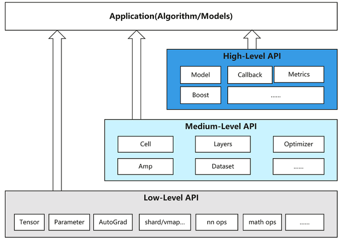

# mindspore

- Reference

  https://www.mindspore.cn/
  
  [chenzomi12 / AISystem](https://github.com/chenzomi12/AISystem)


## 环境准备

### 本机环境

- [install](https://www.mindspore.cn/install)

  ```bash
  conda create -n ms6 python==3.9
  conda activate ms6
  pip install https://ms-release.obs.cn-north-4.myhuaweicloud.com/2.2.14/MindSpore/cpu/x86_64/mindspore-2.2.14-cp39-cp39-win_amd64.whl --trusted-host ms-release.obs.cn-north-4.myhuaweicloud.com -i https://pypi.tuna.tsinghua.edu.cn/simple
  
  ```

  


### 云环境

- https://xihe.mindspore.cn/


## 初学入门

### Brief introduction

- MindSpore 总体架构

  `ModelZoo 模型库`  可用的算法网络

  `MindSpore Extend 扩展库`  支持拓展新领域场景 (如GNN/深度概率编程/强化学习等)

  `MindSpore Science 科学计算`  基于MindSpore的科学计算行业套件 (业界领先的数据集、基础模型、预置高精度模型和前后处理工具)

  `MindExpression 全场景统一API`  基于Python的前端表达与编程接口，支持两个融合两个统一

  **第三方前端**：支持第三方多语言前端表达，未来计划陆续提供C/C++等第三方前端的对接工作，引入更多的第三方生态。

  **MindSpore Data（数据处理层）**：提供高效的数据处理、常用数据集加载等功能和编程接口，支持用户灵活地定义处理注册和pipeline并行优化。

  **MindCompiler（AI编译器）**：图层的核心编译器，主要基于端云统一的MindIR实现三大功能，包括硬件无关的优化（类型推导、自动微分、表达式化简等）、硬件相关优化（自动并行、内存优化、图算融合、流水线执行等）、部署推理相关的优化（量化、剪枝等）。

  **MindRT（全场景运行时）**：昇思MindSpore的运行时系统，包含云侧主机侧运行时系统、端侧以及更小IoT的轻量化运行时系统。

  **MindSpore Insight（可视化调试调优工具）**：昇思MindSpore的可视化调试调优工具，能够可视化地查看训练过程、优化模型性能、调试精度问题、解释推理结果（[了解更多](https://mindspore.cn/mindinsight/docs/zh-CN/master/index.html))。

  **MindSpore Armour（安全增强库）**：面向企业级运用时，安全与隐私保护相关增强功能，如对抗鲁棒性、模型安全测试、差分隐私训练、隐私泄露风险评估、数据漂移检测等技术（[了解更多](https://mindspore.cn/mindarmour/docs/zh-CN/master/index.html)）。

  

- 执行流程

  

- 层次结构

  高层封装性 底层灵活性

  `High-Level Python API`  高级接口(训练推理的管理 混合精度训练 调试调优)

  `Medium-Level Python API`  模块(Dataset Cell Optimizer Loss)

  `Low-Level Python API`  (张量定义 基础算子 自动微分)

  


### QuickStart (demo)

- Summary

  超参数

  数据集准备、网络模型、模型训练(损失函数 优化器)

  保存参数、加载参数

- 快速入门

  处理数据集：下载到本地的数据、构建数据集、检测维度、数据增强

  网络构建：

  模型训练：正向计算(损失函数)、反向传播(梯度)、参数优化(优化器)；测试

  保存模型：模型参数

  加载模型：实例化模型、加载模型参数

- 具体代码

  处理数据集

  ```python
  import mindspore
  from mindspore import nn
  from mindspore.dataset import vision, transforms
  from mindspore.dataset import MnistDataset
  from download import download
  
  # ===============================================================================================================
  # Download dataset
  url = "https://mindspore-website.obs.cn-north-4.myhuaweicloud.com/" \
        "notebook/datasets/MNIST_Data.zip"
  path = download(url, "./data", kind="zip", replace=True)
  
  # Define dataset
  train_dataset = MnistDataset('data/MNIST_Data/train')
  test_dataset = MnistDataset('data/MNIST_Data/test')
  
  
  # print(train_dataset.get_col_names())
  
  
  def datapipe(dataset, batch_size):
      image_transforms = [
          vision.Rescale(1.0 / 255.0, 0),
          vision.Normalize(mean=(0.1307,), std=(0.3081,)),
          vision.HWC2CHW()
      ]
      label_transform = transforms.TypeCast(mindspore.int32)
  
      dataset = dataset.map(image_transforms, 'image')
      dataset = dataset.map(label_transform, 'label')
      dataset = dataset.batch(batch_size)
      return dataset
  
  
  # Map vision transforms and batch dataset
  train_dataset = datapipe(train_dataset, 64)
  test_dataset = datapipe(test_dataset, 64)
  
  
  # for image, label in test_dataset.create_tuple_iterator():
  #     print(f"Shape of image [N, C, H, W]: {image.shape} {image.dtype}")
  #     print(f"Shape of label: {label.shape} {label.dtype}")
  #     break
  # for data in test_dataset.create_dict_iterator():
  #     print(f"Shape of image [N, C, H, W]: {data['image'].shape} {data['image'].dtype}")
  #     print(f"Shape of label: {data['label'].shape} {data['label'].dtype}")
  #     break
  
  ```

  网络模型

  ```python
  # ===============================================================================================================
  # Define model
  class Network(nn.Cell):
      def __init__(self):
          super().__init__()
          self.flatten = nn.Flatten()
          self.dense_relu_sequential = nn.SequentialCell(
              nn.Dense(28 * 28, 512),
              nn.ReLU(),
              nn.Dense(512, 512),
              nn.ReLU(),
              nn.Dense(512, 10)
          )
  
      def construct(self, x):
          x = self.flatten(x)
          logits = self.dense_relu_sequential(x)
          return logits
  
  
  model = Network()
  # print(model)
  
  ```

  模型训练

  ```python
  # ===============================================================================================================
  # Instantiate loss function and optimizer
  loss_fn = nn.CrossEntropyLoss()
  optimizer = nn.SGD(model.trainable_params(), 1e-2)
  
  
  # 1. Define forward function
  def forward_fn(data, label):
      logits = model(data)
      loss = loss_fn(logits, label)
      return loss, logits
  
  
  # 2. Get gradient function
  grad_fn = mindspore.value_and_grad(forward_fn, None, optimizer.parameters, has_aux=True)
  
  
  # 3. Define function of one-step training
  def train_step(data, label):
      (loss, _), grads = grad_fn(data, label)
      optimizer(grads)
      return loss
  
  
  def train(model, dataset):
      size = dataset.get_dataset_size()
      model.set_train()
      for batch, (data, label) in enumerate(dataset.create_tuple_iterator()):
          loss = train_step(data, label)
  
          if batch % 100 == 0:
              loss, current = loss.asnumpy(), batch
              print(f"loss: {loss:>7f}  [{current:>3d}/{size:>3d}]")
  
  
  def test(model, dataset, loss_fn):
      num_batches = dataset.get_dataset_size()
      model.set_train(False)
      total, test_loss, correct = 0, 0, 0
      for data, label in dataset.create_tuple_iterator():
          pred = model(data)
          total += len(data)
          test_loss += loss_fn(pred, label).asnumpy()
          correct += (pred.argmax(1) == label).asnumpy().sum()
      test_loss /= num_batches
      correct /= total
      print(f"Test: \n Accuracy: {(100 * correct):>0.1f}%, Avg loss: {test_loss:>8f} \n")
  
  
  epochs = 3
  for t in range(epochs):
      print(f"Epoch {t + 1}\n-------------------------------")
      train(model, train_dataset)
      test(model, test_dataset, loss_fn)
  print("Done!")
  
  ```

  保存模型 加载模型

  ```python
  # ===============================================================================================================
  # Save checkpoint
  mindspore.save_checkpoint(model, "data/model.ckpt")
  print("Saved Model to model.ckpt")
  
  # ===============================================================================================================
  # Instantiate a random initialized model
  model = Network()
  # Load checkpoint and load parameter to model
  param_dict = mindspore.load_checkpoint("data/model.ckpt")
  param_not_load, _ = mindspore.load_param_into_net(model, param_dict)
  print(param_not_load)
  
  model.set_train(False)
  for data, label in test_dataset:
      pred = model(data)
      predicted = pred.argmax(1)
      print(f'Predicted: "{predicted[:10]}", Actual: "{label[:10]}"')
      break
      
  ```

  


### Tensor


### Dataset

#### 数据集加载


#### 数据集迭代


#### 数据集常见操作

- 数据集常见操作

  shuffle map batch


#### 自定义数据集

- 自定义数据集

  可随机访问数据集

  可迭代数据集

  生成器


## 初学入门

### 高阶封装 model


### 模型模块自定义


### 模块自定义


### 自动微分


### 静态图编程


### 自动混合精度


### 报错分析


## 应用实践 CV

### ResNet50图像分类


### ResNet50迁移学习


### Vision Transformer图像分类


### FCN图像语义分割


### ShuffleNet图像分类


### SSD目标检测


## 应用实践 NLP


## 应用实践 Generative


## 深度开发


# chenzomi12


