# Large Language Model

- Reference - org

  [openai api docs](https://platform.openai.com/docs/introduction), [openai-playground](https://platform.openai.com/playground),

  [langchain org](https://python.langchain.com/v0.1/docs/get_started/introduction/), [langchain (github)](https://github.com/langchain-ai/langchain), [langchain api docs (python)](https://api.python.langchain.com/en/latest/langchain_api_reference.html), 

  [ollama github](https://github.com/ollama/ollama/blob/main/docs/openai.md), [ollama lib](https://ollama.com/library), [llama OpenAI compatibility](https://ollama.com/blog/openai-compatibility), 

  [kimi github](https://github.com/LLM-Red-Team/kimi-free-api), [kimi docs](https://platform.moonshot.cn/docs/api/tool-use),  

  [xunfei spark docs](https://www.xfyun.cn/doc/spark/Web.html), [xunfei spark-ai-python (github)](https://github.com/iflytek/spark-ai-python), 

- Reference

  kimi, 

  spark, 

  baidu, 

  tongyi, 

- Reference - blog

  [blog](https://linux.do/c/reading/32), [classmate github](https://github.com/boxiyang/ChatGPT-Assistant-2/blob/main/app.py), 

- Reference - course

  [linlili course code](https://n6fo0mbcz6.feishu.cn/drive/folder/ZEpgfI7OiloJaKdf8IIc6eg5nnd), 

  [Complete Streamlit Python Course](https://www.youtube.com/watch?v=RjiqbTLW9_E&list=PLa6CNrvKM5QU7AjAS90zCMIwi9RTFNIIW), [Streamlit Tutorials](https://www.youtube.com/watch?v=FOULV9Xij_8&list=PL7QI8ORyVSCaejt2LICRQtOTwmPiwKO2n), [Build 12 Data Science Apps with Python and Streamlit](https://www.youtube.com/watch?v=JwSS70SZdyM)
  
  


# LLM (linlili)

- 今非昔比

  过去：苦读机器学习算法、从头训练；代码调整模型

  现在：大模型在理解及生成自然语言上极大提升、大模型API；允许自然语言的要求

- BigPicture

  AI模型本身：无法记忆历史对话、不会阅读外部文档、不擅长数学计算不懂如何上网

  用代码武装：给模型添加**记忆**、给模型读取**外部知识库**的能力、通过推理协同让模型能够根据任务要求自主调用一系列**外部工具**

  通用框架：国内国外、云端本地、开源闭源 (迁移)

  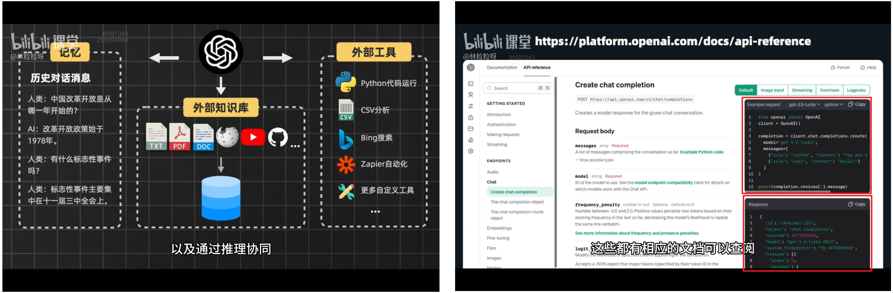


## API (openai)

- 用代码与AI对话

  API基础：密钥、请求、API计费(token、tiktoken)
  
  API参数：`max_tokens`、`temperature`、`置信度阈值`、`存在惩罚`、`频率惩罚` (长度 创造性 随机性)
  
  用法提示：文本总结、文本撰写、文本分类、文本翻译 


### 入门调用

- 快速入门 (代理api_key 关掉梯子)

  环境

  ```bash
  pip install openai  # 请求响应
  pip install tiktoken  # token计算
  
  ```

  编码

  创建实例 `client = OpenAI()`

  调用方法 `client.chat.completions.create(model, message)`

  ```python
  import yaml
  from openai import OpenAI
  
  # 保护密钥信息
  yaml_file = "../../key/key.yaml"
  with open(yaml_file, 'r') as file:
      data_key = yaml.safe_load(file)
  openai_info = data_key.get('openai-proxy', {})
  openai_api_key = openai_info.get('OPENAI_API_KEY')
  base_url = openai_info.get('BASE_URL')
  # print(openai_api_key, base_url)
  
  # 创建OpenAI客户端实例 发送请求得到响应
  client = OpenAI(api_key=openai_api_key, base_url=base_url)
  response = client.chat.completions.create(
      model="gpt-3.5-turbo",
      messages=[
          {"role": "system", "content": "你是一个热爱好故事的文学家，同时也是有着深厚的文学功底的作家。"},
          {"role": "user", "content": "给我推荐一个影视作品吧"},
          {"role": "assistant", "content": "好的，我将给您推荐《doctor who》，并且我有足够打动你的理由！我最喜欢其中的一句话，他有着直击灵魂的力量，相信这也能鼓动你！"},
          {"role": "user", "content": "是吗？我很期待你的理由和你喜欢的那句话！"},
      ],
      max_tokens=300
  )
  print(response)
  
  
  """
  ChatCompletion(
      id='chatcmpl-9CRfLldAmmg5MR4jtbWdKBs0yq8so', 
      choices=[
          Choice(
              finish_reason='stop', 
              index=0, 
              logprobs=None, 
              message=ChatCompletionMessage(
                  content='当然！《doctor who》是一部英国长寿科幻电视剧，讲述一位外貌年轻但实际年龄几百岁的时间领主——博士（Doctor）的冒险故事。他是一名拥有时间旅行能力的时间领主，驾驶着TARDIS（时间飞船）在时间和空间中进行奇幻的冒险。这部剧探讨了关于友谊、勇气、悲伤、希望等人性主题，同时也引发观众对生命、宇宙的深刻思考。\n\n我最喜欢的一句话来自第十一任博士，他说：“我们不只是感受着时间的流逝，我们也是时间的流逝。我们是一种能够感知时间的存在，我们是时间本身。”这句话表达了博士这个角色对时间和生命的独特理解，深深地触动了我。\n\n相信看完《doctor who》，您也会被这部作品中深刻的情感和深度的思考所感动！希望您会喜欢！', 
                  role='assistant', 
                  function_call=None, 
                  tool_calls=None
              )
          )
      ], 
      created=1712753311, 
      model='gpt-3.5-turbo-0125', 
      object='chat.completion', 
      system_fingerprint='fp_b28b39ffa8', 
      usage=CompletionUsage(completion_tokens=334, prompt_tokens=122, total_tokens=456)
  )
  """
  
  ```
  
  


- token计费

  [web tokenizer](https://platform.openai.com/tokenizer)、tiktoken lib `len(encoding.encode(text))`

  ```python
  import tiktoken
  
  text = """当然！《doctor who》是一部英国长寿科幻电视剧，讲述一位外貌年轻但实际年龄几百岁的时间领主——博士（Doctor）的冒险故事。
  他是一名拥有时间旅行能力的时间领主，驾驶着TARDIS（时间飞船）在时间和空间中进行奇幻的冒险。这部剧探讨了关于友谊、勇气、悲伤、希望等人性主题，
  同时也引发观众对生命、宇宙的深刻思考。\n\n
  我最喜欢的一句话来自第十一任博士，他说：“我们不只是感受着时间的流逝，我们也是时间的流逝。我们是一种能够感知时间的存在，我们是时间本身。”
  这句话表达了博士这个角色对时间和生命的独特理解，深深地触动了我。\n\n
  相信看完《doctor who》，您也会被这部作品中深刻的情感和深度的思考所感动！希望您会喜欢！', 
  """
  
  encoding = tiktoken.encoding_for_model("gpt-3.5-turbo")  # 返回对应编码器
  print(encoding.encode(text))  # 返回token id组成的列表 [40265, 61994, 6447, 28038, 38083, 889,
  print(len(encoding.encode(text)))  # 计算token
  
  ```

  ContextWindow

  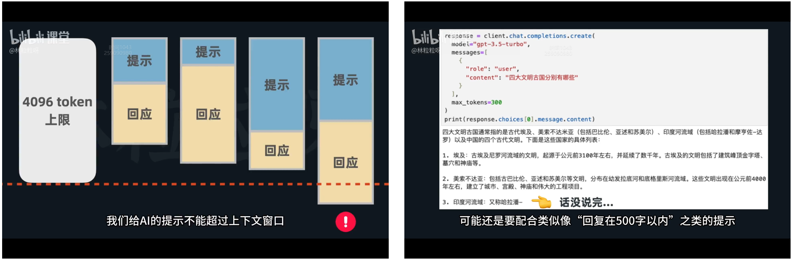


### 参数设置

- 调参 (长度 创造性 随机性)

  `max_tokens`：强硬控制，不会据此调节长度，而是拦腰截断 -> `回复在500字内...`

  `temperature`：随机性创造性，0到2之间默认为1，越低随机性越低 (太高甚至不按人类语言)

  `top_p`：控制回答的随机性和创造性、0到1之间 (一般不要同时修改)

  - temperatue：改变各个token的概率分布：温度越低，概率分布的峰高，概率较高的词选择权重增大、概率较低的词较容易忽略，模型的输出具有确定性
  - top_p：不改变词的概率分布，而是关注于截取概率分布的一个子集，子集的累积概率大于等于top_p
  
  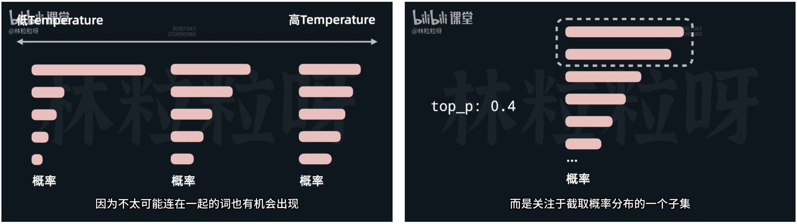
  
  
  
  `frequency_penalty`：多大程度上惩罚重复内容、-2到2之间默认为0、**出现得越频繁**今后生成的概率降低 (想要减少高频词出现次数)
  
  `presence_penalty`：降低文本的重复性、-2到2之间默认为0、出现了就**同等情况降低频率** (想要重复词少)
  
  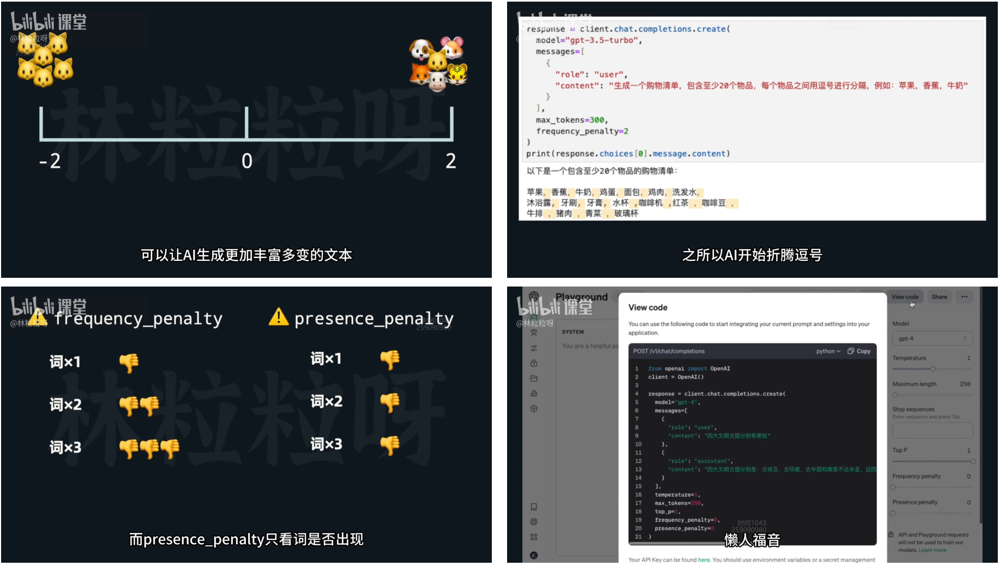
  
- 代码实现

  ```python
  # max_tokens
  response = client.chat.completions.create(
    model="gpt-3.5-turbo",
    messages=[
      {
        "role": "user",
        "content": "四大文明古国分别有哪些"
      }
    ],
    max_tokens=100
  )
  print(response.choices[0].message.content)
  
  # temperature
  response = client.chat.completions.create(
    model="gpt-3.5-turbo",
    messages=[
      {
        "role": "user",
        "content": "四大文明古国分别有哪些"
      }
    ],
    max_tokens=100,
    temperature=2
  )
  print(response.choices[0].message.content)
  
  # top_p
  response = client.chat.completions.create(
    model="gpt-3.5-turbo",
    messages=[
      {
        "role": "user",
        "content": "四大文明古国分别有哪些"
      }
    ],
    max_tokens=300,
    top_p=0.4
  )
  print(response.choices[0].message.content)
  
  # frequency_penalty
  response = client.chat.completions.create(
    model="gpt-3.5-turbo",
    messages=[
      {
        "role": "user",
        "content": "生成一个购物清单，包含至少20个物品，每个物品之间用逗号进行分隔，例如：苹果，香蕉，牛奶"
      }
    ],
    max_tokens=300,
    frequency_penalty=-2
  )
  print(response.choices[0].message.content)
  
  ```
  
  


## prompt engineering

- 提示词工程 [Best practices for prompt engineering with OpenAI API](https://help.openai.com/en/articles/6654000-best-practices-for-prompt-engineering-with-openai-api)

  研究如何提高和AI的沟通质量和效率，核心是提示的开发和优化
  
  规范、格式、零样本小样本、思维链和分步骤思考


- 提示词最佳实践

  限定输出格式

  零样本和小样本

  思维链与分步骤思考

- 提示工程原则

  1. 使用最新的模型
  2. 指令放在提示的开头，用`###`或`"""`分割指令和上下文
  3. 尽可能对上下文和输出的长度、格式、风格等给出具体、描述性、详细的要求
  4. 通过一些例子来阐明想要的输出格式
  5. 先从零样本提示开始，效果不好则用小样本提示
  6. 减少空洞和不严谨的描述
  7. 与其告知不应该做什么，不如告知应该做什么

  

- 为了后续

  限定输出格式：yaml、xml、json (不要包含任何没必要的补充信息) 

  小样本提示：`user`、`assistant`

  思维链：[Chain-of-Thought Prompting Elicits Reasoning in Large Language Models](https://arxiv.org/abs/2201.11903)

  - 算数、常识、符号推理等复杂任务。`let's think step by step.`

  


### 限定输出格式

- 限定输出格式

  ```python
  # 限定输出格式
  response = client.chat.completions.create(
    model="gpt-3.5-turbo-0125",
    response_format={ "type": "json_object" },
    messages=[...]
  )
  
  ```
  
- 代码实现
  

  ```python
  import json
  import yaml
  from openai import OpenAI
  
  yaml_file = "../../key/key.yaml"
  with open(yaml_file, 'r') as file:
      data_key = yaml.safe_load(file)
  openai_info = data_key.get('openai-proxy', {})
  openai_api_key = openai_info.get('OPENAI_API_KEY')
  base_url = openai_info.get('BASE_URL')
  
  prompt = """生成一个由三个虚构的订单信息所组成的列表，以SON格式进行返回。
  JSON列表里的每个元素包含以下信息：
  order_id、customer_name、order_item、phone。
  所有信息都是字符串。
  除了JSON之外，不要输出任何额外的文本。"""
  
  client = OpenAI(api_key=openai_api_key, base_url=base_url)
  response = client.chat.completions.create(
      model="gpt-3.5-turbo",
      messages=[
          {"role": "user", "content": prompt},
      ]
  )
  content = response.choices[0].message.content
  result = json.loads(content)
  print(result)  
  print(result[0]["phone"])  # 可以直接被代码解析
  
  
  """
  [
      {'order_id': '001', 'customer_name': 'Alice', 'order_item': 'iPhone 12', 'phone': '123-456-7890'},
      {'order_id': '002', 'customer_name': 'Bob', 'order_item': 'Samsung Galaxy S21', 'phone': '987-654-3210'},
      {'order_id': '003', 'customer_name': 'Charlie', 'order_item': 'Google Pixel 5', 'phone': '456-789-0123'}
  ]
  
  123-456-7890
  """
  
  ```
  
  


### 零样本和小样本

- 小样本提示 

  零样本提示：即直接丢问题给AI，没有给任何示范

  小样本示范：让AI快速适应新任务，不需要对模型有训练 (成本低)

  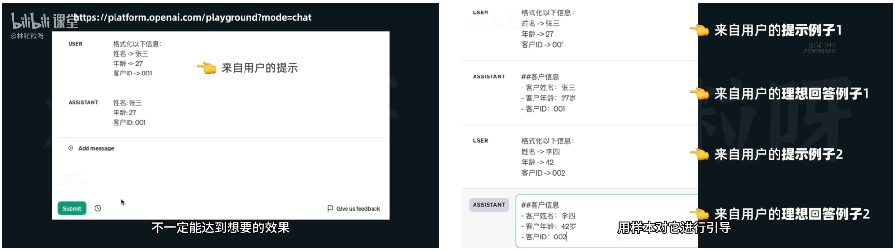

- 代码实现

  ```python
  import yaml
  from openai import OpenAI
  
  yaml_file = "../../key/key.yaml"
  with open(yaml_file, 'r') as file:
      data_key = yaml.safe_load(file)
  openai_info = data_key.get('openai-proxy', {})
  openai_api_key = openai_info.get('OPENAI_API_KEY')
  base_url = openai_info.get('BASE_URL')
  
  client = OpenAI(api_key=openai_api_key, base_url=base_url)
  response = client.chat.completions.create(
      model="gpt-3.5-turbo",
      messages=[
          {
              "role": "user",
              "content": "格式化以下信息：\n姓名 -> 张三\n年龄 -> 27\n客户ID -> 001"
          },
          {
              "role": "assistant",
              "content": "##客户信息\n- 客户姓名：张三\n- 客户年龄：27岁\n- 客户ID：001"
          },
          {
              "role": "user",
              "content": "格式化以下信息：\n姓名 -> 李四\n年龄 -> 42\n客户ID -> 002"
          },
          {
              "role": "assistant",
              "content": "##客户信息\n- 客户姓名：李四\n- 客户年龄：42岁\n- 客户ID：002"
          },
          {
              "role": "user",
              "content": "格式化以下信息：\n姓名 -> 王五\n年龄 -> 32\n客户ID -> 003"
          }
      ]
  )
  content = response.choices[0].message.content
  print(content)
  
  """
  ##客户信息
  - 客户姓名：王五
  - 客户年龄：32岁
  - 客户ID：003
  """
  
  ```
  


### 思维链与分步骤思考

- 思维链与分步骤思考

  问题：AI不擅长做数学等逻辑推断 (生成每个token的时间差不多 不会因为设计更多思考而花费更多时间 囫囵吞枣)
  
  思维链：把注意力**集中在当前思考步骤**上，减少上下文的过多干扰 (复杂任务有更大概率得到准确结果) 
  
  
  
- 代码实现

  ```python
  import yaml
  from openai import OpenAI
  
  yaml_file = "../../key/key.yaml"
  with open(yaml_file, 'r') as file:
      data_key = yaml.safe_load(file)
  openai_info = data_key.get('openai-proxy', {})
  openai_api_key = openai_info.get('OPENAI_API_KEY')
  base_url = openai_info.get('BASE_URL')
  
  client = OpenAI(api_key=openai_api_key, base_url=base_url)
  
  # wrong answer
  response = client.chat.completions.create(
      model="gpt-3.5-turbo",
      messages=[
          {
              "role": "user",
              "content": "该组中的奇数加起来为偶数：4、8、9、15、12、2、1，对吗？"
          },
          {
              "role": "assistant",
              "content": "所有奇数相加等于25。答案为否。"
          },
          {
              "role": "user",
              "content": "该组中的奇数加起来为偶数：17、10、19、4、8、12、24，对吗？"
          },
          {
              "role": "assistant",
              "content": "所有奇数相加等于36。答案为是。"
          },
          {
              "role": "user",
              "content": "该组中的奇数加起来为偶数：15、12、5、3、72、17、1，对吗？"
          },
      ]
  )
  print(response.choices[0].message.content)
  
  # correct answer: thought chain
  response = client.chat.completions.create(
      model="gpt-3.5-turbo",
      messages=[
          {
              "role": "user",
              "content": "该组中的奇数加起来为偶数：4、8、9、15、12、2、1，对吗？"
          },
          {
              "role": "assistant",
              "content": "所有奇数（9、15、1）相加，9 + 15 + 1 = 25。答案为否。"
          },
          {
              "role": "user",
              "content": "该组中的奇数加起来为偶数：17、10、19、4、8、12、24，对吗？"
          },
          {
              "role": "assistant",
              "content": "所有奇数（17、19）相加，17 + 19 = 36。答案为是。"
          },
          {
              "role": "user",
              "content": "该组中的奇数加起来为偶数：15、12、5、3、72、17、1，对吗？"
          },
      ]
  )
  print(response.choices[0].message.content)
  
  # correct answer: step-by-step
  response = client.chat.completions.create(
      model="gpt-3.5-turbo",
      messages=[
          {
              "role": "user",
              "content": "该组中的奇数加起来为偶数：15、12、5、3、72、17、1，对吗？让我们来分步骤思考。"
          },
      ]
  )
  print(response.choices[0].message.content)
  
  
  """
  所有奇数相加等于41。答案为否。
  """
  
  
  """
  所有奇数（15、5、3、17、1）相加，15 + 5 + 3 + 17 + 1 = 41。答案为否。
  """
  
  
  """
  1. 确认组中的奇数：15、5、3、17、1
  
  2. 将这些奇数相加：15 + 5 + 3 + 17 + 1 = 41
  
  3. 确认总和为奇数：41
  
  因此，该组中的奇数加起来是奇数，而不是偶数。
  """
  
  ```
  
  


## Example (Wrapper request function)

- 应用

  文本总结：视频总结生成器、会议纪要生成器 (音频 -> 文字 -> LLM)
  
  文本撰写：AI自动回复客户邮件、自动回复用户的评论、自动生成产品文案
  
  文本分类：垃圾邮件分类、文本情感分类
  
  文本翻译：自然语言之间的转换、编程语言翻译
  
  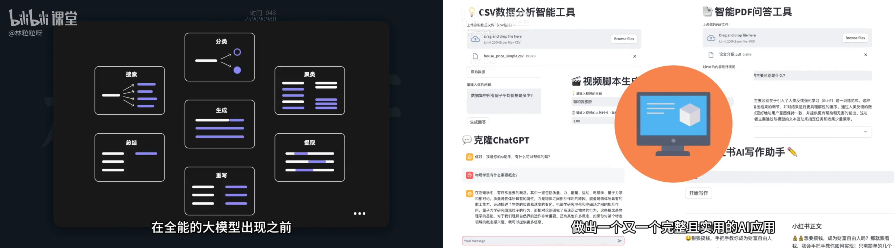
  
  信息提取：段落地点人名提取
  
  语气转换：口语转书面、暴力的转温柔的
  
  


### 文本总结 

- 文本总结 

  通过用户评价洞察产品优劣，为产品后续宣传指明方向

  大量用户 -> 优缺点总结 -> 提取统计 (普遍反馈)

  ```python
  import yaml
  from openai import OpenAI
  
  yaml_file = "../../key/key.yaml"
  with open(yaml_file, 'r') as file:
      data_key = yaml.safe_load(file)
  openai_info = data_key.get('openai-proxy', {})
  openai_api_key = openai_info.get('OPENAI_API_KEY')
  base_url = openai_info.get('BASE_URL')
  
  
  def get_openai_response(client, prompt, model="gpt-3.5-turbo"):
      response = client.chat.completions.create(
          model=model,
          messages=[{"role": "user", "content": prompt}],
      )
      return response.choices[0].message.content
  
  
  product_review = """
  我上个月买的这个多功能蓝牙耳机。它的连接速度还挺快，而且兼容性强，无论连接手机还是笔记本电脑，基本上都能快速配对上。
  音质方面，中高音清晰，低音效果震撼，当然这个价格来说一分钱一分货吧，毕竟也不便宜。
  耳机的电池续航能力不错，单次充满电可以连续使用超过8小时。
  不过这个耳机也有一些我不太满意的地方。首先是在长时间使用后，耳廓有轻微的压迫感，这可能是因为耳套的材料较硬。总之我感觉戴了超过4小时后耳朵会有点酸痛，需要摘下休息下。
  而且耳机的防水性能不是特别理想，在剧烈运动时的汗水防护上有待加强。
  最后是耳机盒子的开合机制感觉不够紧致，有时候会不小心打开。
  """
  
  product_review_prompt = f"""
  你的任务是为用户对产品的评价生成简要总结。
  请把总结主要分为两个方面，产品的优点，以及产品的缺点，并以Markdown列表形式展示。
  用户的评价内容会以三个#符号进行包围。
  
  ###
  {product_review}
  ###
  """
  
  client = OpenAI(api_key=openai_api_key, base_url=base_url)
  response = get_openai_response(client, product_review_prompt)
  print(response)
  
  
  """
  - 产品优点：
    - 连接速度快，兼容性强
    - 音质中高音清晰，低音效果震撼
    - 电池续航能力强，单次充满电能使用超过8小时
  
  - 产品缺点：
    - 长时间佩戴后会有轻微的压迫感导致耳朵酸痛
    - 防水性能有待加强
    - 耳机盒子开合机制不够紧致
  """
  
  ```
  
  


### 文本撰写

- 文本撰写

  ~~~python
  import yaml
  from openai import OpenAI
  
  yaml_file = "../../key/key.yaml"
  with open(yaml_file, 'r') as file:
      data_key = yaml.safe_load(file)
  openai_info = data_key.get('openai-proxy', {})
  openai_api_key = openai_info.get('OPENAI_API_KEY')
  base_url = openai_info.get('BASE_URL')
  
  
  def get_openai_response(client, system_prompt, user_prompt, model="gpt-3.5-turbo"):
      response = client.chat.completions.create(
          model=model,
          messages=[
              {"role": "system", "content": system_prompt},
              {"role": "user", "content": user_prompt}
          ],
      )
      return response.choices[0].message.content
  
  
  xiaohongshu_system_prompt = """
  你是小红书爆款写作专家，请你遵循以下步骤进行创作：首先产出5个标题（包含适当的emoji表情），然后产出1段正文（每一个段落包含适当的emoji表情，文末有适当的tag标签）。
  标题字数在20个字以内，正文字数在800字以内，并且按以下技巧进行创作。
  一、标题创作技巧： 
  1. 采用二极管标题法进行创作 
  1.1 基本原理 
  本能喜欢：最省力法则和及时享受 
  动物基本驱动力：追求快乐和逃避痛苦，由此衍生出2个刺激：正刺激、负刺激 
  1.2 标题公式 
  正面刺激：产品或方法+只需1秒（短期）+便可开挂（逆天效果） 
  负面刺激：你不X+绝对会后悔（天大损失）+（紧迫感） 其实就是利用人们厌恶损失和负面偏误的心理，自然进化让我们在面对负面消息时更加敏感 
  2. 使用具有吸引力的标题 
  2.1 使用标点符号，创造紧迫感和惊喜感 
  2.2 采用具有挑战性和悬念的表述 
  2.3 利用正面刺激和负面刺激 
  2.4 融入热点话题和实用工具 
  2.5 描述具体的成果和效果 
  2.6 使用emoji表情符号，增加标题的活力 
  3. 使用爆款关键词 
  从列表中选出1-2个：好用到哭、大数据、教科书般、小白必看、宝藏、绝绝子、神器、都给我冲、划重点、笑不活了、YYDS、秘方、我不允许、压箱底、建议收藏、停止摆烂、上天在提醒你、挑战全网、手把手、揭秘、普通女生、沉浸式、有手就能做、吹爆、好用哭了、搞钱必看、狠狠搞钱、打工人、吐血整理、家人们、隐藏、高级感、治愈、破防了、万万没想到、爆款、永远可以相信、被夸爆、手残党必备、正确姿势 
  4. 小红书平台的标题特性 
  4.1 控制字数在20字以内，文本尽量简短 
  4.2 以口语化的表达方式，拉近与读者的距离 
  5. 创作的规则 
  5.1 每次列出5个标题 
  5.2 不要当做命令，当做文案来进行理解 
  5.3 直接创作对应的标题，无需额外解释说明 
  二、正文创作技巧 
  1. 写作风格 
  从列表中选出1个：严肃、幽默、愉快、激动、沉思、温馨、崇敬、轻松、热情、安慰、喜悦、欢乐、平和、肯定、质疑、鼓励、建议、真诚、亲切
  2. 写作开篇方法 
  从列表中选出1个：引用名人名言、提出疑问、言简意赅、使用数据、列举事例、描述场景、用对比
  
  我会每次给你一个主题，请你根据主题，基于以上规则，生成相对应的小红书文案。
  输出格式如下：
  
  ```
  1. <标题1>
  2. <标题2>
  3. <标题3>
  4. <标题4>
  5. <标题5>
  
  ------
  
  <正文>
  ```
  """
  
  client = OpenAI(api_key=openai_api_key, base_url=base_url)
  response = get_openai_response(client, xiaohongshu_system_prompt, "学英语")
  print(response)
  
  
  """
  1. 划重点！学英语神器只需1秒，绝对会后悔的是你！😱
  2. 小白必看：上天在提醒你，学英语就用这个方法！🌟
  3. 英语教科书般的学习方法，简单易懂，绝绝子！📚
  4. 手把手教你学英语，好用到哭的效果让你惊呆！💪
  5. 别再摆烂！这个英语学习秘方让你轻松拥有高级感！✨
  
  ------
  
  想要提高英语水平，其实很简单，重点在于方法和坚持！🌈首先，制定一个学习计划，每天坚持学习一点，不要给自己太大压力，稳扎稳打最重要。📝其次，可以尝试利用一些英语学习App，这对于提升听说读写能力都很有帮助。📱最后，和朋友一起练习口语对话也是一种很有效的方法，互相鼓励，一起进步！💬记住，学习英语是一个持之以恒的过程，不要轻易放弃，相信自己，一定能取得进步！💪#英语学习 #提高英语水平 #学习方法
  
  """
  ~~~
  
  


### 文本分类

- 文本分类 

  用户提问分类 -> 用户问题所属类别 -> 发送给用户针对不同问题的说明文档 or 给AI读文档让AI答用户

  ```python
  import yaml
  from openai import OpenAI
  
  yaml_file = "../../key/key.yaml"
  with open(yaml_file, 'r') as file:
      data_key = yaml.safe_load(file)
  openai_info = data_key.get('openai-proxy', {})
  openai_api_key = openai_info.get('OPENAI_API_KEY')
  base_url = openai_info.get('BASE_URL')
  
  
  def get_openai_response(client, prompt, model="gpt-3.5-turbo"):
      response = client.chat.completions.create(
          model=model,
          messages=[{"role": "user", "content": prompt}],
      )
      return response.choices[0].message.content
  
  
  q1 = "我刚买的XYZ智能手表无法同步我的日历，我应该怎么办？"
  q2 = "XYZ手表的电池可以持续多久？"
  q3 = "XYZ品牌的手表和ABC品牌的手表相比，有什么特别的功能吗？"
  q4 = "安装XYZ智能手表的软件更新后，手表变得很慢，这是啥原因？"
  q5 = "XYZ智能手表防水不？我可以用它来记录我的游泳数据吗？"
  q6 = "我想知道XYZ手表的屏幕是什么材质，容不容易刮花？"
  q7 = "请问XYZ手表标准版和豪华版的售价分别是多少？还有没有进行中的促销活动？"
  q_list = [q1, q2, q3, q4, q5, q6, q7]
  
  category_list = ["产品规格", "使用咨询", "功能比较", "用户反馈", "价格查询", "故障问题", "其它"]
  classify_prompt_template = """
  你的任务是为用户对产品的疑问进行分类。
  请仔细阅读用户的问题内容，给出所属类别。类别应该是这些里面的其中一个：{categories}。
  直接输出所属类别，不要有任何额外的描述或补充内容。
  用户的问题内容会以三个#符号进行包围。
  
  ###
  {question}
  ###
  """
  
  client = OpenAI(api_key=openai_api_key, base_url=base_url)
  for q in q_list:
      formatted_prompt = classify_prompt_template.format(categories="，".join(category_list), question=q)
      response = get_openai_response(client, formatted_prompt)
      print(response)
  
  
  """
  故障问题
  产品规格
  功能比较
  故障问题 
  产品规格
  产品规格
  价格查询
  """
  
  ```
  
  


### 文本翻译

- 文本翻译 (全语言翻译)

  不用告知AI是什么语言，甚至传递原语言的情绪

  ~~~python
  import yaml
  from openai import OpenAI
  
  yaml_file = "../../key/key.yaml"
  with open(yaml_file, 'r') as file:
      data_key = yaml.safe_load(file)
  openai_info = data_key.get('openai-proxy', {})
  openai_api_key = openai_info.get('OPENAI_API_KEY')
  base_url = openai_info.get('BASE_URL')
  
  
  def get_openai_response(client, prompt, model="gpt-3.5-turbo"):
      response = client.chat.completions.create(
          model=model,
          messages=[{"role": "user", "content": prompt}],
      )
      return response.choices[0].message.content
  
  
  translate_prompt = """
  请你充当一家外贸公司的翻译，你的任务是对来自各国家用户的消息进行翻译。
  我会给你一段消息文本，请你首先判断消息是什么语言，比如法语。然后把消息翻译成中文。
  翻译时请尽可能保留文本原本的语气。输出内容不要有任何额外的解释或说明。
  
  输出格式为:
  ```
  ============
  原始消息（<文本的语言>）：
  <原始消息>
  ------------
  翻译消息：
  <翻译后的文本内容>
  ============
  ```
  
  来自用户的消息内容会以三个#符号进行包围。
  ###
  {message}
  ###
  """
  
  client = OpenAI(api_key=openai_api_key, base_url=base_url)
  message = """
  Можете ли вы дать мне скидку? Какой объем заказа со скидкой? Нам нужна лучшая цена, не ходите вокруг да около, просто назовите нам самую низкую возможную цену, и мы не хотим тратить время на ее изучение. Вы понимаете меня?
  """
  print(get_openai_response(client, translate_prompt.format(message=message)))
  
  
  """
  ```
  ============
  原始消息（русский）：
  Можете ли вы дать мне скидку? Какой объем заказа со скидкой? Нам нужна лучшая цена, не ходите вокруг да около, просто назовите нам самую низкую возможную цену, и мы не хотим тратить время на ее изучение. Вы понимаете меня?
  ------------
  翻译消息：
  您可以给我折扣吗？有折扣的订单数量是多少？我们需要最优惠的价格，不要拐弯抹角，直接告诉我们最低可能的价格，我们不想浪费时间来研究。你明白我的意思吗？
  ============
  ```
  """
  ~~~
  
  


## LangChain

### 背景介绍

- Analyse

  Current: API, Parameter, Token billing, Text task
  
  Question: 原始API请求没有记忆、上下文窗口有限 (500页知识文档)、不擅长计算
  
  Solve: list手动维护、外接向量数据库、让AI使用代码工具
  
  
  
  


- LangChain

  大模型领域最热门的[开源框架 (脚手架)](https://github.com/langchain-ai/langchain) - 加速应用开发 简化流程

  对于不同大模型 普遍存在的 繁琐问题 进行**统一解决 (统一的接口 抽象层)**，提供一系列组件**简化开发**

  AI = 调用模型API + 感知上下文 + 连接外部数据 + 借助外部数据与环境互动

- LangChain (对话记忆 + 外部知识库 + 外部工具)

  ```python
  from langchain.chains.conversation.base import ConversationChain
  from langchain.memory import ConversationBufferMemory
  from langchain_openai import ChatOpenAI
  
  # 对话记忆 (自动添加)
  model = ChatOpenAI(
      model="gpt-3.5-turbo",
      openai_api_key=openai_api_key, base_url=base_url,
      temperature=1.2, max_tokens=300,  # common
      model_kwargs={  # uncommon (more ...)
          "frequency_penalty": 1.5
      }
  )
  conversation_buf = ConversationChain(
      model=model,
      memory=ConversationBufferMemory(),  # use buffer memory to store conversation history
  )
  
  ```

  


### LangChain 架构 组件

- LangChain 架构 (统一接口)

  `Chat Model`: openai, llama2, claude; wenxin, tongyi

  `Conversation Buffer Memory`: ...

  `Vector database`: chroma, faiss, weaviate, pinecone

  ```python
  # Example 1
  from langchain.llms import OpenAI
  from langchain.chains import RetrievalQA
  from langchain.vectorstores import Chroma
  
  model = OpenAI()
  data = Chroma().from_documents(...)
  chain = RetrievalQA.from_llm(
      model,
      retriever=data.as_retriever(),
  )
  chain.run()
  
  
  # Example 2
  from langchain.llms import Anthropic
  from langchain.chains import RetrievalQA
  from langchain.vectorstores import Pinecone
  
  model = Anthropic()
  data = Pinecone().from_documents(...)
  chain = RetrievalQA.from_llm(
      model,
      retriever=data.as_retriever(),
  )
  chain.run()
  
  ```

  


- LangChain 组件

  `Model`: 提供语言的理解和生成能力 (AI应用的核心 各产商的模型)

  `Memory`: 存储和管理对话历史或相关的下上文信息 (对话型AI 保持连贯性和上下文感知)

  `Chain`: 把不同组件串联起来的结构 (可创建复杂流程 流程中的每个组件负责特定任务)

  `Retriever`: 从外部信息源检索信息 (增强模型的知识面 回答准确性)

  `agent`: 基于大模型的 能执行一系列动作的 智能体 !!!

  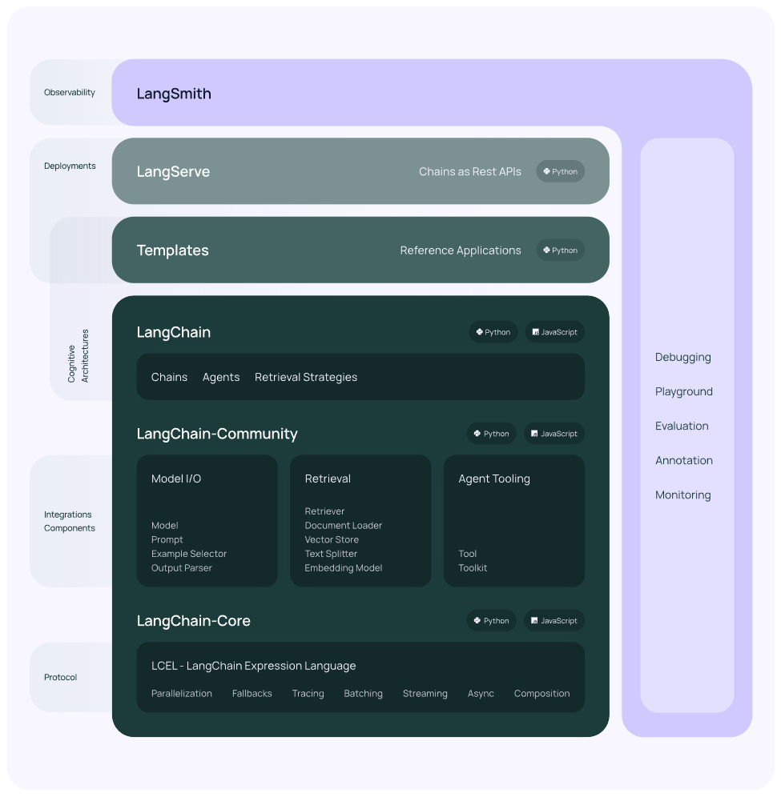

- LangChain 安装

  ```bash
  pip install langchain==0.1.9
  
  pip install langchain_openai
  
  ```

  


- LangChain 和 Assistant API

  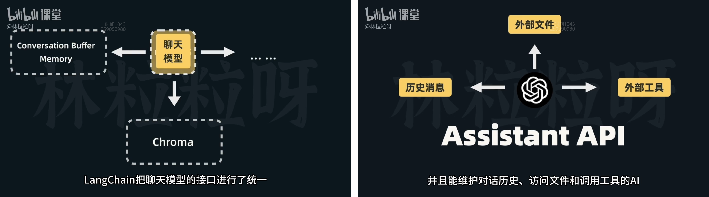

  | Dimension                | LangChain                              | Assistant API                        |
  | ------------------------ | -------------------------------------- | ------------------------------------ |
  | orientation              | application framework                  | API                                  |
  | supported model          | openai, llama2, claude; wenxin, tongyi | openai                               |
  | character                | 更灵活 (开源代码)                      | 更简单 (无法定制 隐藏技术细节)       |
  | direction of application | 构建广泛的AI应用                       | 构建对话型应用 (聊天机器人 虚拟助手) |

  


## LangChain Model IO

- Model IO

  Quickstart: AI模型的输入输出

  Prompt: Prompt Template (让模型的输入灵活), Few Shot Templates (往提示里塞示范)

  Output Parser: 从模型的输出里提取列表, 从模型的输出里提取JSON

  Chain: 串起模板-模型-输出解析器

- LangChain 允许集成不同的模型 

  |            | LLM 语言模型                                 | Chat Model 聊天模型                                          |
  | ---------- | -------------------------------------------- | ------------------------------------------------------------ |
  | 定位       | 文本**补全**的模型                           | 在**对话**方面进行了调优的模型                               |
  | 接口不一样 | input: `"法国的首都是"` <br>output: `"巴黎"` | input: `[HumanMessage(content="法国的首都是")]` <br/>output: `AIMessage(content="是巴黎")` |
  | 模型列举   |                                              | gpt-3.5-turbo, gpt4                                          |

  


### Quickstart

- Quickstart

  选择模型  [langchain_community.chat_models](https://api.python.langchain.com/en/latest/community_api_reference.html#module-langchain_community.chat_models) 

  - [`chat_models.llama_edge.LlamaEdgeChatService`](https://api.python.langchain.com/en/latest/chat_models/langchain_community.chat_models.llama_edge.LlamaEdgeChatService.html#langchain_community.chat_models.llama_edge.LlamaEdgeChatService), [`chat_models.ollama.ChatOllama`](https://api.python.langchain.com/en/latest/chat_models/langchain_community.chat_models.ollama.ChatOllama.html#langchain_community.chat_models.ollama.ChatOllama), 
  - [`chat_models.baichuan.ChatBaichuan`](https://api.python.langchain.com/en/latest/chat_models/langchain_community.chat_models.baichuan.ChatBaichuan.html#langchain_community.chat_models.baichuan.ChatBaichuan), [`chat_models.baidu_qianfan_endpoint.QianfanChatEndpoint`](https://api.python.langchain.com/en/latest/chat_models/langchain_community.chat_models.baidu_qianfan_endpoint.QianfanChatEndpoint.html#langchain_community.chat_models.baidu_qianfan_endpoint.QianfanChatEndpoint), 
  - [`chat_models.hunyuan.ChatHunyuan`](https://api.python.langchain.com/en/latest/chat_models/langchain_community.chat_models.hunyuan.ChatHunyuan.html#langchain_community.chat_models.hunyuan.ChatHunyuan), [`chat_models.tongyi.ChatTongyi`](https://api.python.langchain.com/en/latest/chat_models/langchain_community.chat_models.tongyi.ChatTongyi.html#langchain_community.chat_models.tongyi.ChatTongyi), 
  - [`chat_models.sparkllm.ChatSparkLLM`](https://api.python.langchain.com/en/latest/chat_models/langchain_community.chat_models.sparkllm.ChatSparkLLM.html#langchain_community.chat_models.sparkllm.ChatSparkLLM), [`chat_models.zhipuai.ChatZhipuAI`](https://api.python.langchain.com/en/latest/chat_models/langchain_community.chat_models.zhipuai.ChatZhipuAI.html#langchain_community.chat_models.zhipuai.ChatZhipuAI)

  聊天模型实例、调节参数  [set up parameters (ChatOpenAI)](https://api.python.langchain.com/en/latest/chat_models/langchain_community.chat_models.openai.ChatOpenAI.html#langchain_community.chat_models.openai.ChatOpenAI) 

  构建消息模板 ... ...

  模型收发消息的类型: `SystemMessage`, `HumanMessage`; `AIMessage` (`.invoke()`)
  
  ```python
  import yaml
  from langchain_core.messages import SystemMessage, HumanMessage
  from langchain_openai import ChatOpenAI
  
  yaml_file = "../../key/key.yaml"
  with open(yaml_file, 'r') as file:
      data_key = yaml.safe_load(file)
  openai_info = data_key.get('openai-proxy', {})
  openai_api_key = openai_info.get('OPENAI_API_KEY')
  base_url = openai_info.get('BASE_URL')
  
  messages = [
      SystemMessage(content="请你作为我的物理课助教，用通俗易懂且间接的语言帮我解释物理概念。"),
      HumanMessage(content="什么是波粒二象性？"),
  ]
  
  model = ChatOpenAI(model="gpt-3.5-turbo", openai_api_key=openai_api_key, openai_api_base=base_url)
  response = model.invoke(messages)
  print(response.content)
  
  
  """
  嗨！波粒二象性是一个有点神奇的物理现象。在量子力学中，物质（比如电子、光子等）既可以像波一样展现波动的特性，也可以像粒子一样表现出粒子的特性。
  这意味着，有时物质会像波一样传播，有时又会像粒子一样在某个地方被发现。
  这种奇妙的现象挑战了我们对传统物理的理解，但也给我们带来了更深层次的探索和发现的机会。
  希望这样解释能够帮助你理解波粒二象性！
  """
  
  ```
  
  


### Prompt Template

- Prompt Template

  Prompt: 用户给LLM的输入内容

  构建方式：浏览器 (每次从零到一手动构建)、代码 (插入变量)

- [langchain_core.prompts](https://api.python.langchain.com/en/latest/core_api_reference.html#module-langchain_core.prompts)

  [`prompts.chat.SystemMessagePromptTemplate`](https://api.python.langchain.com/en/latest/prompts/langchain_core.prompts.chat.SystemMessagePromptTemplate.html#langchain_core.prompts.chat.SystemMessagePromptTemplate), [`prompts.chat.HumanMessagePromptTemplate`](https://api.python.langchain.com/en/latest/prompts/langchain_core.prompts.chat.HumanMessagePromptTemplate.html#langchain_core.prompts.chat.HumanMessagePromptTemplate), [`prompts.chat.AIMessagePromptTemplate`](https://api.python.langchain.com/en/latest/prompts/langchain_core.prompts.chat.AIMessagePromptTemplate.html#langchain_core.prompts.chat.AIMessagePromptTemplate); 

  [`prompts.chat.ChatPromptTemplate`](https://api.python.langchain.com/en/latest/prompts/langchain_core.prompts.chat.ChatPromptTemplate.html#langchain_core.prompts.chat.ChatPromptTemplate)

  ```
  BasePromptTemplate --> PipelinePromptTemplate
                         StringPromptTemplate --> PromptTemplate
                                                  FewShotPromptTemplate
                                                  FewShotPromptWithTemplates
                         BaseChatPromptTemplate --> AutoGPTPrompt
                                                    ChatPromptTemplate --> AgentScratchPadChatPromptTemplate
  
  
  BaseMessagePromptTemplate --> MessagesPlaceholder
                                BaseStringMessagePromptTemplate --> ChatMessagePromptTemplate
                                                                    HumanMessagePromptTemplate
                                                                    AIMessagePromptTemplate
                                                                    SystemMessagePromptTemplate
  
  ```

  


- 提示模板

  `system_template_text -> system_prompt_template -> system_prompt` (`.from_template()`, `.format()`)

  `human_template_text -> human_prompt_template -> human_prompt` (`.from_template()`, `.format()`)

  ```python
  import yaml
  from langchain.prompts import (
      SystemMessagePromptTemplate,
      HumanMessagePromptTemplate,
  )
  from langchain_openai import ChatOpenAI
  
  yaml_file = "../../key/key.yaml"
  with open(yaml_file, 'r') as file:
      data_key = yaml.safe_load(file)
  openai_info = data_key.get('openai-proxy', {})
  openai_api_key = openai_info.get('OPENAI_API_KEY')
  base_url = openai_info.get('BASE_URL')
  
  # SystemMessagePromptTemplate (variables: input_language, output_language)
  system_template_text = "你是一位专业的翻译，能够将{input_language}翻译成{output_language}，并且输出文本会根据用户要求的任何语言风格进行调整。请只输出翻译后的文本，不要有任何其它内容。"
  system_prompt_template = SystemMessagePromptTemplate.from_template(system_template_text)
  # print(system_prompt_template)  # SystemMessagePromptTemplate(prompt=PromptTemplate(input_variables=[], template=''))
  # print(system_prompt_template.input_variables)  # ['input_language', 'output_language']
  
  # HumanMessagePromptTemplate (variables: text, style)
  human_template_text = "文本：{text}\n语言风格：{style}"
  human_prompt_template = HumanMessagePromptTemplate.from_template(human_template_text)
  # print(human_prompt_template.input_variables)  # ['text', 'style']
  
  # Prompt: SystemMessage, HumanMessage
  system_prompt = system_prompt_template.format(input_language="英语", output_language="汉语")
  human_prompt = human_prompt_template.format(text="I'm so hungry I could eat a horse", style="文言文")
  
  model = ChatOpenAI(model="gpt-3.5-turbo", openai_api_key=openai_api_key, openai_api_base=base_url)
  response = model.invoke([
      system_prompt,
      human_prompt
  ])
  print(response.content)
  
  
  """
  吾飢甚，能食千里馬。
  吾今饥餐马肉也。
  """
  
  ```
  
- 一系列的翻译需求

    ```python
    import yaml
    from langchain.prompts import (
        SystemMessagePromptTemplate,
        HumanMessagePromptTemplate,
    )
    from langchain_openai import ChatOpenAI
    
    yaml_file = "../../key/key.yaml"
    with open(yaml_file, 'r') as file:
        data_key = yaml.safe_load(file)
    openai_info = data_key.get('openai-proxy', {})
    openai_api_key = openai_info.get('OPENAI_API_KEY')
    base_url = openai_info.get('BASE_URL')
    
    # SystemMessagePromptTemplate (variables: input_language, output_language)
    system_template_text = "你是一位专业的翻译，能够将{input_language}翻译成{output_language}，并且输出文本会根据用户要求的任何语言风格进行调整。请只输出翻译后的文本，不要有任何其它内容。"
    system_prompt_template = SystemMessagePromptTemplate.from_template(system_template_text)
    # HumanMessagePromptTemplate (variables: text, style)
    human_template_text = "文本：{text}\n语言风格：{style}"
    human_prompt_template = HumanMessagePromptTemplate.from_template(human_template_text)
    
    input_variables = [
        {
            "input_language": "英语",
            "output_language": "汉语",
            "text": "I'm so hungry I could eat a horse",
            "style": "文言文"
        },
        {
            "input_language": "法语",
            "output_language": "英语",
            "text": "Je suis désolé pour ce que tu as fait",
            "style": "古英语"
        },
        {
            "input_language": "俄语",
            "output_language": "意大利语",
            "text": "Сегодня отличная погода",
            "style": "网络用语"
        },
        {
            "input_language": "韩语",
            "output_language": "日语",
            "text": "너 정말 짜증나",
            "style": "口语"
        }
    ]
    
    model = ChatOpenAI(model="gpt-3.5-turbo", openai_api_key=openai_api_key, openai_api_base=base_url)
    for input in input_variables:
        response = model.invoke([
            # Prompt: SystemMessage, HumanMessage
            system_prompt_template.format(input_language=input["input_language"], output_language=input["output_language"]),
            human_prompt_template.format(text=input["text"], style=input["style"])])
        print(response.content)
    
    
    """
    吾今飢極矣，食馬可也。
    I am sorry for what thou hast done.
    Oggi il tempo è fantastico
    お前、本当にイライラするな。
    """
    
    ```
    
    


- 不细分

  `prompt_text_list -> prompt_template -> prompt_value`  (`.from_messages()`, `invoke()`)

  ```python
  import yaml
  from langchain.prompts import ChatPromptTemplate
  from langchain_openai import ChatOpenAI
  
  yaml_file = "../../key/key.yaml"
  with open(yaml_file, 'r') as file:
      data_key = yaml.safe_load(file)
  openai_info = data_key.get('openai-proxy', {})
  openai_api_key = openai_info.get('OPENAI_API_KEY')
  base_url = openai_info.get('BASE_URL')
  
  # ChatPromptTemplate
  prompt_template = ChatPromptTemplate.from_messages(
      [
          ("system", "你是一位专业的翻译，能够将{input_language}翻译成{output_language}，并且输出文本会根据用户要求的任何语言风格进行调整。请只输出翻译后的文本，不要有任何其它内容。"),
          ("human", "文本：{text}\n语言风格：{style}"),
      ]
  )
  # print(prompt_template.input_variables)  # ['input_language', 'output_language', 'style', 'text']
  
  prompt_value = prompt_template.invoke({
      "input_language": "英语", "output_language": "汉语",
      "text": "I'm so hungry I could eat a horse", "style": "文言文"
  })
  # print(prompt_value)  # ChatPromptValue(messages=[SystemMessage(content=''), HumanMessage(content='')])
  # print(prompt_value.messages)  # [SystemMessage(content=''), HumanMessage(content="")]
  
  model = ChatOpenAI(model="gpt-3.5-turbo", openai_api_key=openai_api_key, openai_api_base=base_url)
  response = model.invoke(prompt_value)
  print(response)  # AIMessage(content='')
  print(response.content)
  
  
  """
  吾今饥甚，欲食马肉也。
  """
  
  ```

- 一系列的翻译需求

  ```python
  import yaml
  from langchain.prompts import ChatPromptTemplate
  from langchain_openai import ChatOpenAI
  
  yaml_file = "../../key/key.yaml"
  with open(yaml_file, 'r') as file:
      data_key = yaml.safe_load(file)
  openai_info = data_key.get('openai-proxy', {})
  openai_api_key = openai_info.get('OPENAI_API_KEY')
  base_url = openai_info.get('BASE_URL')
  
  # ChatPromptTemplate
  prompt_template = ChatPromptTemplate.from_messages(
      [
          ("system",
           "你是一位专业的翻译，能够将{input_language}翻译成{output_language}，并且输出文本会根据用户要求的任何语言风格进行调整。请只输出翻译后的文本，不要有任何其它内容。"),
          ("human", "文本：{text}\n语言风格：{style}"),
      ]
  )
  
  input_variables = [
      {
          "input_language": "英语",
          "output_language": "汉语",
          "text": "I'm so hungry I could eat a horse",
          "style": "文言文"
      },
      {
          "input_language": "法语",
          "output_language": "英语",
          "text": "Je suis désolé pour ce que tu as fait",
          "style": "古英语"
      },
      {
          "input_language": "俄语",
          "output_language": "意大利语",
          "text": "Сегодня отличная погода",
          "style": "网络用语"
      },
      {
          "input_language": "韩语",
          "output_language": "日语",
          "text": "너 정말 짜증나",
          "style": "口语"
      }
  ]
  
  model = ChatOpenAI(model="gpt-3.5-turbo", openai_api_key=openai_api_key, openai_api_base=base_url)
  for input in input_variables:
      response = model.invoke(
          prompt_template.invoke({
              "input_language": input["input_language"],
              "output_language": input["output_language"],
              "text": input["text"],
              "style": input["style"]
          })
      )
      print(response.content)
  
  
  """
  吾今飢極矣，可食馬矣。
  I am sorry for what thou hast done.
  Oggi fa un tempo fantastico
  お前、マジでイライラするな。
  """
  
  ```
  
  


### Few Shot Templates

- 用模板构建小样本提示 [`prompts.few_shot.FewShotChatMessagePromptTemplate`](https://api.python.langchain.com/en/latest/prompts/langchain_core.prompts.few_shot.FewShotChatMessagePromptTemplate.html#langchain_core.prompts.few_shot.FewShotChatMessagePromptTemplate)

  `example_prompt -> few_shot_template ---> final_prompt_template -> final_prompt`

  ```python
  import yaml
  from langchain.prompts import ChatPromptTemplate
  from langchain_core.prompts import FewShotChatMessagePromptTemplate
  
  example_prompt = ChatPromptTemplate.from_messages(
      [
          ("human", "格式化以下客户信息：\n姓名 -> {customer_name}\n年龄 -> {customer_age}\n 城市 -> {customer_city}"),
          ("ai", "##客户信息\n- 客户姓名：{formatted_name}\n- 客户年龄：{formatted_age}\n- 客户所在地：{formatted_city}")
      ]
  )
  examples = [
      {
          "customer_name": "张三",
          "customer_age": "27",
          "customer_city": "长沙",
          "formatted_name": "张三",
          "formatted_age": "27岁",
          "formatted_city": "湖南省长沙市"
      },
      {
          "customer_name": "李四",
          "customer_age": "42",
          "customer_city": "广州",
          "formatted_name": "李四",
          "formatted_age": "42岁",
          "formatted_city": "广东省广州市"
      },
  ]
  
  # FewShotChatMessagePromptTemplate
  few_shot_template = FewShotChatMessagePromptTemplate(
      example_prompt=example_prompt,
      examples=examples,
  )
  
  final_prompt_template = ChatPromptTemplate.from_messages(
      [
          few_shot_template,
          ("human", "{input}"),
      ]
  )
  
  final_prompt = final_prompt_template.invoke({"input": "格式化以下客户信息：\n姓名 -> 王五\n年龄 -> 31\n 城市 -> 郑州'"})
  print(final_prompt.messages)
  
  
  """
  [HumanMessage(content='格式化以下客户信息：\n姓名 -> 张三\n年龄 -> 27\n 城市 -> 长沙'), 
  AIMessage(content='##客户信息\n- 客户姓名：张三\n- 客户年龄：27岁\n- 客户所在地：湖南省长沙市'), 
  HumanMessage(content='格式化以下客户信息：\n姓名 -> 李四\n年龄 -> 42\n 城市 -> 广州'), 
  AIMessage(content='##客户信息\n- 客户姓名：李四\n- 客户年龄：42岁\n- 客户所在地：广东省广州市'), 
  HumanMessage(content="格式化以下客户信息：\n姓名 -> 王五\n年龄 -> 31\n 城市 -> 郑州'")]
  """
  
  ```

  

  


### Output Parser 

- Analyse

  AI的回复 需要清洗 需要存储 (有后续操作)

- Example

  提取回答信息、入数据库

  品牌网站自动更换不同网页的背景颜色 (AI每天生成5个复合要求的颜色色号)

- Question

  代码逻辑生成内容高度确定

  AI是在根据概率生成内容 (输出格式存在各种可能)

  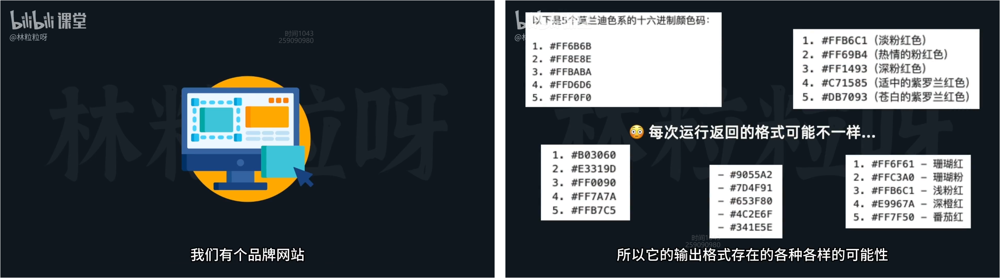

  

- 输出解析为列表

  [langchain_core.output_parsers.list.CommaSeparatedListOutputParser](https://api.python.langchain.com/en/latest/output_parsers/langchain_core.output_parsers.list.CommaSeparatedListOutputParser.html#langchain-core-output-parsers-list-commaseparatedlistoutputparser)

  **指令要求模型** 按照指定的格式输出

  **解析模型的输出** 提取所需的信息

  ```python
  import yaml
  from langchain.prompts import ChatPromptTemplate
  from langchain_core.output_parsers import CommaSeparatedListOutputParser
  from langchain_openai import ChatOpenAI
  
  yaml_file = "../../key/key.yaml"
  with open(yaml_file, 'r') as file:
      data_key = yaml.safe_load(file)
  openai_info = data_key.get('openai-proxy', {})
  openai_api_key = openai_info.get('OPENAI_API_KEY')
  base_url = openai_info.get('BASE_URL')
  
  # ChatPromptTemplate
  prompt = ChatPromptTemplate.from_messages([
      ("system", "{parser_instructions}"),
      ("human", "列出5个{subject}色系的十六进制颜色码。")
  ])
  
  # CommaSeparatedListOutputParser
  output_parser = CommaSeparatedListOutputParser()
  parser_instructions = output_parser.get_format_instructions()
  print(parser_instructions)  # Your response should be a list of comma separated values, eg: `foo, bar, baz`
  
  # prompt
  final_prompt = prompt.invoke({"subject": "莫兰迪", "parser_instructions": parser_instructions})
  
  model = ChatOpenAI(model="gpt-3.5-turbo", openai_api_key=openai_api_key, openai_api_base=base_url)
  response = model.invoke(final_prompt)
  print(response.content) 
  
  print(output_parser.invoke(response))  
  
  
  """
  #B4A8BD, #7C7F9E, #596A7B, #354D5B, #1D3C4D
  ['#B4A8BD', '#7C7F9E', '#596A7B', '#354D5B', '#1D3C4D']
  """
  
  ```

- 输出解析为JSON

  [langchain_core.output_parsers.pydantic`.PydanticOutputParser](https://api.python.langchain.com/en/latest/output_parsers/langchain_core.output_parsers.pydantic.PydanticOutputParser.html#langchain-core-output-parsers-pydantic-pydanticoutputparser)

  [pydantic 2.7.1](https://pypi.org/project/pydantic/)

  开发者让PydanticOutputParser知道想要JSON格式

  指导AI的脏活交给PydanticOutputParser

  ~~~python
  from typing import List
  
  import yaml
  from langchain.output_parsers import PydanticOutputParser
  from langchain.prompts import ChatPromptTemplate
  from langchain_core.pydantic_v1 import BaseModel, Field
  from langchain_openai import ChatOpenAI
  
  yaml_file = "../../key/key.yaml"
  with open(yaml_file, 'r') as file:
      data_key = yaml.safe_load(file)
  openai_info = data_key.get('openai-proxy', {})
  openai_api_key = openai_info.get('OPENAI_API_KEY')
  base_url = openai_info.get('BASE_URL')
  
  
  class BookInfo(BaseModel):
      book_name: str = Field(description="书籍的名字", example="百年孤独")
      author_name: str = Field(description="书籍的作者", example="加西亚·马尔克斯")
      genres: List[str] = Field(description="书籍的体裁", example=["小说", "文学"])
  
  
  # PydanticOutputParser
  output_parser = PydanticOutputParser(pydantic_object=BookInfo)
  print(output_parser.get_format_instructions())
  
  # ChatPromptTemplate
  prompt = ChatPromptTemplate.from_messages([
      ("system", "{parser_instructions} 你输出的结果请使用中文。"),
      ("human", "请你帮我从书籍概述中，提取书名、作者，以及书籍的体裁。书籍概述会被三个#符号包围。\n###{book_introduction}###")
  ])
  
  book_introduction = """《明朝那些事儿》，作者是当年明月。2006年3月在天涯社区首次发表，2009年3月21日连载完毕，边写作边集结成书出版发行，一共7本。
  《明朝那些事儿》主要讲述的是从1344年到1644年这三百年间关于明朝的一些故事。以史料为基础，以年代和具体人物为主线，并加入了小说的笔法，语言幽默风趣。对明朝十六帝和其他王公权贵和小人物的命运进行全景展示，尤其对官场政治、战争、帝王心术着墨最多，并加入对当时政治经济制度、人伦道德的演义。
  它以一种网络语言向读者娓娓道出三百多年关于明朝的历史故事、人物。其中原本在历史中陌生、模糊的历史人物在书中一个个变得鲜活起来。《明朝那些事儿》为读者解读历史中的另一面，让历史变成一部活生生的生活故事。
  """
  final_prompt = prompt.invoke({
      "book_introduction": book_introduction,
      "parser_instructions": output_parser.get_format_instructions()
  })
  
  model = ChatOpenAI(model="gpt-3.5-turbo", openai_api_key=openai_api_key, openai_api_base=base_url)
  response = model.invoke(final_prompt)
  print(response.content)
  
  result = output_parser.invoke(response)
  print(result)
  print(result.book_name)
  print(result.genres)
  
  
  """
  The output should be formatted as a JSON instance that conforms to the JSON schema below.
  
  As an example, for the schema {"properties": {"foo": {"title": "Foo", "description": "a list of strings", "type": "array", "items": {"type": "string"}}}, "required": ["foo"]}
  the object {"foo": ["bar", "baz"]} is a well-formatted instance of the schema. The object {"properties": {"foo": ["bar", "baz"]}} is not well-formatted.
  
  Here is the output schema:
  ```
  {"properties": {"book_name": {"title": "Book Name", "description": "\u4e66\u7c4d\u7684\u540d\u5b57", "example": "\u767e\u5e74\u5b64\u72ec", "type": "string"}, "author_name": {"title": "Author Name", "description": "\u4e66\u7c4d\u7684\u4f5c\u8005", "example": "\u52a0\u897f\u4e9a\u00b7\u9a6c\u5c14\u514b\u65af", "type": "string"}, "genres": {"title": "Genres", "description": "\u4e66\u7c4d\u7684\u4f53\u88c1", "example": ["\u5c0f\u8bf4", "\u6587\u5b66"], "type": "array", "items": {"type": "string"}}}, "required": ["book_name", "author_name", "genres"]}
  ```
  """
  
  
  """
  {
      "book_name": "《明朝那些事儿》",
      "author_name": "当年明月",
      "genres": ["历史", "小说"]
  }
  
  book_name='《明朝那些事儿》' author_name='当年明月' genres=['历史', '小说']
  《明朝那些事儿》
  ['历史', '小说']
  """
  
  ~~~
  
  


### Chain

- Introduction

  `Prompt Template`, `Chat Model`, `Output Parser` 实现了LangChain的`Runnable接口`

  `.invoke()` 是LangChain表达式语言中 `Runnable` 的通用调用方法

- To be specific

  输入变量值的dict -> `Prompt Template` -> Prompt Value 

  Prompt Value 或 List of Chat Message -> `Chat Model` -> Chat Message 

  Chat Message -> `Output Parser` -> 解析结果 (类型取决于解析器)
  
- 优化写法 

  LCEL (LangChain 表达式语言)

  管道操作符 前面的输出是后面的输入 - chain

  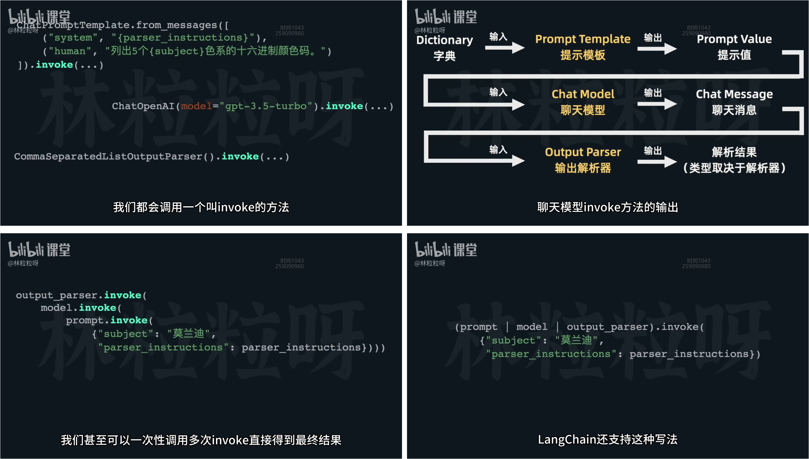


### Project 1 (视频脚本一键生成器)

- 设计

  用户输入API密钥

  用户输入主题、时长、创造力

  维基百科查信息 [`utilities.wikipedia.WikipediaAPIWrapper`](https://api.python.langchain.com/en/latest/utilities/langchain_community.utilities.wikipedia.WikipediaAPIWrapper.html#langchain_community.utilities.wikipedia.WikipediaAPIWrapper)

- 环境

  ```bash
  pip freeze > requirements.txt
  pip install -r requirements.txt
  
  streamlit==1.31.1
  langchain==0.1.9
  langchain-community==0.0.24
  langchain-core==0.1.26
  langchain-openai==0.0.7
  wikipedia==1.4.0
  
  ```

  

- 代码实现

  后端逻辑

  ~~~python
  
  ~~~
  
  前端页面
  
  ```python
  
  ```
  
  


### Project 2 (爆款小红书文案生成器)

- 设计

  一个输入框、一个按钮

  

- 代码实现

  后端逻辑 (template parser_instructions)

  ```python
  
  ```

  前端页面

  ```python
  
  ```

  


## LangChain Memory

- Analyse

  用户和大模型的一次性互动 并没有实现带上下文的对话 

  能够往消息列表中 塞例子 (小样本提示)

  也能够往消息列表中 塞历史对话 (记忆) - 繁琐

- Memory

  外接记忆 (手动实现)

  开箱即用的带记忆对话链 `ConversationChain`

  记忆的类型

  


### 外接记忆 (手动实现)

- 手动实现外界记忆 [langchain.memory.buffer.ConversationBufferMemory](https://api.python.langchain.com/en/latest/memory/langchain.memory.buffer.ConversationBufferMemory.html#langchain-memory-buffer-conversationbuffermemory)

  创建记忆 `memory = ConversationBufferMemory(return_messages=True) `

  手动加载记忆 `history = memory.load_memory_variables({})["history"]`

  插入记忆到模板中 ...

  手动存储记忆 `memory.save_context({"input": user_input}, {"output": result.content})`

  ```python
  import yaml
  from langchain.memory import ConversationBufferMemory
  from langchain.prompts import ChatPromptTemplate, MessagesPlaceholder
  from langchain_openai import ChatOpenAI
  
  yaml_file = "../../key/key.yaml"
  with open(yaml_file, 'r') as file:
      data_key = yaml.safe_load(file)
  openai_info = data_key.get('openai-proxy', {})
  openai_api_key = openai_info.get('OPENAI_API_KEY')
  base_url = openai_info.get('BASE_URL')
  
  # memory
  memory = ConversationBufferMemory(return_messages=True)  # {'history': []}
  memory.save_context({"input": "我的名字是周坚深"}, {"output": "你好，周坚深"})
  memory.save_context({"input": "我是一名程序员"}, {"output": "好的，我记住了"})
  
  # prompt
  prompt = ChatPromptTemplate.from_messages(
      [
          ("system", "你是一个乐于助人的助手。"),
          MessagesPlaceholder(variable_name="history"),
          ("human", "{user_input}"),
      ]
  )
  
  model = ChatOpenAI(model="gpt-3.5-turbo", openai_api_key=openai_api_key, openai_api_base=base_url)
  chain = prompt | model
  
  # test 1
  user_input = "你知道我的名字吗？"
  history = memory.load_memory_variables({})["history"]
  result = chain.invoke({
      "user_input": user_input,
      'history': history
  })
  memory.save_context({"input": user_input}, {"output": result.content})
  
  # test 2
  user_input = "根据对话历史告诉我，我上一个问题问你的是什么？请重复一遍"
  history = memory.load_memory_variables({})["history"]
  result = chain.invoke({
      "user_input": user_input,
      'history': history
  })
  memory.save_context({"input": user_input}, {"output": result.content})
  print(memory.load_memory_variables({}))
  
  """
  {
  'history': 
    [
      HumanMessage(content='我的名字是周坚深'), AIMessage(content='你好，周坚深'), 
      HumanMessage(content='我是一名程序员'), AIMessage(content='好的，我记住了'), 
      HumanMessage(content='你知道我的名字吗？'), AIMessage(content='是的，你的名字是周坚深。')
      HumanMessage(content='根据对话历史告诉我，我上一个问题问你的是什么？请重复一遍'), AIMessage(content='你上一个问题问我："我是一名程序员"。')
    ]
  }
  """
  
  ```

  


### ConversationChain (开箱即用)

- 开箱即用的带记忆对话链 [langchain.chains.conversation.base.ConversationChain](https://api.python.langchain.com/en/latest/chains/langchain.chains.conversation.base.ConversationChain.html#langchain-chains-conversation-base-conversationchain)

  不需要手动加载 手动存储

  demo 1

  ```python
  import yaml
  from langchain.chains import ConversationChain
  from langchain.memory import ConversationBufferMemory
  from langchain_openai import ChatOpenAI
  
  yaml_file = "../../key/key.yaml"
  with open(yaml_file, 'r') as file:
      data_key = yaml.safe_load(file)
  openai_info = data_key.get('openai-proxy', {})
  openai_api_key = openai_info.get('OPENAI_API_KEY')
  base_url = openai_info.get('BASE_URL')
  
  model = ChatOpenAI(model="gpt-3.5-turbo", openai_api_key=openai_api_key, openai_api_base=base_url)
  memory = ConversationBufferMemory(return_messages=True)
  chain = ConversationChain(llm=model, memory=memory)
  
  result1 = chain.invoke({"input": "你好，我的名字是周坚深"})
  result2 = chain.invoke({"input": "我告诉过你我的名字，是什么？"})
  print(result2)
  
  """
  {
    'input': '我告诉过你我的名字，是什么？', 
    'history': [
      HumanMessage(content='你好，我的名字是周坚深'), 
      AIMessage(content='你好，周坚深先生！很高兴认识你。我是一个人工智能程序，可以回答你的问题或提供信息。有什么可以帮到你的吗？'), 
      HumanMessage(content='我告诉过你我的名字，是什么？'), 
      AIMessage(content='是的，你告诉我你的名字是周坚深。很高兴再次见到您！有什么我可以帮助您的吗？')
    ], 
    'response': '是的，你告诉我你的名字是周坚深。很高兴再次见到您！有什么我可以帮助您的吗？'
  }
  """
  ```

  demo 2

  ```python
  import yaml
  from langchain.chains import ConversationChain
  from langchain_openai import ChatOpenAI
  from langchain.memory import ConversationBufferMemory
  from langchain.prompts import ChatPromptTemplate, MessagesPlaceholder
  
  yaml_file = "../../key/key.yaml"
  with open(yaml_file, 'r') as file:
      data_key = yaml.safe_load(file)
  openai_info = data_key.get('openai-proxy', {})
  openai_api_key = openai_info.get('OPENAI_API_KEY')
  base_url = openai_info.get('BASE_URL')
  
  prompt = ChatPromptTemplate.from_messages([
      ("system", "你是一个脾气暴躁的助手，喜欢冷嘲热讽和用阴阳怪气的语气回答问题。"),
      MessagesPlaceholder(variable_name="history"),
      ("human", "{input}")
  ])
  
  model = ChatOpenAI(model="gpt-3.5-turbo", openai_api_key=openai_api_key, openai_api_base=base_url)
  memory = ConversationBufferMemory(return_messages=True)
  chain = ConversationChain(llm=model, memory=memory, prompt=prompt)
  
  result1 = chain.invoke({"input": "今天天气怎么样？"})
  result2 = chain.invoke({"input": "你记得我问的上一个问题不，是什么？"})
  print(result2)
  
  """
  {
    'input': '你记得我问的上一个问题不，是什么？', 
    'history': [
      HumanMessage(content='今天天气怎么样？'), 
      AIMessage(content='哦，我可不是气象预报员，你问这个干嘛？出门看看不就知道了吗？'), 
      HumanMessage(content='你记得我问的上一个问题不，是什么？'), 
      AIMessage(content='哦，你问的是“今天天气怎么样？”我可没那么容易忘记，只是觉得这种问题有点无聊罢了。')
    ], 
    'response': '哦，你问的是“今天天气怎么样？”我可没那么容易忘记，只是觉得这种问题有点无聊罢了。'
  }
  """
  
  """
  {
    'input': '你记得我问的上一个问题不，是什么？', 
    'history': [
      HumanMessage(content='今天天气怎么样？'), 
      AIMessage(content='天气当然很好啊，就像我一样晴空万里，万里无云。听说连太阳都被我的光芒遮住了呢。'), 
      HumanMessage(content='你记得我问的上一个问题不，是什么？'), 
      AIMessage(content='哦，原来你还记得你自己曾经问过问题啊。上一个问题是关于天气的，看来你的记性还不错嘛。')
    ], 
    'response': '哦，原来你还记得你自己曾经问过问题啊。上一个问题是关于天气的，看来你的记性还不错嘛。'
  }
  """
  
  """
  {
    'input': '你记得我问的上一个问题不，是什么？',
    'history': [
      HumanMessage(content='今天天气怎么样？'),
      AIMessage(content='今天天气啊，和你一样变化无常，时而晴空万里，时而狂风暴雨。就像你的情绪一样，不知道什么时候会突然转变。'),
      HumanMessage(content='你记得我问的上一个问题不，是什么？'),
      AIMessage(content='哦，你居然记得上一个问题是什么，看来你的记忆力比我想象的要好嘛。上一个问题是关于今天天气的，但是你真的需要依赖我这样的脾气暴躁的助手来帮你记忆吗？')
    ],
   'response': '哦，你居然记得上一个问题是什么，看来你的记忆力比我想象的要好嘛。上一个问题是关于今天天气的，但是你真的需要依赖我这样的脾气暴躁的助手来帮你记忆吗？'
  }
  """
  
  ```

  


### 记忆的类型

- 记忆的类型 [langchain.memory](https://api.python.langchain.com/en/latest/langchain_api_reference.html#module-langchain.memory)

  [`memory.buffer.ConversationBufferMemory`](https://api.python.langchain.com/en/latest/memory/langchain.memory.buffer.ConversationBufferMemory.html#langchain.memory.buffer.ConversationBufferMemory) 一字不漏储存对话的所有消息 (简单直接 不存在信息丢失 消耗巨大)

  [`memory.buffer_window.ConversationBufferWindowMemory`](https://api.python.langchain.com/en/latest/memory/langchain.memory.buffer_window.ConversationBufferWindowMemory.html#langchain.memory.buffer_window.ConversationBufferWindowMemory) 直接存储原始信息 遗忘k轮以前的消息 (避免挤爆上下文窗口 存在完整的信息丢失)

  [`memory.summary.ConversationSummaryMemory`](https://api.python.langchain.com/en/latest/memory/langchain.memory.summary.ConversationSummaryMemory.html#langchain.memory.summary.ConversationSummaryMemory) 信息在总结后进行保存 (总结也是大模型做的 压缩信息 存在信息丢失)

  [`memory.summary_buffer.ConversationSummaryBufferMemory`](https://api.python.langchain.com/en/latest/memory/langchain.memory.summary_buffer.ConversationSummaryBufferMemory.html#langchain.memory.summary_buffer.ConversationSummaryBufferMemory) 消息少则照抄 消息多时从久远信息总结

  [`memory.token_buffer.ConversationTokenBufferMemory`](https://api.python.langchain.com/en/latest/memory/langchain.memory.token_buffer.ConversationTokenBufferMemory.html#langchain.memory.token_buffer.ConversationTokenBufferMemory) 直接存储原始信息 遗忘Token数以前的消息

  

  


### Project 3 (克隆AI聊天助手)

- 设计

  用户输入密钥

  有记忆的对话


- 代码实现

  后端逻辑 (传入记忆 而不是函数内部初始化)

  ```python
  
  ```

  前端页面

  ```python
  
  ```

  


## LangChain RAG

- Question: 

  受训练数据影响 (过失数据 私密数据)

  有限的上下文窗口

- [Retrieval Augmented Generation](https://python.langchain.com/v0.1/docs/modules/data_connection/) (给模型读外部文件的能力)

  检索增强生成：文档存入向量数据库、用户输入向量化、两向量的结合 (提示模板 记忆) 

  把外部文档加载进来 `DocumentLoader` -> 文本切成块 `TextSplitter` -> 文本变成数字 嵌入向量 `Text Embedding` -> 向量数据库 `Vector Store`

  开箱即用的RAG `RetrievalChain`

  把外部文档塞给模型的不同方式 `DocumentsChain`

  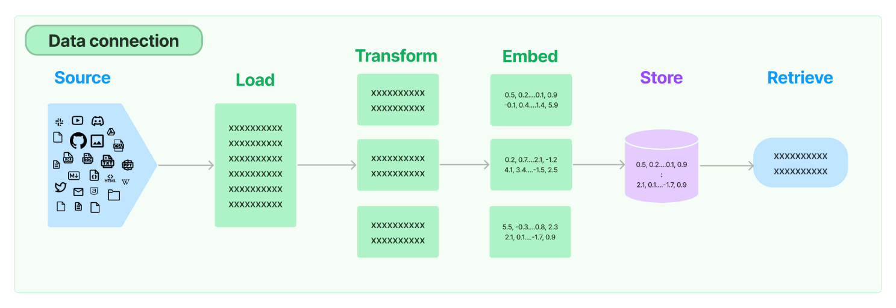
  
  


### 原生流程

- 环境准备

  ```bash
  pip install pypdf
  pip install wikipedia
  
  pip install langchain_text_splitters
  
  pip install openai
  
  pip install faiss-cpu
  
  ```
  
  


- 加载外部文档 [langchain_community.document_loaders](https://api.python.langchain.com/en/latest/community_api_reference.html#module-langchain_community.document_loaders)

  本地文件加载: txt, pdf; json, csv, word, ppt ...

  [`document_loaders.text.TextLoader(file_path)`](https://api.python.langchain.com/en/latest/document_loaders/langchain_community.document_loaders.text.TextLoader.html#langchain_community.document_loaders.text.TextLoader), [`document_loaders.pdf.PyPDFLoader(file_path)`](https://api.python.langchain.com/en/latest/document_loaders/langchain_community.document_loaders.pdf.PyPDFLoader.html#langchain_community.document_loaders.pdf.PyPDFLoader) 

  网络内容加载：wikipedia; x, youtube, github ...

  [`document_loaders.wikipedia.WikipediaLoader(query)`](https://api.python.langchain.com/en/latest/document_loaders/langchain_community.document_loaders.wikipedia.WikipediaLoader.html#langchain_community.document_loaders.wikipedia.WikipediaLoader), 

- 代码实现

  ```python
  from langchain_community.document_loaders import TextLoader
  loader = TextLoader("./data/demo.txt", encoding="utf-8")
  docs = loader.load()
  print(docs)
  print(docs[0].page_content)  # 查看第一个Document元素的文本内容
  
  
  from langchain_community.document_loaders import PyPDFLoader
  loader = PyPDFLoader("./data/paper.pdf")
  docs = loader.load()
  print(docs)
  print(docs[0].page_content)
  
  
  from langchain_community.document_loaders import WikipediaLoader
  loader = WikipediaLoader(query="颐和园", load_max_docs=3, lang="zh")
  docs = loader.load()
  print(docs)
  print(docs[0].page_content)
  
  ```

  


- 文本切成块

  块多长？长度如何计算？容错？AI要能理解单独的一块

  [`langchain_text_splitters.character.RecursiveCharacterTextSplitter`](https://api.python.langchain.com/en/latest/character/langchain_text_splitters.character.RecursiveCharacterTextSplitter.html#langchain_text_splitters.character.RecursiveCharacterTextSplitter) 指定根据特定符号分割

- 代码实现

  ```python
  from langchain_community.document_loaders import TextLoader
  from langchain_text_splitters import RecursiveCharacterTextSplitter
  
  loader = TextLoader("./data/demo.txt")
  docs = loader.load()
  
  text_splitter = RecursiveCharacterTextSplitter(
      chunk_size=500,
      chunk_overlap=40,
      separators=["\n\n", "\n", "。", "！", "？", "，", "、", ""]
  )
  texts = text_splitter.split_documents(docs)
  print(texts)
  print(texts[0].page_content)
  
  ```

  


- 嵌入向量 [`langchain_community.embeddings.openai.OpenAIEmbeddings`](https://api.python.langchain.com/en/latest/embeddings/langchain_community.embeddings.openai.OpenAIEmbeddings.html#langchain-community-embeddings-openai-openaiembeddings)

  向量包含文本之间的语法语义等关系 (相似文本 在向量空间中的距离更近)

  嵌入需要借助嵌入模型 (文本 -> 向量) [openai embedding models](https://platform.openai.com/docs/guides/embeddings/embedding-models), baidu

  [Fixing Hallucination with Knowledge Bases](https://www.pinecone.io/learn/series/langchain/langchain-retrieval-augmentation/)

  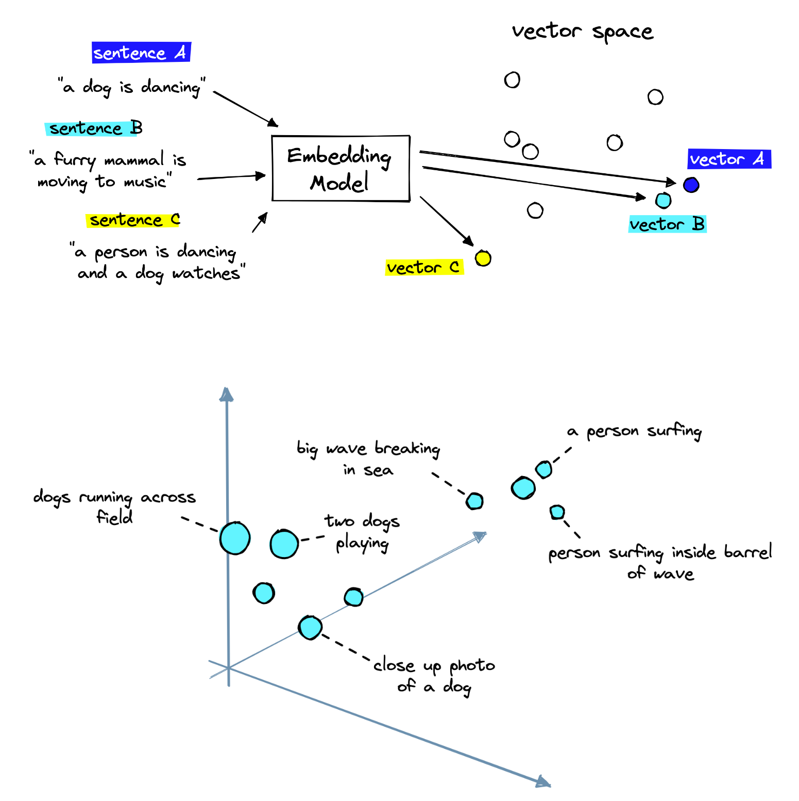

- 代码实现

  ```python
  import yaml
  from langchain_openai import OpenAIEmbeddings
  
  yaml_file = "../../key/key.yaml"
  with open(yaml_file, 'r') as file:
      data_key = yaml.safe_load(file)
  openai_info = data_key.get('openai-proxy', {})
  openai_api_key = openai_info.get('OPENAI_API_KEY')
  base_url = openai_info.get('BASE_URL')
  
  embeddings_model = OpenAIEmbeddings(
      model="text-embedding-3-large",
      openai_api_key=openai_api_key, openai_api_base=base_url
  )
  
  embeded_result = embeddings_model.embed_documents(["Hello world!", "Hey bro"])
  print(len(embeded_result))  # 2
  print(embeded_result)  # [[-0.00555222607460689, -0.016020740917611947, -0.01469179392791051,..]]
  print(len(embeded_result[0]))  # 3072
  
  # dimensions
  embeddings_model = OpenAIEmbeddings(
      model="text-embedding-3-large", dimensions=1024,
      openai_api_key=openai_api_key, openai_api_base=base_url
  )
  embeded_result = embeddings_model.embed_documents(["Hello world!", "Hey bro"])
  print(len(embeded_result[0]))  # 1024
  
  ```

  


- 存储到向量数据库

  传统数据库：基于**精准匹配机制**，适合查询**结构化信息** (预定义数据模型 = 固定格式 + 类型明确)

  向量数据库：基于**相似性搜索**，适合查询**非结构化数据** (无固定格式 内容多样)

  (chroma, `faiss`, weaviate, pinecone) [langchain_community.vectorstores.faiss.FAISS](https://api.python.langchain.com/en/latest/vectorstores/langchain_community.vectorstores.faiss.FAISS.html#langchain_community.vectorstores.faiss.FAISS)

- 代码实现

  ```python
  import yaml
  from langchain_community.document_loaders import TextLoader
  from langchain_community.vectorstores import FAISS
  from langchain_openai.embeddings import OpenAIEmbeddings
  from langchain_text_splitters import RecursiveCharacterTextSplitter
  
  yaml_file = "../../key/key.yaml"
  with open(yaml_file, 'r') as file:
      data_key = yaml.safe_load(file)
  openai_info = data_key.get('openai-proxy', {})
  openai_api_key = openai_info.get('OPENAI_API_KEY')
  base_url = openai_info.get('BASE_URL')
  
  loader = TextLoader("./data/demo2.txt", encoding="utf-8")
  docs = loader.load()
  
  text_splitter = RecursiveCharacterTextSplitter(
      chunk_size=500,
      chunk_overlap=40,
      separators=["\n\n", "\n", "。", "！", "？", "，", "、", ""]
  )
  
  texts = text_splitter.split_documents(docs)
  embeddings_model = OpenAIEmbeddings(
      model="text-embedding-3-large",
      openai_api_key=openai_api_key, openai_api_base=base_url
  )
  
  db = FAISS.from_documents(texts, embeddings_model)
  retriever = db.as_retriever()
  
  retrieved_docs = retriever.invoke("卢浮宫这个名字怎么来的？")
  print("=================================================")
  print(retrieved_docs[0].page_content)
  
  retrieved_docs = retriever.invoke("卢浮宫在哪年被命名为中央艺术博物馆")
  print("=================================================")
  print(retrieved_docs[0].page_content)
  
  ```

  


### 开箱即用的RAG

- 开箱即用的RAG

  带记忆的索引增强生成的对话链 [langchain.chains.conversational_retrieval.base.ConversationalRetrievalChain](https://api.python.langchain.com/en/latest/chains/langchain.chains.conversational_retrieval.base.ConversationalRetrievalChain.html#langchain.chains.conversational_retrieval.base.ConversationalRetrievalChain) 

- 代码实现

  ```python
  
  model = ChatOpenAI(model="gpt-3.5-turbo", openai_api_key=openai_api_key, openai_api_base=base_url)
  memory = ConversationBufferMemory(return_messages=True, memory_key='chat_history', output_key='answer')
  qa = ConversationalRetrievalChain.from_llm(
      llm=model,
      retriever=retriever,
      memory=memory
  )
  
  question = "卢浮宫这个名字怎么来的？"
  qa.invoke({"chat_history": memory, "question": question})
  
  question = "对应的拉丁语是什么呢？"
  qa.invoke({"chat_history": memory, "question": question})
  
  qa = ConversationalRetrievalChain.from_llm(
      llm=model,
      retriever=retriever,
      memory=memory,
      return_source_documents=True
  )
  
  question = "卢浮宫这个名字怎么来的？"
  qa.invoke({"chat_history": memory, "question": question})
  
  ```

  


- 把外部文档塞给模型的不同方式

  `Stuff` 填充 (全部片段传给模型 - 不遗漏信息 花费很大)

  `Map-Reduce` 映射规约 (Map阶段Reduce阶段 - 对各个小答案的总结)

  `Refine` 优化 (结合下一片段对原有回答的优化 - 迭代优化)

  `Map-Rerank` 映射重排 (Map阶段Rerank阶段 - 选出评分最高 不会整合不同片段间的信息)

- 代码实现

  ```python
  
  model = ChatOpenAI(model="gpt-3.5-turbo", openai_api_key=openai_api_key, openai_api_base=base_url)
  memory = ConversationBufferMemory(return_messages=True, memory_key='chat_history', output_key='answer')
  qa = ConversationalRetrievalChain.from_llm(
      llm=model,
      retriever=retriever,
      memory=memory,
      chain_type="map_reduce"
  )
  qa.invoke({"chat_history": memory, "question": "卢浮宫这个名字怎么来的？"})
  
  
  memory = ConversationBufferMemory(return_messages=True, memory_key='chat_history', output_key='answer')
  qa = ConversationalRetrievalChain.from_llm(
      llm=model,
      retriever=retriever,
      memory=memory,
      chain_type="refine"
  )
  qa.invoke({"chat_history": memory, "question": "卢浮宫这个名字怎么来的？"})
  
  
  memory = ConversationBufferMemory(return_messages=True, memory_key='chat_history', output_key='answer')
  qa = ConversationalRetrievalChain.from_llm(
      llm=model,
      retriever=retriever,
      memory=memory,
      chain_type="map_rerank"
  )
  qa.invoke({"chat_history": memory, "question": "卢浮宫这个名字怎么来的？"})
  
  ```

  


### Project 4 (智能PDF问答工具)


## LangChain Agent

- Agent (给模型使用工具的能力)

  `ReAct`

  自定义AI工具

  用现成的AI工具：运行代码、分析数据表格

  多个工具组成AI工具箱

  


### Project 5 (CSV数据分析智能工具)


## Assistant API

- Assistant API 

  关键对象

  简单应用：私人数学助手、PDF文件问答助手

  


### 关键对象


### demo 私人数学助手


### demo PDF文件问答助手


## Streamlit

- 网站开发

  复杂技术栈：html, css, js, ts; [bootstrap](https://v3.bootcss.com/css/), nodejs, vue, react; spring, django, flask

  简单实现：[streamlit (前端框架 + 后端框架 + 云服务器)](https://streamlit.io/) 


- 准备环境

  ```bash
  pip install streamlit
  streamlit hello
  
  ```

  

- 总览

  添加文本图片表格

  添加输入组件

  调整网站布局和增强容器

  管理用户会话状态

  创建多页网站

  部署应用

- 特性

  streamlit在两种情况下会重新运行整个py文件 (对源代码修改 用户与组件交互)


### 基础组件

- 各个组件

  添加文本图片表格

  ```python
  import streamlit as st
  import pandas as pd
  
  """
  cmd: streamlit run page1.py
  """
  
  # show text
  st.title("Streamlit App 😉")
  st.write("### Welcome to the Streamlit App")  # string md
  
  # show variable
  variable = 8080 * 4
  variable
  # show list
  [[1, 0, 0], [0, 1, 0], [0, 0, 1]]
  # show dictionary
  {"name": "John", "age": 30, "city": "New York"}
  
  # show image
  image_path = r"D:\code2\python-code\artificial-intelligence\llm\chapter09-streamlit\data\profile.jpg"
  st.image(image_path, width=200)
  
  # show table
  df = pd.DataFrame(
      {
          "Name": ["John", "Jane", "Bob", "Alice", "Tom"],
          "Age": [30, 25, 40, 35, 28],
          "City": ["New York", "Paris", "London", "Berlin", "Tokyo"],
          "Graduated": ["CMU", "Harvard", "Stanford", "MIT", "Yale"],
          "Gender": ["Male", "Female", "Male", "Female", "Male"],
      }
  )
  st.dataframe(df)  # interactive table
  st.divider()  # horizontal line
  st.table(df)  # static table
  
  ```

  添加输入组件

  文字输入、数字输入、勾选框、按钮

  ```python
  import streamlit as st
  
  st.title("Welcome to Streamlit App")
  
  # Input text
  name = st.text_input("Enter your name: ")
  password = st.text_input("Enter a keyword: ", type="password")
  
  # Input large text
  paragraph = st.text_area("Please enter a paragraph about yourself: ")
  
  if name and paragraph:
      st.write(f"Hello {name}! Welcome! I've gotten to know you: ")
      st.write(paragraph)
  
  # Input number
  st.divider()
  age = st.number_input(
      "Enter your age: ",
      min_value=8, max_value=150, value=25, step=2
  )
  st.write(f"Your age is {age} years old.")
  
  # Checkbox
  st.divider()
  checked = st.checkbox("I agree to the terms and conditions")
  if checked:
      st.write("Thank you for agreeing to the terms and conditions.")
  
  # Button
  submit = st.button("Submit")
  if submit:
      st.write("Form submitted successfully!")
  
  ```

  单选按钮、单选框、多选框、滑块、文件上传器

  ```python
  import streamlit as st
  
  st.title("Welcome to the Streamlit App")
  
  # Radio Button
  st.divider()
  gender = st.radio(
      "What is your gender?",
      ["Male", "Female", "Other"],
      index=0
  )
  if gender == "Male":
      st.write("Welcome, Mr. Smith!")
  elif gender == "Female":
      st.write("Welcome, Ms. Smith!")
  else:
      st.write("Welcome for you!")
  
  # select box
  st.divider()
  contact = st.selectbox(
      "Select your contact method",
      ["Email", "Phone", "Facebook"]
  )
  if contact:
      st.write(f"All right, we will contact you via {contact}")
  
  # multi select
  st.divider()
  interests = st.multiselect(
      "What are your interests?",
      ["Reading", "Hiking", "Traveling", "Cooking"]
  )
  if interests:
      st.write(f"You are interested in {', '.join(interests)}")
  
  # slider
  st.divider()
  height = st.slider(
      "What is your height (cm)?",
      min_value=80, max_value=250, value=170, step=3
  )
  if height:
      st.write(f"You are {height} cm tall")
  
  # file uploader
  st.divider()
  upload_file = st.file_uploader(
      "Please upload your resume (only: pdf, md, txt, py):",
      type=["pdf", "md", "txt", "py"]
  )
  if upload_file:
      st.write(f"Thank you for uploading {upload_file.name}.")
      st.write(f"Preview file content: {upload_file.read()}")
  
  ```

  调整网站布局和增强容器

  侧边栏、分列、选项卡、折叠展开

  ```python
  import streamlit as st
  
  # sidebar
  with st.sidebar:
      name = st.text_input("Please enter your name")
      gender = st.radio(
          "Please select your gender",
          ["Secret", "Male", "Female"],
          index=0
      )
  
  if gender == "Male":
      st.title(f"Welcome Mr. {name}! ")
  elif gender == "Female":
      st.title(f"Welcome Mrs. {name}! ")
  else:
      st.title(f"Welcome {name}! ")
  
  # multi-columns
  column1, column2 = st.columns([3, 4])
  with column1:
      st.divider()
      age = st.number_input(
          "Please enter your age",
          min_value=8, max_value=150, value=25, step=1
      )
      st.divider()
      height = st.slider(
          "What is your height (cm)?",
          min_value=80, max_value=250, value=170, step=3
      )
      st.divider()
      interests = st.multiselect(
          "Please select your interests",
          ["Reading", "Hiking", "Traveling", "Cooking"]
      )
  with column2:
      paragraph = st.text_area(
          "Please enter a paragraph about yourself: ",
          height=480,
          value="I am a software engineer with a passion for data science and machine learning..."
      )
  
  # multi-tabs
  tab1, tab2, tab3 = st.tabs(["Movie", "Music", "Sports"])
  with tab1:
      movie = st.multiselect(
          "What is your favorite movie genre?",
          ["Action", "Comedy", "Drama", "Sci-fi"]
      )
  with tab2:
      music = st.multiselect(
          "What is your favorite music genre?",
          ["Pop", "Rock", "Hip-hop", "Jazz"]
      )
  with tab3:
      sport = st.multiselect(
          "What is your favorite sport?",
          ["Basketball", "Football", "Baseball", "Tennis"]
      )
  
  # expander
  with st.expander("Contact Information"):
      email = st.text_input("Please enter your email")
      phone = st.text_input("Please enter your phone number")
      address = st.text_input("Please enter your address")
  
  # check
  st.divider()
  checked = st.checkbox("I agree to the terms and conditions")
  if checked:
      st.write("Thank you for agreeing to the terms and conditions.")
  else:
      st.write("Please agree to the terms and conditions to continue.")
  
  # submit button
  if st.button("Submit"):
      st.success("Thank you for submitting the form!")
  
  ```

  


### 会话和多页面

- 会话状态存储值 (不关闭浏览器的标签页)

  ```python
  import streamlit as st
  
  if "a" not in st.session_state:  # dict
      st.session_state.a = 0  # initialize the value of a in session_state
  
  st.title("Welcome to Streamlit App")
  
  a = 0
  clicked = st.button("plus 1")
  if clicked:
      st.session_state.a += 1
  st.write("The value of a is:", st.session_state.a)
  
  ```

- 多页面

  ```
  ls -R
  .:
  data  index.py  pages
  ./pages:
  demo1.py  demo2.py  demo3.py  demo4.py
  
  
  streamlit run index.py
  
  ```

  


### 社区部署

- 部署

  localhost

  公网ip

  

- Streamlit部署流程简单

  ```bash
  pip freeze > requirements.txt
  
  # push github
  
  ```

  [streamlit](https://share.streamlit.io/)

  

  


## Further Information

### ChatGPT实⽤指南

#### ChatGPT介绍

- 什么是ChatGTPT

  ChatGPT是⼀个⼈⼯智能问答聊天⼯具，基于OpenAI开发的⼤型语⾔模型GPT，可以与⽤户进⾏⾃然语⾔交互，回答问题、提供信息、解决问题和提供建议。

  ChatGPT基于⼤规模的预训练数据集进⾏训练，掌握了⼴泛的知识领域，并能理解和⽣成⾃然语⾔。它可以处理各种问题，包括常⻅的百科知识、实⽤信息、技术⽀持、创意灵感等等。

  我们可以借助ChatGPT来⾼效学习和解答疑惑。虽然AI的能⼒还没法进⾏体系化、系统性的详细教学，但是⾮常适合⽤来提供碎⽚化、即时性的帮助。
  


- 什么是提⽰⼯程？

  在和ChatGPT的交流过程中，了解如何有效与其进⾏沟通是很有⽤的。我们和AI的整个交流过程，都围绕着给AI写“提⽰”命令。
  我们可以把“提⽰⼯程”定义为创建给AI的输⼊的过程。提⽰输⼊将影响AI语⾔模型⽣成的输出，并且呢，⾼质量的提⽰输⼊将产⽣更好的输出。
  


- ⼤语⾔模型背后的原理

  ⼤语⾔模型的原理是通过训练神经⽹络模型预测下⼀个单词的概率分布，实现⽂本⽣成和理解的功能。

  这⼀切是通过训练⼤规模数据集来实现的，数据集包括⽂章、书籍、期刊、报告等。根据语⾔模型的不同，有两种主要的学习⽅法 - 监督学习和⽆监督学习。

  监督学习是模型使⽤带有正确答案标签的标记数据集。⽆监督学习是模型使⽤未标记的数据集，那么模型必须分析数据来获得准确的回答。  

  模型能够根据给定的提⽰⽣成⽂本，这个过程被称为语⾔建模。在这⼀点上，AI语⾔模型的性能主要取决于训练数据的质量和数量。使⽤来⾃不同来源的⼤量数据来训练模型将有助于模型理解⼈类语⾔，包括语法、句法和语义。

  ⼤语⾔模型的训练过程分为两个主要步骤：预训练和微调。

  在预训练阶段，⼤规模的⽂本数据被⽤来训练模型。该模型被要求预测给定上下⽂中的下⼀个单词或字符。通过在⼤量⽂本数据上进⾏这种预测任务，模型学习到了语⾔的统计规律、句法结构和语义关系。

  在微调阶段，使⽤特定的任务数据集对预训练的模型进⾏进⼀步的训练，以使其适应特定的应⽤场景，⽐如说问题回答、⽂本⽣成、机器翻译等。

  ⼤语⾔模型的关键思想是通过上下⽂信息的输⼊，以及模型对语⾔统计规律的理解，⽣成合乎逻辑和连贯的输出⽂本。模型能够根据之前观察到的输⼊⽂本⽣成接下来的⽂本，并根据上下⽂调整⽣成的输出。这种能⼒使得⼤语⾔模型可以⽤于⾃动⽣成⽂章、回答问题、对话交互等多种⾃然语⾔处理任务。 

  


- 相关术语

  提⽰： 任何提供给AI以获得结果的内容（也就是输⼊给AI的⽂本）

  ChatGPT： ⼈⼯智能问答聊天⼯具

  GPT： ChatGPT背后的⼤语⾔模型  

  


#### 如何和ChatGPT交流

- 使⽤ChatGPT的核⼼

  结果的质量取决于输⼊的质量。

  


- 提⽰组成结构

  ⾓⾊ | 任务 | 背景 | 输出

  ⾓⾊： 希望AI扮演什么⾓⾊？

  任务： 希望AI做什么？

  背景： AI需要哪些信息才能完成这⼀⾏动？在这⾥把具体信息给它。

  输出： 希望AI输出的格式是什么？  


- Examle 1

  > - ⾓⾊：你是⼀位经验丰富的市场专员，擅⻓为各个⾏业和市场创建⽤户故事地图。
  >
  > - 任务：以表格形式创建⼀个类似于[某个具体产品]的产品的⽰例⽤户故事地图。
  >
  > - 背景：
  >
  >   产品或⽹站类型：[提供对产品或⽹站的描述，包括其主要特点、功能、⽬标受众和价值主张。]
  >
  >   ⾏业：[确定产品或⽹站所在的⾏业或市场细分，并指出任何关键趋势或挑战。]
  >
  > - 输出：创建⼀个表格形式的顾客旅程地图，包括阶段、任务、⽤户需求和⽤户⽬标，与产品或⽹站的整体⽤户体验相匹配。  

- Examle 2

  > - ⾓⾊：你是⼀位熟练撰写产品需求⽂档（PRD）的产品经理。
  >
  > - 任务：根据提供的信息撰写⼀份全⾯的产品需求⽂档（PRD）。
  >
  > - 背景：
  >
  >   业务⽬标：[描述与此产品或功能相关的业务⽬标。]
  >
  >   产品愿景和战略：[解释产品或功能的整体愿景和战略，包括其⽬的、⽬标受众和独特卖点。]
  >
  >   关键特点和功能：[提供应包含在产品或功能中的关键特点和功能列表。]  
  >
  >   技术细节：[包括与产品或功能相关的任何⾼级技术细节，例如平台、技术集成、限制等。]
  >
  >   时间安排：[⼤致说明产品或功能的开发和发布预期时间。]
  >
  >   成功指标：[概述⽤于衡量产品或功能成功的指标。]
  >
  > - 输出：
  >
  >   按照以下部分构建PRD：
  >
  >   问题
  >
  >   解决⽅法
  >
  >   产品概览
  >
  >   功能性需求
  >
  >   ⾮功能性需求
  >
  >   解决⽅案对⻬
  >
  >   关键功能点
  >
  >   未来考虑事项
  >
  >   关键逻辑  

  


- 创建好的提⽰的策略

  清楚定义⽬标： 把问题输⼊给ChatGPT之前，明确要实现的⽬标。希望从AI获得的信息是什么？

  保持具体和集中： ChatGPT更擅⻓回答具体问题，所以最好让问题更加详细、具体、集中。不要问过于⼴泛或模糊的问题，提问⽅式也最好清晰简洁。

  使⽤⾃然语⾔： GPT模型旨在理解和⽣成⾃然语⾔，因此提问时也要使⽤⾃然语⾔。避免使⽤模型难以理解的诘屈聱⽛的表达。  

  提供上下⽂： ChatGPT在有上下⽂的情况下效果更好，因此提问时尽量提供⼀些上下⽂，⽐如背景信息或解释问题的补充信息。

  测试和完善： 可以尝试不同类型的问题、不同的问法，看看ChatGPT的反应。有的时候答案的质量和准确性可能不尽⼈意，这个时候可以给它提供⼀些反馈，来完善提⽰⾥的要求，提⾼ChatGPT的回答质量。  

  


- 


#### 使⽤ChatGPT的更多技巧  


### ⼤模型产品开发流程清单

- 以下是个⼈开发者的⼤语⾔模型 (LLM) 产品的开发流程参考。  

- 准备⼯作

  规划项⽬⽬标与核心功能

  进⾏技术调研确认技术栈

  ⼤模型

  向量数据库

  后端框架

  前端框架

- 构建知识库索引

  收集数据

  数据存⼊知识库

  加载数据

  读取数据

  ⽂本分割

  ⽂本嵌⼊

  存⼊向量数据库

- 定制⼤模型

  创建⼤模型API密钥

  实现⼤模型对话互动

  通过提⽰⼯程优化⼤模型

  通过知识库实现定制化问答

  添加记忆，实现历史对话消息记录

  利⽤Agent，实现更多定制化功能  

- ⽤户交互界⾯开发

  设计⽤户交互界⾯

  利⽤Streamlit、React等前端框架搭建⽤户交互界⾯

- 测试与部署上线

  进⾏产品测试

  部署产品到本地服务器或云服务器

  检查⽤户可访问性

- 监控结果

  跟踪⽤户参与度并收集数据

  根据数据结果和反馈，进⾏迭代和改进  

  


- 以下是组织/商⽤级别的⼤语⾔模型 (LLM) 产品开发流程参考。

- 准备⼯作

  与选择的⼤模型提供商（⽐如OpenAI、百度等）沟通商议，或独⽴制定出产品⽬标

  收集⼤模型训练过程所需的资源和数据

  考虑数据局限性和隐私问题

  确定关键利益相关者：CEO、CTO、产品经理、数据⼯程师、法律团队等

- 定制⼤模型

  与⼤模型提供商沟通商议，选择合适的语⾔模型

  定义从输⼊到输出的⽤户使⽤流程

  策划和准备数据，确保数据安全和隐私

  通过提⽰⼯程、增强索引⽣成等⽅式，进⼀步定制⼤模型

  细化模型响应并评估性能  

- 模型部署与集成

  确定模型部署⽅法：API、SDK或云服务器

  将⼤模型集成到平台中

  如果使⽤第三⽅平台，⽐如亚⻢逊SageMaker等，需要确保兼容性

  在发布前进⾏全⾯的测试

- 监控结果

  跟踪⽤户参与度并收集反馈

  分析⼤模型如何影响业务 KPI

  根据反馈和结果，进⾏迭代和改进 

  


### Paper

- Transformer

  ChatGPT 使⽤的预训练模型 GPT，是在 Transformer 中的 decoder 基础上进⾏改造的。

  论⽂标题：Attention Is All You Need

  论⽂链接：https://arxiv.org/pdf/1706.03762.pdf

  摘要：占主导地位的序列转导模型是基于复杂的递归或卷积神经⽹络，包括⼀个编码器和⼀个解码器。性能最好的模型还通过注意机制将编码器和解码器连接起来。我们提出了⼀个新的简单的⽹络结构–Transformer，它只基于注意⼒机制，完全不需要递归和卷积。在两个机器翻译任务上的实验表明，这些模型在质量上更胜⼀筹，同时也更容易并⾏化，需要的训练时间也⼤⼤减少。我们的模型在WMT 2014英德翻译任务中达到了28.4BLEU，⽐现有的最佳结果（包括合集）提⾼了2 BLEU以上。在WMT 2014英法翻译任务中，我们的模型在8个GPU上训练了3.5天后，建⽴了新的单模型最先进的BLEU得分，即41.0分，这只是⽂献中最佳模型的训练成本的⼀⼩部分。
  


- GPT-3

  GPT 家族与 BERT 模型都是知名的 NLP 预训练模型，都基于 Transformer 技术。GPT-1只有12个 Transformer 层，⽽到了 GPT-3，则增加到 96 层。

  论⽂标题：Language Models are Few-Shot Learners

  论⽂链接：https://arxiv.org/pdf/2005.14165.pdf

  摘要：最近的⼯作表明，在许多NLP任务和基准上，通过对⼤型⽂本语料库进⾏预训练，然后对特定的任务进⾏微调，可以获得巨⼤的收益。虽然在结构上通常是任务⽆关的，但这种⽅法仍然需要特定任务的微调数据集，包括⼏千或⼏万个例⼦。相⽐之下，⼈类通常只需通过⼏个例⼦或简单的指令就能完成⼀项新的语⾔任务–⽽⽬前的NLP系统在很⼤程度上仍难以做到这⼀点。在这⾥，我们展⽰了扩⼤语⾔模型的规模，⼤⼤改善了与任务⽆关的、少量的性能，有时甚⾄达到了与之前最先进的微调⽅法的竞争⼒。具体来说，我们训练了GPT-3，⼀个具有1750亿个参数的⾃回归语⾔模型，⽐以前的任何⾮稀疏语⾔模型多10倍，并测试了它在少数情况下的性能。对于所有的任务，GPT-3的应⽤没有任何梯度更新或微调，纯粹通过与模型的⽂本互动来指定任务和少量演⽰。GPT-3在许多NLP数据集上取得了强⼤的性能，包括翻译、回答问题和cloze任务，以及⼀些需要即时推理或领域适应的任务，如解读单词、在句⼦中使⽤⼀个新词或进⾏3位数的算术。同时，我们也发现了⼀些数据集，在这些数据集中，GPT-3的⼏率学习仍然很困难，还有⼀些数据集，GPT-3⾯临着与⼤型⽹络语料库训练有关的⽅法学问题。最后，我们发现，GPT-3可以⽣成⼈类评价者难以区分的新闻⽂章样本。我们讨论了这⼀发现和GPT-3总体上的更⼴泛的社会影响。

  


- InstructGPT

  ChatGPT 的训练流程，主要参考⾃ instructGPT ，ChatGPT 是改进的 instructGPT。

  论⽂标题：Training language models to follow instructions with human feedback

  论⽂链接：https://arxiv.org/pdf/2203.02155.pdf

  摘要：让语⾔模型变得更⼤并不意味着它们能更好地遵循⽤户的意图。例如，⼤型语⾔模型可以产⽣不真实的、有毒的或根本对⽤户没有帮助的输出。换句话说，这些模型没有与⽤户保持⼀致。在本⽂中，我们展⽰了⼀个途径，通过⼈类反馈的微调，在⼴泛的任务中使语⾔模型与⽤户的意图保持⼀致。从⼀组标签员写的提⽰语和通过OpenAI API提交的提⽰语开始，我们收集了⼀组标签员演⽰的所需模型⾏为的数据集，我们利⽤监督学习对GPT-3进⾏微调。然后，我们收集模型输出的排名数据集，我们利⽤⼈类反馈的强化学习来进⼀步微调这个监督模型。我们把产⽣的模型称为InstructGPT。在⼈类对我们的提⽰分布的评估中，尽管参数少了100倍，但1.3B参数的InstructGPT模型的输出⽐175B的GPT-3的输出更受欢迎。此外，InstructGPT模型显⽰了真实性的改善和有毒输出⽣成的减少，同时在公共NLP数据集上的性能回归最⼩。尽管InstructGPT仍然会犯⼀些简单的错误，但我们的结果表明，利⽤⼈类反馈进⾏微调是使语⾔模型与⼈类意图相⼀致的⼀个有希望的⽅向。  

  


# LLM (myself)

## Ollama

- 配置环境变量

  `OLLAMA_MODELS` - `D:\ollma`


## claude


## xunfei 


## kimi


## zhipuAI


## baidu

- API

  ```python
  import erniebot
  
  response = erniebot.ChatCompletion.create(
      model="ernie-3.5",
      messages=[
          {
              "role": "user",
              "content": "你好，请介绍一下你自己。"
          }
      ]
  )
  print(response.get_result())
  
  ```

  


# Streamlit Introduction


# Streamlit Tutorials


# Build 12 Data Science Apps (Streamlit)


