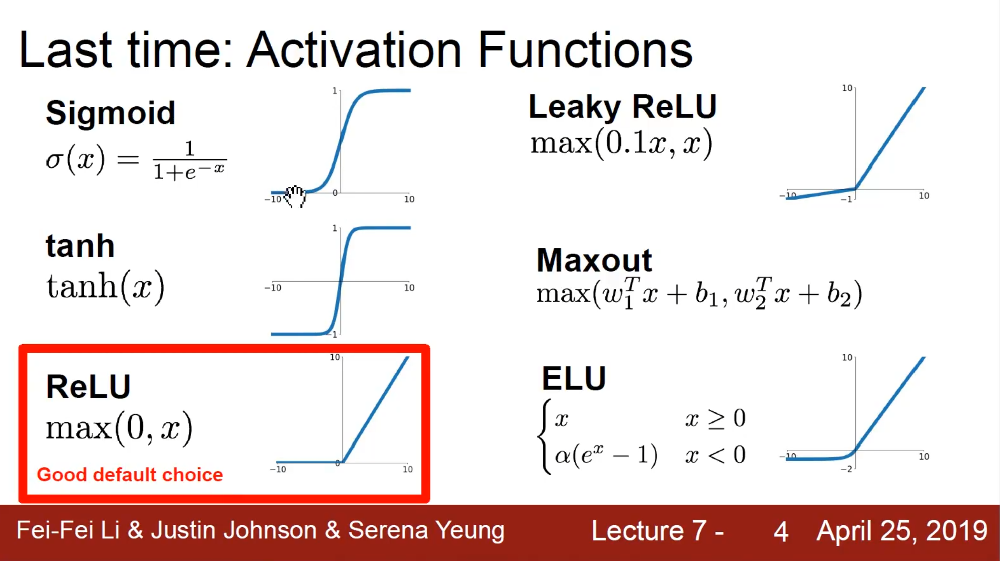
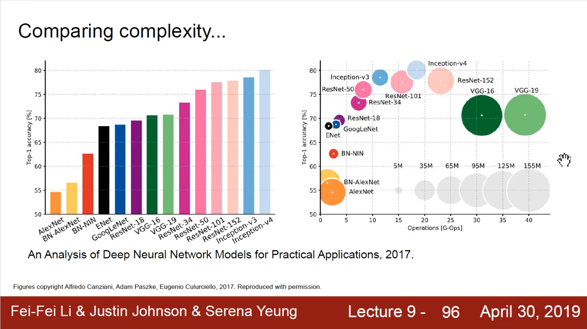

# deep-learning-tensorflow

- Reference - org

  [tensorflow zh](https://www.tensorflow.org/?hl=zh-cn), [tensorflow api docs (python)](https://www.tensorflow.org/api_docs/python/tf), 

  [keras](https://keras.io/), [keras zh](https://keras-zh.readthedocs.io/), 

- Reference - note

  [A Concise Handbook of TensorFlow 2](https://tf.wiki/), 

- Reference - blog

  [tensoflow版本搭配](https://tensorflow.google.cn/install/source_windows?hl=en#gpu)

- Reference - course

  [tensorflow2 long](https://www.bilibili.com/video/BV1G341187tH/), 


- 定位

  API调用工程师、一点点的原理


# tensorflow (org)

## Prepare the environment

- Env

  Local: conda, docker

  Online: Google Colab


- conda

  ```bash
  conda create -n py38tfg4 python=3.8
  conda activate py38tfg4
  
  conda install cudatoolkit=11.3
  conda install cudnn=8.2.1
  pip install tensorflow==2.7.0
  
  pip install --upgrade protobuf
  pip install protobuf==3.20.0
  
  conda install pillow
  conda install scikit-learn
  conda install scipy
  pip install chardet
  
  ```

- docker

  ```bash
   docker pull tensorflow/tensorflow:latest  # Download latest stable image
   docker run -it -p 8888:8888 tensorflow/tensorflow:latest-jupyter  # Start Jupyter server 
   
  ```

  


- QuickStart

  ```python
  import tensorflow as tf
  import tensorflow.keras as keras
  
  # tf version
  print(tf.__version__)
  
  # check if GPU is available
  # print(tf.test.is_gpu_available())
  print(tf.config.list_physical_devices('GPU'))
  
  ```

  


## List check

### Modules

[`audio`](https://www.tensorflow.org/api_docs/python/tf/audio) module: Public API for tf._api.v2.audio namespace

[`autodiff`](https://www.tensorflow.org/api_docs/python/tf/autodiff) module: Public API for tf._api.v2.autodiff namespace

[`autograph`](https://www.tensorflow.org/api_docs/python/tf/autograph) module: Public API for tf._api.v2.autograph namespace

[`bitwise`](https://www.tensorflow.org/api_docs/python/tf/bitwise) module: Public API for tf._api.v2.bitwise namespace

[`compat`](https://www.tensorflow.org/api_docs/python/tf/compat) module: Public API for tf._api.v2.compat namespace

[`config`](https://www.tensorflow.org/api_docs/python/tf/config) module: Public API for tf._api.v2.config namespace

[`data`](https://www.tensorflow.org/api_docs/python/tf/data) module: Public API for tf._api.v2.data namespace

[`debugging`](https://www.tensorflow.org/api_docs/python/tf/debugging) module: Public API for tf._api.v2.debugging namespace

[`distribute`](https://www.tensorflow.org/api_docs/python/tf/distribute) module: Public API for tf._api.v2.distribute namespace

[`dtypes`](https://www.tensorflow.org/api_docs/python/tf/dtypes) module: Public API for tf._api.v2.dtypes namespace

[`errors`](https://www.tensorflow.org/api_docs/python/tf/errors) module: Public API for tf._api.v2.errors namespace

[`experimental`](https://www.tensorflow.org/api_docs/python/tf/experimental) module: Public API for tf._api.v2.experimental namespace

[`feature_column`](https://www.tensorflow.org/api_docs/python/tf/feature_column) module: Public API for tf._api.v2.feature_column namespace

[`graph_util`](https://www.tensorflow.org/api_docs/python/tf/graph_util) module: Public API for tf._api.v2.graph_util namespace

[`image`](https://www.tensorflow.org/api_docs/python/tf/image) module: Public API for tf._api.v2.image namespace

[`io`](https://www.tensorflow.org/api_docs/python/tf/io) module: Public API for tf._api.v2.io namespace

[`keras`](https://www.tensorflow.org/api_docs/python/tf/keras) module: DO NOT EDIT.

[`linalg`](https://www.tensorflow.org/api_docs/python/tf/linalg) module: Public API for tf._api.v2.linalg namespace

[`lite`](https://www.tensorflow.org/api_docs/python/tf/lite) module: Public API for tf._api.v2.lite namespace

[`lookup`](https://www.tensorflow.org/api_docs/python/tf/lookup) module: Public API for tf._api.v2.lookup namespace

[`math`](https://www.tensorflow.org/api_docs/python/tf/math) module: Public API for tf._api.v2.math namespace

[`mlir`](https://www.tensorflow.org/api_docs/python/tf/mlir) module: Public API for tf._api.v2.mlir namespace

[`nest`](https://www.tensorflow.org/api_docs/python/tf/nest) module: Public API for tf._api.v2.nest namespace

[`nn`](https://www.tensorflow.org/api_docs/python/tf/nn) module: Public API for tf._api.v2.nn namespace

[`profiler`](https://www.tensorflow.org/api_docs/python/tf/profiler) module: Public API for tf._api.v2.profiler namespace

[`quantization`](https://www.tensorflow.org/api_docs/python/tf/quantization) module: Public API for tf._api.v2.quantization namespace

[`queue`](https://www.tensorflow.org/api_docs/python/tf/queue) module: Public API for tf._api.v2.queue namespace

[`ragged`](https://www.tensorflow.org/api_docs/python/tf/ragged) module: Public API for tf._api.v2.ragged namespace

[`random`](https://www.tensorflow.org/api_docs/python/tf/random) module: Public API for tf._api.v2.random namespace

[`raw_ops`](https://www.tensorflow.org/api_docs/python/tf/raw_ops) module: Public API for tf._api.v2.raw_ops namespace

[`saved_model`](https://www.tensorflow.org/api_docs/python/tf/saved_model) module: Public API for tf._api.v2.saved_model namespace

[`sets`](https://www.tensorflow.org/api_docs/python/tf/sets) module: Public API for tf._api.v2.sets namespace

[`signal`](https://www.tensorflow.org/api_docs/python/tf/signal) module: Public API for tf._api.v2.signal namespace

[`sparse`](https://www.tensorflow.org/api_docs/python/tf/sparse) module: Public API for tf._api.v2.sparse namespace

[`strings`](https://www.tensorflow.org/api_docs/python/tf/strings) module: Public API for tf._api.v2.strings namespace

[`summary`](https://www.tensorflow.org/api_docs/python/tf/summary) module: Public API for tf._api.v2.summary namespace

[`sysconfig`](https://www.tensorflow.org/api_docs/python/tf/sysconfig) module: Public API for tf._api.v2.sysconfig namespace

[`test`](https://www.tensorflow.org/api_docs/python/tf/test) module: Public API for tf._api.v2.test namespace

[`tpu`](https://www.tensorflow.org/api_docs/python/tf/tpu) module: Public API for tf._api.v2.tpu namespace

[`train`](https://www.tensorflow.org/api_docs/python/tf/train) module: Public API for tf._api.v2.train namespace

[`types`](https://www.tensorflow.org/api_docs/python/tf/types) module: Public API for tf._api.v2.types namespace

[`version`](https://www.tensorflow.org/api_docs/python/tf/version) module: Public API for tf._api.v2.version namespace

[`xla`](https://www.tensorflow.org/api_docs/python/tf/xla) module: Public API for tf._api.v2.xla namespace


### Classes

[`class AggregationMethod`](https://www.tensorflow.org/api_docs/python/tf/AggregationMethod): A class listing aggregation methods used to combine gradients.

[`class CriticalSection`](https://www.tensorflow.org/api_docs/python/tf/CriticalSection): Critical section.

[`class DType`](https://www.tensorflow.org/api_docs/python/tf/dtypes/DType): Represents the type of the elements in a `Tensor`.

[`class DeviceSpec`](https://www.tensorflow.org/api_docs/python/tf/DeviceSpec): Represents a (possibly partial) specification for a TensorFlow device.

[`class GradientTape`](https://www.tensorflow.org/api_docs/python/tf/GradientTape): Record operations for automatic differentiation.

[`class Graph`](https://www.tensorflow.org/api_docs/python/tf/Graph): A TensorFlow computation, represented as a dataflow graph.

[`class IndexedSlices`](https://www.tensorflow.org/api_docs/python/tf/IndexedSlices): A sparse representation of a set of tensor slices at given indices.

[`class IndexedSlicesSpec`](https://www.tensorflow.org/api_docs/python/tf/IndexedSlicesSpec): Type specification for a [`tf.IndexedSlices`](https://www.tensorflow.org/api_docs/python/tf/IndexedSlices).

[`class Module`](https://www.tensorflow.org/api_docs/python/tf/Module): Base neural network module class.

[`class Operation`](https://www.tensorflow.org/api_docs/python/tf/Operation): Represents a graph node that performs computation on tensors.

[`class OptionalSpec`](https://www.tensorflow.org/api_docs/python/tf/OptionalSpec): Type specification for [`tf.experimental.Optional`](https://www.tensorflow.org/api_docs/python/tf/experimental/Optional).

[`class RaggedTensor`](https://www.tensorflow.org/api_docs/python/tf/RaggedTensor): Represents a ragged tensor.

[`class RaggedTensorSpec`](https://www.tensorflow.org/api_docs/python/tf/RaggedTensorSpec): Type specification for a [`tf.RaggedTensor`](https://www.tensorflow.org/api_docs/python/tf/RaggedTensor).

[`class RegisterGradient`](https://www.tensorflow.org/api_docs/python/tf/RegisterGradient): A decorator for registering the gradient function for an op type.

[`class SparseTensor`](https://www.tensorflow.org/api_docs/python/tf/sparse/SparseTensor): Represents a sparse tensor.

[`class SparseTensorSpec`](https://www.tensorflow.org/api_docs/python/tf/SparseTensorSpec): Type specification for a [`tf.sparse.SparseTensor`](https://www.tensorflow.org/api_docs/python/tf/sparse/SparseTensor).

[`class Tensor`](https://www.tensorflow.org/api_docs/python/tf/Tensor): A [`tf.Tensor`](https://www.tensorflow.org/api_docs/python/tf/Tensor) represents a multidimensional array of elements.

[`class TensorArray`](https://www.tensorflow.org/api_docs/python/tf/TensorArray): Class wrapping dynamic-sized, per-time-step, Tensor arrays.

[`class TensorArraySpec`](https://www.tensorflow.org/api_docs/python/tf/TensorArraySpec): Type specification for a [`tf.TensorArray`](https://www.tensorflow.org/api_docs/python/tf/TensorArray).

[`class TensorShape`](https://www.tensorflow.org/api_docs/python/tf/TensorShape): Represents the shape of a `Tensor`.

[`class TensorSpec`](https://www.tensorflow.org/api_docs/python/tf/TensorSpec): Describes the type of a tf.Tensor.

[`class TypeSpec`](https://www.tensorflow.org/api_docs/python/tf/TypeSpec): Specifies a TensorFlow value type.

[`class UnconnectedGradients`](https://www.tensorflow.org/api_docs/python/tf/UnconnectedGradients): Controls how gradient computation behaves when y does not depend on x.

[`class Variable`](https://www.tensorflow.org/api_docs/python/tf/Variable): See the [variable guide](https://tensorflow.org/guide/variable).

[`class VariableAggregation`](https://www.tensorflow.org/api_docs/python/tf/VariableAggregation): Indicates how a distributed variable will be aggregated.

[`class VariableSynchronization`](https://www.tensorflow.org/api_docs/python/tf/VariableSynchronization): Indicates when a distributed variable will be synced.

[`class constant_initializer`](https://www.tensorflow.org/api_docs/python/tf/constant_initializer): Initializer that generates tensors with constant values.

[`class name_scope`](https://www.tensorflow.org/api_docs/python/tf/name_scope): A context manager for use when defining a Python op.

[`class ones_initializer`](https://www.tensorflow.org/api_docs/python/tf/ones_initializer): Initializer that generates tensors initialized to 1.

[`class random_normal_initializer`](https://www.tensorflow.org/api_docs/python/tf/random_normal_initializer): Initializer that generates tensors with a normal distribution.

[`class random_uniform_initializer`](https://www.tensorflow.org/api_docs/python/tf/random_uniform_initializer): Initializer that generates tensors with a uniform distribution.

[`class zeros_initializer`](https://www.tensorflow.org/api_docs/python/tf/zeros_initializer): Initializer that generates tensors initialized to 0.


### Functions

[`Assert(...)`](https://www.tensorflow.org/api_docs/python/tf/debugging/Assert): Asserts that the given condition is true.

[`abs(...)`](https://www.tensorflow.org/api_docs/python/tf/math/abs): Computes the absolute value of a tensor.

[`acos(...)`](https://www.tensorflow.org/api_docs/python/tf/math/acos): Computes acos of x element-wise.

[`acosh(...)`](https://www.tensorflow.org/api_docs/python/tf/math/acosh): Computes inverse hyperbolic cosine of x element-wise.

[`add(...)`](https://www.tensorflow.org/api_docs/python/tf/math/add): Returns x + y element-wise.

[`add_n(...)`](https://www.tensorflow.org/api_docs/python/tf/math/add_n): Returns the element-wise sum of a list of tensors.

[`approx_top_k(...)`](https://www.tensorflow.org/api_docs/python/tf/approx_top_k): Returns min/max k values and their indices of the input operand in an approximate manner.

[`argmax(...)`](https://www.tensorflow.org/api_docs/python/tf/math/argmax): Returns the index with the largest value across axes of a tensor.

[`argmin(...)`](https://www.tensorflow.org/api_docs/python/tf/math/argmin): Returns the index with the smallest value across axes of a tensor.

[`argsort(...)`](https://www.tensorflow.org/api_docs/python/tf/argsort): Returns the indices of a tensor that give its sorted order along an axis.

[`as_dtype(...)`](https://www.tensorflow.org/api_docs/python/tf/dtypes/as_dtype): Converts the given `type_value` to a [`tf.DType`](https://www.tensorflow.org/api_docs/python/tf/dtypes/DType).

[`as_string(...)`](https://www.tensorflow.org/api_docs/python/tf/strings/as_string): Converts each entry in the given tensor to strings.

[`asin(...)`](https://www.tensorflow.org/api_docs/python/tf/math/asin): Computes the trignometric inverse sine of x element-wise.

[`asinh(...)`](https://www.tensorflow.org/api_docs/python/tf/math/asinh): Computes inverse hyperbolic sine of x element-wise.

[`assert_equal(...)`](https://www.tensorflow.org/api_docs/python/tf/debugging/assert_equal): Assert the condition `x == y` holds element-wise.

[`assert_greater(...)`](https://www.tensorflow.org/api_docs/python/tf/debugging/assert_greater): Assert the condition `x > y` holds element-wise.

[`assert_less(...)`](https://www.tensorflow.org/api_docs/python/tf/debugging/assert_less): Assert the condition `x < y` holds element-wise.

[`assert_rank(...)`](https://www.tensorflow.org/api_docs/python/tf/debugging/assert_rank): Assert that `x` has rank equal to `rank`.

[`atan(...)`](https://www.tensorflow.org/api_docs/python/tf/math/atan): Computes the trignometric inverse tangent of x element-wise.

[`atan2(...)`](https://www.tensorflow.org/api_docs/python/tf/math/atan2): Computes arctangent of `y/x` element-wise, respecting signs of the arguments.

[`atanh(...)`](https://www.tensorflow.org/api_docs/python/tf/math/atanh): Computes inverse hyperbolic tangent of x element-wise.

[`batch_to_space(...)`](https://www.tensorflow.org/api_docs/python/tf/batch_to_space): BatchToSpace for N-D tensors of type T.

[`bitcast(...)`](https://www.tensorflow.org/api_docs/python/tf/bitcast): Bitcasts a tensor from one type to another without copying data.

[`boolean_mask(...)`](https://www.tensorflow.org/api_docs/python/tf/boolean_mask): Apply boolean mask to tensor.

[`broadcast_dynamic_shape(...)`](https://www.tensorflow.org/api_docs/python/tf/broadcast_dynamic_shape): Computes the shape of a broadcast given symbolic shapes.

[`broadcast_static_shape(...)`](https://www.tensorflow.org/api_docs/python/tf/broadcast_static_shape): Computes the shape of a broadcast given known shapes.

[`broadcast_to(...)`](https://www.tensorflow.org/api_docs/python/tf/broadcast_to): Broadcast an array for a compatible shape.

[`case(...)`](https://www.tensorflow.org/api_docs/python/tf/case): Create a case operation.

[`cast(...)`](https://www.tensorflow.org/api_docs/python/tf/cast): Casts a tensor to a new type.

[`clip_by_global_norm(...)`](https://www.tensorflow.org/api_docs/python/tf/clip_by_global_norm): Clips values of multiple tensors by the ratio of the sum of their norms.

[`clip_by_norm(...)`](https://www.tensorflow.org/api_docs/python/tf/clip_by_norm): Clips tensor values to a maximum L2-norm.

[`clip_by_value(...)`](https://www.tensorflow.org/api_docs/python/tf/clip_by_value): Clips tensor values to a specified min and max.

[`complex(...)`](https://www.tensorflow.org/api_docs/python/tf/dtypes/complex): Converts two real numbers to a complex number.

[`concat(...)`](https://www.tensorflow.org/api_docs/python/tf/concat): Concatenates tensors along one dimension.

[`cond(...)`](https://www.tensorflow.org/api_docs/python/tf/cond): Return `true_fn()` if the predicate `pred` is true else `false_fn()`.

[`constant(...)`](https://www.tensorflow.org/api_docs/python/tf/constant): Creates a constant tensor from a tensor-like object.

[`control_dependencies(...)`](https://www.tensorflow.org/api_docs/python/tf/control_dependencies): Wrapper for [`Graph.control_dependencies()`](https://www.tensorflow.org/api_docs/python/tf/Graph#control_dependencies) using the default graph.

[`conv(...)`](https://www.tensorflow.org/api_docs/python/tf/conv): Computes a N-D convolution given (N+1+batch_dims)-D `input` and (N+2)-D `filter` tensors.

[`conv2d_backprop_filter_v2(...)`](https://www.tensorflow.org/api_docs/python/tf/conv2d_backprop_filter_v2): Computes the gradients of convolution with respect to the filter.

[`conv2d_backprop_input_v2(...)`](https://www.tensorflow.org/api_docs/python/tf/conv2d_backprop_input_v2): Computes the gradients of convolution with respect to the input.

[`convert_to_tensor(...)`](https://www.tensorflow.org/api_docs/python/tf/convert_to_tensor): Converts the given `value` to a `Tensor`.

[`cos(...)`](https://www.tensorflow.org/api_docs/python/tf/math/cos): Computes cos of x element-wise.

[`cosh(...)`](https://www.tensorflow.org/api_docs/python/tf/math/cosh): Computes hyperbolic cosine of x element-wise.

[`cumsum(...)`](https://www.tensorflow.org/api_docs/python/tf/math/cumsum): Compute the cumulative sum of the tensor `x` along `axis`.

[`custom_gradient(...)`](https://www.tensorflow.org/api_docs/python/tf/custom_gradient): Decorator to define a function with a custom gradient.

[`device(...)`](https://www.tensorflow.org/api_docs/python/tf/device): Specifies the device for ops created/executed in this context.

[`divide(...)`](https://www.tensorflow.org/api_docs/python/tf/math/divide): Computes Python style division of `x` by `y`.

[`dynamic_partition(...)`](https://www.tensorflow.org/api_docs/python/tf/dynamic_partition): Partitions `data` into `num_partitions` tensors using indices from `partitions`.

[`dynamic_stitch(...)`](https://www.tensorflow.org/api_docs/python/tf/dynamic_stitch): Interleave the values from the `data` tensors into a single tensor.

[`edit_distance(...)`](https://www.tensorflow.org/api_docs/python/tf/edit_distance): Computes the Levenshtein distance between sequences.

[`eig(...)`](https://www.tensorflow.org/api_docs/python/tf/linalg/eig): Computes the eigen decomposition of a batch of matrices.

[`eigvals(...)`](https://www.tensorflow.org/api_docs/python/tf/linalg/eigvals): Computes the eigenvalues of one or more matrices.

[`einsum(...)`](https://www.tensorflow.org/api_docs/python/tf/einsum): Tensor contraction over specified indices and outer product.

[`ensure_shape(...)`](https://www.tensorflow.org/api_docs/python/tf/ensure_shape): Updates the shape of a tensor and checks at runtime that the shape holds.

[`equal(...)`](https://www.tensorflow.org/api_docs/python/tf/math/equal): Returns the truth value of (x == y) element-wise.

[`executing_eagerly(...)`](https://www.tensorflow.org/api_docs/python/tf/executing_eagerly): Checks whether the current thread has eager execution enabled.

[`exp(...)`](https://www.tensorflow.org/api_docs/python/tf/math/exp): Computes exponential of x element-wise. 𝑦=𝑒𝑥.

[`expand_dims(...)`](https://www.tensorflow.org/api_docs/python/tf/expand_dims): Returns a tensor with a length 1 axis inserted at index `axis`.

[`extract_volume_patches(...)`](https://www.tensorflow.org/api_docs/python/tf/extract_volume_patches): Extract `patches` from `input` and put them in the `"depth"` output dimension. 3D extension of `extract_image_patches`.

[`eye(...)`](https://www.tensorflow.org/api_docs/python/tf/eye): Construct an identity matrix, or a batch of matrices.

[`fftnd(...)`](https://www.tensorflow.org/api_docs/python/tf/fftnd): ND fast Fourier transform.

[`fill(...)`](https://www.tensorflow.org/api_docs/python/tf/fill): Creates a tensor filled with a scalar value.

[`fingerprint(...)`](https://www.tensorflow.org/api_docs/python/tf/fingerprint): Generates fingerprint values.

[`floor(...)`](https://www.tensorflow.org/api_docs/python/tf/math/floor): Returns element-wise largest integer not greater than x.

[`foldl(...)`](https://www.tensorflow.org/api_docs/python/tf/foldl): foldl on the list of tensors unpacked from `elems` on dimension 0. (deprecated argument values)

[`foldr(...)`](https://www.tensorflow.org/api_docs/python/tf/foldr): foldr on the list of tensors unpacked from `elems` on dimension 0. (deprecated argument values)

[`function(...)`](https://www.tensorflow.org/api_docs/python/tf/function): Compiles a function into a callable TensorFlow graph. (deprecated arguments) (deprecated arguments) (deprecated arguments)

[`gather(...)`](https://www.tensorflow.org/api_docs/python/tf/gather): Gather slices from params axis `axis` according to indices. (deprecated arguments)

[`gather_nd(...)`](https://www.tensorflow.org/api_docs/python/tf/gather_nd): Gather slices from `params` into a Tensor with shape specified by `indices`.

[`get_current_name_scope(...)`](https://www.tensorflow.org/api_docs/python/tf/get_current_name_scope): Returns current full name scope specified by [`tf.name_scope(...)`](https://www.tensorflow.org/api_docs/python/tf/name_scope)s.

[`get_logger(...)`](https://www.tensorflow.org/api_docs/python/tf/get_logger): Return TF logger instance.

[`get_static_value(...)`](https://www.tensorflow.org/api_docs/python/tf/get_static_value): Returns the constant value of the given tensor, if efficiently calculable.

[`grad_pass_through(...)`](https://www.tensorflow.org/api_docs/python/tf/grad_pass_through): Creates a grad-pass-through op with the forward behavior provided in f.

[`gradients(...)`](https://www.tensorflow.org/api_docs/python/tf/gradients): Constructs symbolic derivatives of sum of `ys` w.r.t. x in `xs`.

[`greater(...)`](https://www.tensorflow.org/api_docs/python/tf/math/greater): Returns the truth value of (x > y) element-wise.

[`greater_equal(...)`](https://www.tensorflow.org/api_docs/python/tf/math/greater_equal): Returns the truth value of (x >= y) element-wise.

[`group(...)`](https://www.tensorflow.org/api_docs/python/tf/group): Create an op that groups multiple operations.

[`guarantee_const(...)`](https://www.tensorflow.org/api_docs/python/tf/guarantee_const): Promise to the TF runtime that the input tensor is a constant. (deprecated)

[`hessians(...)`](https://www.tensorflow.org/api_docs/python/tf/hessians): Constructs the Hessian of sum of `ys` with respect to `x` in `xs`.

[`histogram_fixed_width(...)`](https://www.tensorflow.org/api_docs/python/tf/histogram_fixed_width): Return histogram of values.

[`histogram_fixed_width_bins(...)`](https://www.tensorflow.org/api_docs/python/tf/histogram_fixed_width_bins): Bins the given values for use in a histogram.

[`identity(...)`](https://www.tensorflow.org/api_docs/python/tf/identity): Return a Tensor with the same shape and contents as input.

[`identity_n(...)`](https://www.tensorflow.org/api_docs/python/tf/identity_n): Returns a list of tensors with the same shapes and contents as the input

[`ifftnd(...)`](https://www.tensorflow.org/api_docs/python/tf/ifftnd): ND inverse fast Fourier transform.

[`import_graph_def(...)`](https://www.tensorflow.org/api_docs/python/tf/graph_util/import_graph_def): Imports the graph from `graph_def` into the current default `Graph`. (deprecated arguments)

[`init_scope(...)`](https://www.tensorflow.org/api_docs/python/tf/init_scope): A context manager that lifts ops out of control-flow scopes and function-building graphs.

[`inside_function(...)`](https://www.tensorflow.org/api_docs/python/tf/inside_function): Indicates whether the caller code is executing inside a [`tf.function`](https://www.tensorflow.org/api_docs/python/tf/function).

[`irfftnd(...)`](https://www.tensorflow.org/api_docs/python/tf/irfftnd): ND inverse real fast Fourier transform.

[`is_symbolic_tensor(...)`](https://www.tensorflow.org/api_docs/python/tf/is_symbolic_tensor): Test if `tensor` is a symbolic Tensor.

[`is_tensor(...)`](https://www.tensorflow.org/api_docs/python/tf/is_tensor): Checks whether `x` is a TF-native type that can be passed to many TF ops.

[`less(...)`](https://www.tensorflow.org/api_docs/python/tf/math/less): Returns the truth value of (x < y) element-wise.

[`less_equal(...)`](https://www.tensorflow.org/api_docs/python/tf/math/less_equal): Returns the truth value of (x <= y) element-wise.

[`linspace(...)`](https://www.tensorflow.org/api_docs/python/tf/linspace): Generates evenly-spaced values in an interval along a given axis.

[`load_library(...)`](https://www.tensorflow.org/api_docs/python/tf/load_library): Loads a TensorFlow plugin.

[`load_op_library(...)`](https://www.tensorflow.org/api_docs/python/tf/load_op_library): Loads a TensorFlow plugin, containing custom ops and kernels.

[`logical_and(...)`](https://www.tensorflow.org/api_docs/python/tf/math/logical_and): Returns the truth value of x AND y element-wise.

[`logical_not(...)`](https://www.tensorflow.org/api_docs/python/tf/math/logical_not): Returns the truth value of `NOT x` element-wise.

[`logical_or(...)`](https://www.tensorflow.org/api_docs/python/tf/math/logical_or): Returns the truth value of x OR y element-wise.

[`make_ndarray(...)`](https://www.tensorflow.org/api_docs/python/tf/make_ndarray): Create a numpy ndarray from a tensor.

[`make_tensor_proto(...)`](https://www.tensorflow.org/api_docs/python/tf/make_tensor_proto): Create a TensorProto.

[`map_fn(...)`](https://www.tensorflow.org/api_docs/python/tf/map_fn): Transforms `elems` by applying `fn` to each element unstacked on axis 0. (deprecated arguments)

[`matmul(...)`](https://www.tensorflow.org/api_docs/python/tf/linalg/matmul): Multiplies matrix `a` by matrix `b`, producing `a` * `b`.

[`matrix_square_root(...)`](https://www.tensorflow.org/api_docs/python/tf/linalg/sqrtm): Computes the matrix square root of one or more square matrices:

[`maximum(...)`](https://www.tensorflow.org/api_docs/python/tf/math/maximum): Returns the max of x and y (i.e. x > y ? x : y) element-wise.

[`meshgrid(...)`](https://www.tensorflow.org/api_docs/python/tf/meshgrid): Broadcasts parameters for evaluation on an N-D grid.

[`minimum(...)`](https://www.tensorflow.org/api_docs/python/tf/math/minimum): Returns the min of x and y (i.e. x < y ? x : y) element-wise.

[`multiply(...)`](https://www.tensorflow.org/api_docs/python/tf/math/multiply): Returns an element-wise x * y.

[`negative(...)`](https://www.tensorflow.org/api_docs/python/tf/math/negative): Computes numerical negative value element-wise.

[`no_gradient(...)`](https://www.tensorflow.org/api_docs/python/tf/no_gradient): Specifies that ops of type `op_type` is not differentiable.

[`no_op(...)`](https://www.tensorflow.org/api_docs/python/tf/no_op): Does nothing. Only useful as a placeholder for control edges.

[`nondifferentiable_batch_function(...)`](https://www.tensorflow.org/api_docs/python/tf/nondifferentiable_batch_function): Batches the computation done by the decorated function.

[`norm(...)`](https://www.tensorflow.org/api_docs/python/tf/norm): Computes the norm of vectors, matrices, and tensors.

[`not_equal(...)`](https://www.tensorflow.org/api_docs/python/tf/math/not_equal): Returns the truth value of (x != y) element-wise.

[`numpy_function(...)`](https://www.tensorflow.org/api_docs/python/tf/numpy_function): Wraps a python function and uses it as a TensorFlow op.

[`one_hot(...)`](https://www.tensorflow.org/api_docs/python/tf/one_hot): Returns a one-hot tensor.

[`ones(...)`](https://www.tensorflow.org/api_docs/python/tf/ones): Creates a tensor with all elements set to one (1).

[`ones_like(...)`](https://www.tensorflow.org/api_docs/python/tf/ones_like): Creates a tensor of all ones that has the same shape as the input.

[`pad(...)`](https://www.tensorflow.org/api_docs/python/tf/pad): Pads a tensor.

[`parallel_stack(...)`](https://www.tensorflow.org/api_docs/python/tf/parallel_stack): Stacks a list of rank-`R` tensors into one rank-`(R+1)` tensor in parallel.

[`pow(...)`](https://www.tensorflow.org/api_docs/python/tf/math/pow): Computes the power of one value to another.

[`print(...)`](https://www.tensorflow.org/api_docs/python/tf/print): Print the specified inputs.

[`py_function(...)`](https://www.tensorflow.org/api_docs/python/tf/py_function): Wraps a python function into a TensorFlow op that executes it eagerly.

[`ragged_fill_empty_rows(...)`](https://www.tensorflow.org/api_docs/python/tf/ragged_fill_empty_rows)

[`ragged_fill_empty_rows_grad(...)`](https://www.tensorflow.org/api_docs/python/tf/ragged_fill_empty_rows_grad)

[`random_index_shuffle(...)`](https://www.tensorflow.org/api_docs/python/tf/random_index_shuffle): Outputs the position of `value` in a permutation of [0, ..., max_index].

[`range(...)`](https://www.tensorflow.org/api_docs/python/tf/range): Creates a sequence of numbers.

[`rank(...)`](https://www.tensorflow.org/api_docs/python/tf/rank): Returns the rank of a tensor.

[`realdiv(...)`](https://www.tensorflow.org/api_docs/python/tf/realdiv): Returns x / y element-wise for real types.

[`recompute_grad(...)`](https://www.tensorflow.org/api_docs/python/tf/recompute_grad): Defines a function as a recompute-checkpoint for the tape auto-diff.

[`reduce_all(...)`](https://www.tensorflow.org/api_docs/python/tf/math/reduce_all): Computes [`tf.math.logical_and`](https://www.tensorflow.org/api_docs/python/tf/math/logical_and) of elements across dimensions of a tensor.

[`reduce_any(...)`](https://www.tensorflow.org/api_docs/python/tf/math/reduce_any): Computes [`tf.math.logical_or`](https://www.tensorflow.org/api_docs/python/tf/math/logical_or) of elements across dimensions of a tensor.

[`reduce_logsumexp(...)`](https://www.tensorflow.org/api_docs/python/tf/math/reduce_logsumexp): Computes log(sum(exp(elements across dimensions of a tensor))).

[`reduce_max(...)`](https://www.tensorflow.org/api_docs/python/tf/math/reduce_max): Computes [`tf.math.maximum`](https://www.tensorflow.org/api_docs/python/tf/math/maximum) of elements across dimensions of a tensor.

[`reduce_mean(...)`](https://www.tensorflow.org/api_docs/python/tf/math/reduce_mean): Computes the mean of elements across dimensions of a tensor.

[`reduce_min(...)`](https://www.tensorflow.org/api_docs/python/tf/math/reduce_min): Computes the [`tf.math.minimum`](https://www.tensorflow.org/api_docs/python/tf/math/minimum) of elements across dimensions of a tensor.

[`reduce_prod(...)`](https://www.tensorflow.org/api_docs/python/tf/math/reduce_prod): Computes [`tf.math.multiply`](https://www.tensorflow.org/api_docs/python/tf/math/multiply) of elements across dimensions of a tensor.

[`reduce_sum(...)`](https://www.tensorflow.org/api_docs/python/tf/math/reduce_sum): Computes the sum of elements across dimensions of a tensor.

[`register_tensor_conversion_function(...)`](https://www.tensorflow.org/api_docs/python/tf/register_tensor_conversion_function): Registers a function for converting objects of `base_type` to `Tensor`.

[`repeat(...)`](https://www.tensorflow.org/api_docs/python/tf/repeat): Repeat elements of `input`.

[`required_space_to_batch_paddings(...)`](https://www.tensorflow.org/api_docs/python/tf/required_space_to_batch_paddings): Calculate padding required to make block_shape divide input_shape.

[`reshape(...)`](https://www.tensorflow.org/api_docs/python/tf/reshape): Reshapes a tensor.

[`reverse(...)`](https://www.tensorflow.org/api_docs/python/tf/reverse): Reverses specific dimensions of a tensor.

[`reverse_sequence(...)`](https://www.tensorflow.org/api_docs/python/tf/reverse_sequence): Reverses variable length slices.

[`rfftnd(...)`](https://www.tensorflow.org/api_docs/python/tf/rfftnd): ND fast real Fourier transform.

[`roll(...)`](https://www.tensorflow.org/api_docs/python/tf/roll): Rolls the elements of a tensor along an axis.

[`round(...)`](https://www.tensorflow.org/api_docs/python/tf/math/round): Rounds the values of a tensor to the nearest integer, element-wise.

[`saturate_cast(...)`](https://www.tensorflow.org/api_docs/python/tf/dtypes/saturate_cast): Performs a safe saturating cast of `value` to `dtype`.

[`scalar_mul(...)`](https://www.tensorflow.org/api_docs/python/tf/math/scalar_mul): Multiplies a scalar times a `Tensor` or `IndexedSlices` object.

[`scan(...)`](https://www.tensorflow.org/api_docs/python/tf/scan): scan on the list of tensors unpacked from `elems` on dimension 0. (deprecated argument values)

[`scatter_nd(...)`](https://www.tensorflow.org/api_docs/python/tf/scatter_nd): Scatters `updates` into a tensor of shape `shape` according to `indices`.

[`searchsorted(...)`](https://www.tensorflow.org/api_docs/python/tf/searchsorted): Searches for where a value would go in a sorted sequence.

[`sequence_mask(...)`](https://www.tensorflow.org/api_docs/python/tf/sequence_mask): Returns a mask tensor representing the first N positions of each cell.

[`shape(...)`](https://www.tensorflow.org/api_docs/python/tf/shape): Returns a tensor containing the shape of the input tensor.

[`shape_n(...)`](https://www.tensorflow.org/api_docs/python/tf/shape_n): Returns shape of a list of tensors.

[`sigmoid(...)`](https://www.tensorflow.org/api_docs/python/tf/math/sigmoid): Computes sigmoid of `x` element-wise.

[`sign(...)`](https://www.tensorflow.org/api_docs/python/tf/math/sign): Returns an element-wise indication of the sign of a number.

[`sin(...)`](https://www.tensorflow.org/api_docs/python/tf/math/sin): Computes sine of x element-wise.

[`sinh(...)`](https://www.tensorflow.org/api_docs/python/tf/math/sinh): Computes hyperbolic sine of x element-wise.

[`size(...)`](https://www.tensorflow.org/api_docs/python/tf/size): Returns the size of a tensor.

[`slice(...)`](https://www.tensorflow.org/api_docs/python/tf/slice): Extracts a slice from a tensor.

[`sort(...)`](https://www.tensorflow.org/api_docs/python/tf/sort): Sorts a tensor.

[`space_to_batch(...)`](https://www.tensorflow.org/api_docs/python/tf/space_to_batch): SpaceToBatch for N-D tensors of type T.

[`space_to_batch_nd(...)`](https://www.tensorflow.org/api_docs/python/tf/space_to_batch_nd): SpaceToBatch for N-D tensors of type T.

[`split(...)`](https://www.tensorflow.org/api_docs/python/tf/split): Splits a tensor `value` into a list of sub tensors.

[`sqrt(...)`](https://www.tensorflow.org/api_docs/python/tf/math/sqrt): Computes element-wise square root of the input tensor.

[`square(...)`](https://www.tensorflow.org/api_docs/python/tf/math/square): Computes square of x element-wise.

[`squeeze(...)`](https://www.tensorflow.org/api_docs/python/tf/squeeze): Removes dimensions of size 1 from the shape of a tensor.

[`stack(...)`](https://www.tensorflow.org/api_docs/python/tf/stack): Stacks a list of rank-`R` tensors into one rank-`(R+1)` tensor.

[`stop_gradient(...)`](https://www.tensorflow.org/api_docs/python/tf/stop_gradient): Stops gradient computation.

[`strided_slice(...)`](https://www.tensorflow.org/api_docs/python/tf/strided_slice): Extracts a strided slice of a tensor (generalized Python array indexing).

[`subtract(...)`](https://www.tensorflow.org/api_docs/python/tf/math/subtract): Returns x - y element-wise.

[`switch_case(...)`](https://www.tensorflow.org/api_docs/python/tf/switch_case): Create a switch/case operation, i.e.

[`tan(...)`](https://www.tensorflow.org/api_docs/python/tf/math/tan): Computes tan of x element-wise.

[`tanh(...)`](https://www.tensorflow.org/api_docs/python/tf/math/tanh): Computes hyperbolic tangent of `x` element-wise.

[`tensor_scatter_nd_add(...)`](https://www.tensorflow.org/api_docs/python/tf/tensor_scatter_nd_add): Adds sparse `updates` to an existing tensor according to `indices`.

[`tensor_scatter_nd_max(...)`](https://www.tensorflow.org/api_docs/python/tf/tensor_scatter_nd_max): Apply a sparse update to a tensor taking the element-wise maximum.

[`tensor_scatter_nd_min(...)`](https://www.tensorflow.org/api_docs/python/tf/tensor_scatter_nd_min)

[`tensor_scatter_nd_sub(...)`](https://www.tensorflow.org/api_docs/python/tf/tensor_scatter_nd_sub): Subtracts sparse `updates` from an existing tensor according to `indices`.

[`tensor_scatter_nd_update(...)`](https://www.tensorflow.org/api_docs/python/tf/tensor_scatter_nd_update): Scatter `updates` into an existing tensor according to `indices`.

[`tensordot(...)`](https://www.tensorflow.org/api_docs/python/tf/tensordot): Tensor contraction of a and b along specified axes and outer product.

[`tile(...)`](https://www.tensorflow.org/api_docs/python/tf/tile): Constructs a tensor by tiling a given tensor.

[`timestamp(...)`](https://www.tensorflow.org/api_docs/python/tf/timestamp): Provides the time since epoch in seconds.

[`transpose(...)`](https://www.tensorflow.org/api_docs/python/tf/transpose): Transposes `a`, where `a` is a Tensor.

[`truediv(...)`](https://www.tensorflow.org/api_docs/python/tf/math/truediv): Divides x / y elementwise (using Python 3 division operator semantics).

[`truncatediv(...)`](https://www.tensorflow.org/api_docs/python/tf/truncatediv): Returns x / y element-wise, rounded towards zero.

[`truncatemod(...)`](https://www.tensorflow.org/api_docs/python/tf/truncatemod): Returns element-wise remainder of division.

[`tuple(...)`](https://www.tensorflow.org/api_docs/python/tf/tuple): Groups tensors together.

[`type_spec_from_value(...)`](https://www.tensorflow.org/api_docs/python/tf/type_spec_from_value): Returns a [`tf.TypeSpec`](https://www.tensorflow.org/api_docs/python/tf/TypeSpec) that represents the given `value`.

[`unique(...)`](https://www.tensorflow.org/api_docs/python/tf/unique): Finds unique elements in a 1-D tensor.

[`unique_with_counts(...)`](https://www.tensorflow.org/api_docs/python/tf/unique_with_counts): Finds unique elements in a 1-D tensor.

[`unravel_index(...)`](https://www.tensorflow.org/api_docs/python/tf/unravel_index): Converts an array of flat indices into a tuple of coordinate arrays.

[`unstack(...)`](https://www.tensorflow.org/api_docs/python/tf/unstack): Unpacks the given dimension of a rank-`R` tensor into rank-`(R-1)` tensors.

[`variable_creator_scope(...)`](https://www.tensorflow.org/api_docs/python/tf/variable_creator_scope): Scope which defines a variable creation function to be used by variable().

[`vectorized_map(...)`](https://www.tensorflow.org/api_docs/python/tf/vectorized_map): Parallel map on the list of tensors unpacked from `elems` on dimension 0.

[`where(...)`](https://www.tensorflow.org/api_docs/python/tf/where): Returns the indices of non-zero elements, or multiplexes `x` and `y`.

[`while_loop(...)`](https://www.tensorflow.org/api_docs/python/tf/while_loop): Repeat `body` while the condition `cond` is true. (deprecated argument values)

[`zeros(...)`](https://www.tensorflow.org/api_docs/python/tf/zeros): Creates a tensor with all elements set to zero.

[`zeros_like(...)`](https://www.tensorflow.org/api_docs/python/tf/zeros_like): Creates a tensor with all elements set to zero.


# keras (org)

- 总览

  主页、Keras优势

  快速开始：Sequential模型指引、函数式API指引、FAQ常见问题解答

  模型：关于Keras模型、Sequential模型、Model (函数式API)

- 网络层：

  关于Keras网络层、核心网络层、

  Convolutional Layers、Pooling Layers、Locally-connected、Recurrent Layers、Embedding Layers、Merge Lagers、

  [Advanced Activations Layers](https://keras-zh.readthedocs.io/layers/advanced-activations/)、Normalization Layers、Noise Layers、Layer Wrappers、自定义层

- 数据预处理：

  序列预处理、文本预处理、图像预处理、Losses、Metrics、[Optimizers](https://keras-zh.readthedocs.io/optimizers/)、[Activations](https://keras-zh.readthedocs.io/activations/)、[Callbacks](https://keras-zh.readthedocs.io/callbacks/)、[Datasets](https://keras-zh.readthedocs.io/datasets/)、[Applications](https://keras-zh.readthedocs.io/applications/)、[Backend](https://keras-zh.readthedocs.io/backend/)、

  Initializers、[Regularizers](https://keras-zh.readthedocs.io/regularizers/)、Constraints、[Visualization](https://keras-zh.readthedocs.io/visualization/)、[Scikit-learn API](https://keras-zh.readthedocs.io/scikit-learn-api/)、[Utils](https://keras-zh.readthedocs.io/utils/)

- 经典样例

  RNN加法、自定义层、Baby RNN、Baby MemNN、CIFAR-10 CNN、CIFAR-10 ResNet、

  卷积滤波器可视化、卷积LSTM、Deep Dream、图片OCR、双向LSTM、

  1D CNN文本分类、CNN-LSTM 情感分类、Fasttext 文本分类、LSTM 情感分类、

  Squence to sequence 训练、Squence to squence 预测、stateful LSTM、LSTM for 文本生成、GAN 辅助分类器


## Data pre-processing

### Optimizers

- Introduction

  梯度下降过程中要使用 优化器

  常见优化器：`SGD`, RMSProp, AdaGrad, Adadelta, Adam, Adamax, Nadam

  优化器原理：求得损失函数对于权重的梯度，按照某个步长更新梯度，使得损失函数更小

  延申概念：动量

  


### Activations

- Introduction

  激活函数的作用：线性函数 -> 非线性 神经网络!

  常见激活函数：elu, `softmax`, selu, softplus, softsign, `relu`, tanh, `sigmoid`, hard_sigmoid, exponential, linear; 

  高级激活函数：`keras.layers.advanced_activations` 

  


### Callbacks

- Introduction

  回调的作用：监控训练的异常、监控准确率的变化(早停)、每轮结束后的存储参数

  常见的回调：Callback, BaseLogger, TerminateOnNaN, EarlyStopping, TensorBoard (tf可视化工具)


### Datasets

- 常见数据集

  CIFAR10: 50k 32*32 rgb + 10k (10 classification)

  CIFAR100: 50k 32*32 rgb + 10k (100 classification)

  IMDB: Film review emotion classification 25k (2 classification)

  Reuters: 11k (46 classification)

  MNIST: 60k 28*28 gray + 10k (10 classification)

  Fashion-MNIST: 60k 28*28 gray + 10k (10 classification)

  Boston: 13 x -> 1 y


- code

  ```python
  from keras.datasets import cifar10
  (x_train, y_train), (x_test, y_test) = cifar10.load_data()
  
  
  from keras.datasets import cifar100
  (x_train, y_train), (x_test, y_test) = cifar100.load_data(label_mode='fine')
  
  
  from keras.datasets import imdb
  (x_train, y_train), (x_test, y_test) = imdb.load_data(
      path="imdb.npz", num_words=None, skip_top=0, maxlen=None, 
      seed=113, start_char=1, oov_char=2, index_from=3
  )
  
  
  from keras.datasets import reuters
  (x_train, y_train), (x_test, y_test) = reuters.load_data(
      path="reuters.npz", num_words=None, skip_top=0, maxlen=None,
      test_split=0.2, seed=113, start_char=1, oov_char=2, index_from=3
  )
  
  
  from keras.datasets import mnist
  (x_train, y_train), (x_test, y_test) = mnist.load_data()
  
  
  from keras.datasets import fashion_mnist
  (x_train, y_train), (x_test, y_test) = fashion_mnist.load_data()
  
  ```

  


## Data pre-processing

### Applications

- 预训练模型

  特征提取：不要全连接层、只留卷积层

  微调：换成自己的全连接层、冻结全连接层以前的卷积层 (泛化到自己的数据集上)

- 在 ImageNet 上预训练过的用于图像分类的模型

  [Xception](https://keras-zh.readthedocs.io/applications/#xception), [VGG16](https://keras-zh.readthedocs.io/applications/#vgg16), [VGG19](https://keras-zh.readthedocs.io/applications/#vgg19), [ResNet, ResNetV2](https://keras-zh.readthedocs.io/applications/#resnet), [InceptionV3](https://keras-zh.readthedocs.io/applications/#inceptionv3), [InceptionResNetV2](https://keras-zh.readthedocs.io/applications/#inceptionresnetv2), 

  [MobileNet](https://keras-zh.readthedocs.io/applications/#mobilenet), [MobileNetV2](https://keras-zh.readthedocs.io/applications/#mobilenetv2), [DenseNet](https://keras-zh.readthedocs.io/applications/#densenet), [NASNet](https://keras-zh.readthedocs.io/applications/#nasnet)

  


### Backend


### Regularizers

- Introduction 

  防止过拟合：正则化、数据增强、早停、dropout、模型集成


### Visualization

- Introduction

  可视化模型结构

  可视化训练过程中的误差和准确率


### Scikit-learn API


### Utils


## Example

https://keras-zh.readthedocs.io/examples/conv_filter_visualization/


# tensorflow (long)

## Basic conception

### History

- History

  2015, Scikit-learn, no GPU

  2013, `Caffe`, no auto-grad, c++ -> `PyTorch`

  Torch, lua

  `Keras`, wrapper

  Theano -> Tensorflow -> `Tensorflow2`

  Chainer

  MXNet

- TF1.x Sucks

  调试困难

  API混乱

  入门困难，入门后依旧困难


- Tensorflow 优势

  GPU加速

  自动求导

  神经网络层

- GPU加速

  ```python
  import tensorflow as tf
  import timeit
  import tensorflow.keras as keras
  
  with tf.device('/cpu:0'):
      a_cpu = tf.random.normal([10000, 10000])
      b_cpu = tf.random.normal([10000, 20000])
      print(a_cpu.device, b_cpu.device)
  
  with tf.device('/gpu:0'):
      a_gpu = tf.random.normal([10000, 10000])
      b_gpu = tf.random.normal([10000, 20000])
      print(a_gpu.device, b_gpu.device)
  
  
  def cpu_run():
      with tf.device('/cpu:0'):
          c_cpu = tf.matmul(a_cpu, b_cpu)
      return c_cpu
  
  
  def gpu_run():
      with tf.device('/gpu:0'):
          c_gpu = tf.matmul(a_gpu, b_gpu)
      return c_gpu
  
  
  # warm up
  time_cpu = timeit.timeit(cpu_run, number=10)
  time_gpu = timeit.timeit(gpu_run, number=10)
  print('warm up: ', time_cpu, time_gpu)  # 76.9196078 3.8772426999999965
  
  # real run
  time_cpu = timeit.timeit(cpu_run, number=10)
  time_gpu = timeit.timeit(gpu_run, number=10)
  print('real run:', time_cpu, time_gpu)  # 69.85335289999999 0.000644300000004705
  
  ```

  


