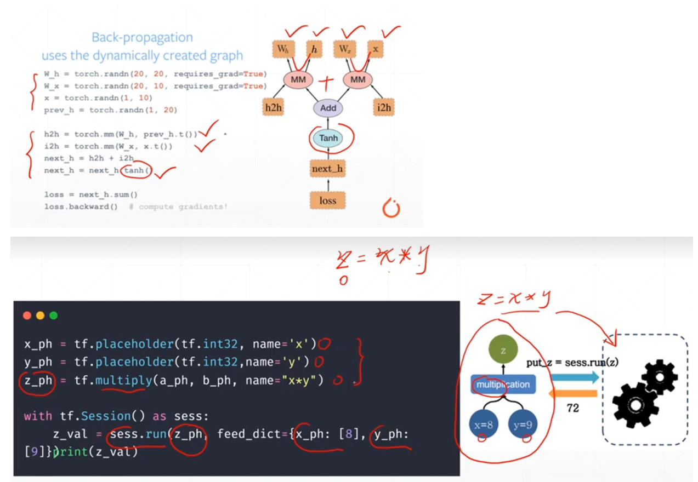
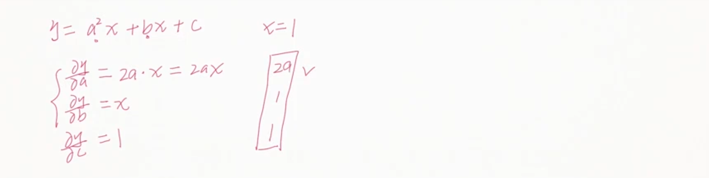
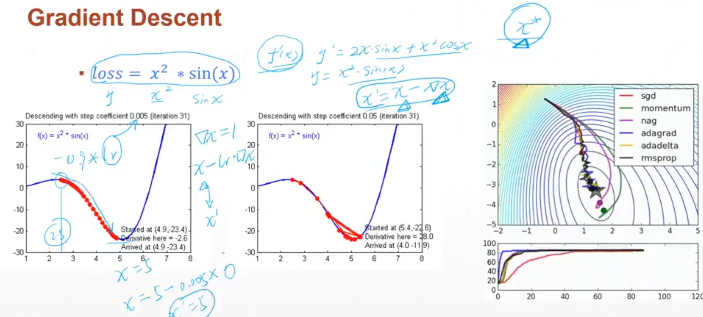
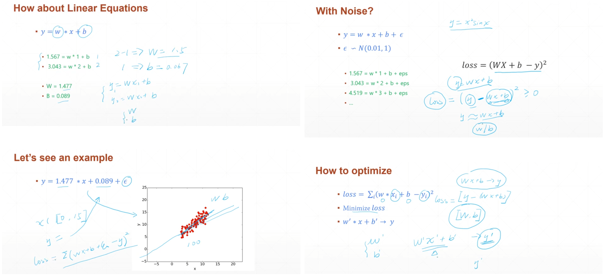
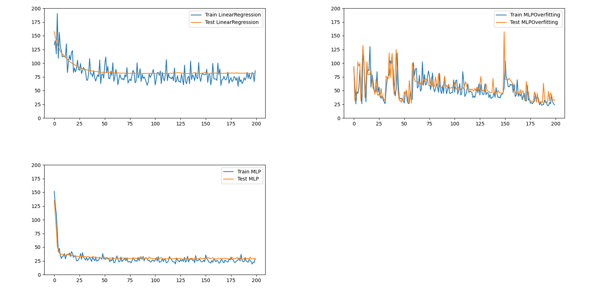
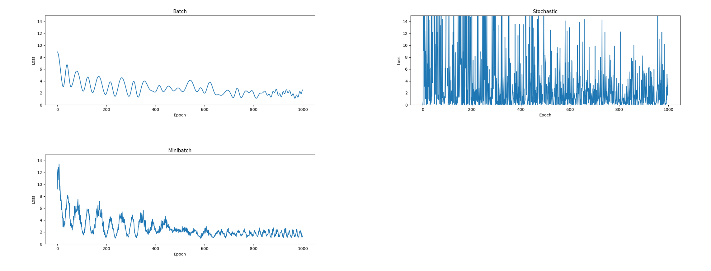

# deep-learning-torch

- Reference -org

  [torch org](https://pytorch.org/)

- Reference - note

  [PyTorch for Deep Learning & Machine Learning – Full Course (freeCodeCamp.org)](https://www.youtube.com/watch?v=V_xro1bcAuA&t=10s), 

  [torch快速入门](https://www.youtube.com/watch?v=ejYbJ7YR_Gk)、[freeCodeCamp torch](https://www.youtube.com/watch?v=V_xro1bcAuA)、

  [龙曲良 torch](https://www.bilibili.com/video/BV12B4y1k7b5/)、[龙曲良 torch 同学笔记](https://github.com/WhiteCrow5/PyTorch-LearningNotes)、[龙曲良 torch 同学笔记](https://github.com/Relph1119/deeplearning-with-pytorch-notes)、[龙曲良 torch 同学笔记](https://github.com/QfanNUIST/long_pytorchstudy)、

  [torch 视频教程](https://www.bilibili.com/video/BV1Au4m1c7KR/?)、

  [PyTorch Course (2022)](https://www.youtube.com/watch?v=v43SlgBcZ5Y)、

  [PyTorch 学习笔记 张贤同学](https://pytorch.zhangxiann.com/)、[Jack-Cherish/Deep-Learning](https://github.com/Jack-Cherish/Deep-Learning)、[Mikoto10032/DeepLearning](Mikoto10032/DeepLearning)

  [94页论文综述卷积神经网络 arxiv 解读](https://zhuanlan.zhihu.com/p/35388569)、

  [LiuEr pytorch](https://www.bilibili.com/video/BV1Y7411d7Ys/)、[note](https://blog.csdn.net/bit452/category_10569531.html), 

  [GNN link!!](https://gitcode.com/jwwthu/GNN4Traffic/overview?utm_source=artical_gitcode), 

- Reference - course

  [CSC321 (Toronto)](https://www.cs.toronto.edu/~tijmen/csc321/slides/lecture_slides_lec6.pdf), 


# Torch (Long)

- torch历史

  2002 torch

  2011 torch7 (Lua)

  2016 pytorch 0.1 (THNN后端)

  2018 pytorch 1.0 (CAFFE2后端)

  2019 pytorch 1.1 

- 同类框架

  Google: tensorflow, keras, theano

  Facebook: pytorch, caffe

  Amazon: mxnet

  Microsoft: cntk

- 优秀框架

  pytorch：**动态图**优先 (一步一步给定数据计算，随时查看每一步数据)

  tensorflow：静态图优先 (图的创建和图的运行分离 不能干预中间过程)

  


- 环境搭建

  ```bash
  conda create -n dl2 python==3.9
  conda activate dl2
  pip install torch==2.0.1 torchvision==0.15.2 torchaudio==2.0.2 --index-url https://download.pytorch.org/whl/cu118
  
  ```


- pytorch生态

  自然语言处理：`NLP`、`AllenNLP`

  计算机视觉：`TorchVision`

  图结构：`geometric`、`Fast.ai`
  
  部署协议：`onnx`
  
- pytorch能做

  GPU加速、自动求导、常用网络层

  


- GPU加速

  ```python
  import torch
  import time
  
  print(torch.__version__)  # 2.0.1+cu118
  print(torch.cuda.is_available())  # Ture
  
  # Matrix multiplication in CPU mode
  a = torch.randn(10000, 1000)
  b = torch.randn(1000, 2000)
  
  t0 = time.time()
  c = torch.matmul(a, b)
  t1 = time.time()
  print(a.device, t1 - t0, c.norm(2))
  
  # Matrix multiplication in GPU mode
  device = torch.device("cuda")
  a = a.to(device)
  b = b.to(device)
  
  t0 = time.time()
  c = torch.matmul(a, b)
  t2 = time.time()
  print(a.device, t2 - t0, c.norm(2))  # It takes time to activate the GPU device.
  
  t0 = time.time()
  c = torch.matmul(a, b)
  t2 = time.time()
  print(a.device, t2 - t0, c.norm(2))  # Real running time
  
  """
  cpu 0.22655916213989258 tensor(141234.9531)
  cuda:0 7.067934513092041 tensor(141378.8125, device='cuda:0')
  cuda:0 0.0010001659393310547 tensor(141378.8125, device='cuda:0')
  """
  
  ```

- 自动求导

  

  ```python
  import torch
  from torch import autograd
  
  x = torch.tensor(1.)
  a = torch.tensor(1., requires_grad=True)
  b = torch.tensor(2., requires_grad=True)
  c = torch.tensor(3., requires_grad=True)
  
  y = a ** 2 * x + b * x + c
  
  print("before: ", a.grad, b.grad, c.grad)  # None, None, None
  grads = autograd.grad(y, [a, b, c])
  print("after: ", grads[0], grads[1], grads[2])  # tensor(2.) tensor(1.) tensor(1.)
  
  ```

- 常用网络层

  `nn.Linear`、`nn.Conv2d`、`nn.LSTM`、

  `nn.ReLU`、`nn.Sigmoid`、

  `nn.Softmax`、`nn.CrossEntropyLoss`、`nn.MSE`

  


## 简单案例

### sample regression problem

- 知识点

  gradient descent：目标是求函数的极值、通过迭代逼近

  optimizer：`adam`、`sgd`、`rmsprop`
  
  
  
  

- 问题

  求解线性方程：closed form solution

  带有噪声的：numerical solution

  矩阵方程：多条数据的

  


- Task

  Linear Regression  [-inf, +inf]

  Logistic Regression  [0, 1]

  Classification  {0,1,2,...,9}  $\sum p_i = 1$ 


- 代码实现 (无torch)

  Task: Solve binary first order equations

  计算损失函数 `compute_error_for_line_given_points`

  梯度下降 `step_gradient`

  迭代计算 `gradient_descent_runner`

  ```python
  import os
  
  import numpy as np
  
  # set the project path
  project_path = os.path.dirname(__file__)
  data_path = os.path.join(project_path, 'data')
  
  # initialize variables
  learning_rate = 0.01
  num_iterations = 1000
  initial_b = 0
  initial_w = 0
  
  
  def generate_data_to_csv(n):
      """ Generate fake data csv, points of the linear equation with noise """
      np.random.seed(0)
      x = np.random.rand(n)
      y = 2 * x + 3 + np.random.randn(n)
      data = np.stack((x, y), axis=1)
      np.savetxt(os.path.join(data_path, "data_fake.csv"), data, delimiter=",")
      return data
  
  
  def compute_error_for_line_given_points(b, w, points):
      """ loss = (WX + b - Y)^2 """
      total_error = 0
      for i in range(len(points)):
          x = points[i, 0]
          y = points[i, 1]
          total_error += (y - (w * x + b)) ** 2
      return total_error / float(len(points))
  
  
  def step_gradient(b_current, w_current, points, learning_rate):
      """ w' = w - lr * dloss/dw """
  
      b_gradient, w_gradient = 0, 0
      n = float(len(points))
  
      for i in range(len(points)):
          x, y = points[i, 0], points[i, 1]
          b_gradient += -(2 / n) * (y - ((w_current * x) + b_current))  # dloss/db  avg
          w_gradient += -(2 / n) * x * (y - ((w_current * x) + b_current))  # dloss/dw  avg
  
      new_b = b_current - (learning_rate * b_gradient)
      new_w = w_current - (learning_rate * w_gradient)
  
      return [new_b, new_w]
  
  
  def gradient_descent_runner(points, starting_b, starting_w, learning_rate, num_iterations):
      """ Iterate to optimize """
      b, w = starting_b, starting_w
  
      for i in range(num_iterations):
          b, w = step_gradient(b, w, points, learning_rate)
  
      return [b, w]
  
  
  if __name__ == '__main__':
      generate_data_to_csv(100)  # generate data to csv file
      points = np.loadtxt(os.path.join(data_path, "data_fake.csv"), delimiter=",")  # load data from csv file
      train_data, test_data = points[:80], points[80:]  # split data into training and testing sets
  
      # train the model
      b, w = gradient_descent_runner(train_data, initial_b, initial_w, learning_rate, num_iterations)
      print("Final b: {}, w: {}".format(b, w))
      # test the model
      test_error = compute_error_for_line_given_points(b, w, test_data)
      print("Error on test data: {}".format(test_error))
      
      """
      Final b: 3.2940507061348856, w: 1.8881539583398386
      Error on test data: 0.9014630358776691
      """
  
  ```

  


### Simple classification problem 

- handwriting recognition

  image: 28 * 28

  each number owns 7k images

  train/test splitting: 60,000, 10,000

- Calculate Process

  ```
  # Two-dimensional picture vectorization
  X = [v1, v2, ..., v784];  X.shape(1, dimx)  
  
  
  # Layer
  H1 = XW1 + b1;  W1.shape(dim1, dimx);  b1.shape(dim1)  ->  H1.shape(1, dim1)
  H2 = H2W2 + b2;  W2.shape(dim2, dim1);  b2.shape(dim2)  ->  H2.shape(1, dim2)
  H3 = H2W3 + b3;  W3.shape(dim3, dim2);  b3.shape(dim3)  ->  H2.shape(1, dim3)
  ...
  pred = W3 * {W2[W1X + b1] + b2} + b3
  
  # one-hot encoding
  1 -> [0,1,0,0,0...]
  3 -> [0,0,0,0,1...]
  
  # Loss
  ([0,0.3,0.4,...] - [0,1,0,...]) ** 2
  
  
  # non-linear factor
  # ReLU: The gradient is easy to calculate and avoid the gradient disappearing
  H1 = ReLU(XW1 + b1)
  H2 = ReLU(H2W2 + b2);
  H3 = H2W3 + b3;  ->  softmax
  ...
  
  # gradient descent
  Find W, b, st pred and y are close
  W = [W1, W2, W3];  b = [b1, b2, b3]
  
  # Inference
  label
  
  ```

  

- 代码实现 (torch dl整体流程)

  Load data

  Build model

  Train

  Test

  ```python
  import os
  
  import torch
  from torch import nn
  from torch.nn import functional as F
  from torch import optim
  import torchvision  # cv
  from matplotlib import pyplot as plt
  from d03_mnist_utils import plot_curve, plot_image, one_hot
  
  # set the project path
  project_path = os.path.dirname(__file__)
  data_path = os.path.join(project_path, 'data')
  os.environ['KMP_DUPLICATE_LIB_OK'] = 'TRUE'  # plot_image()
  
  # hyperparameters
  learning_rate = 0.01
  num_epochs = 10
  batch_size = 512  # parameter of DataLoader
  
  # step 1: load data
  train_loader = torch.utils.data.DataLoader(
      torchvision.datasets.MNIST(
          os.path.join(data_path, 'data_mnist'), train=True, download=True,
          transform=torchvision.transforms.Compose([
              torchvision.transforms.ToTensor(),
              torchvision.transforms.Normalize((0.1307,), (0.3081,))  # best
          ])
      ),
      batch_size=batch_size,
      shuffle=True,
  )
  test_loader = torch.utils.data.DataLoader(
      torchvision.datasets.MNIST(
          os.path.join(data_path, 'data_mnist'), train=False, download=True,
          transform=torchvision.transforms.Compose([
              torchvision.transforms.ToTensor(),
              torchvision.transforms.Normalize((0.1307,), (0.3081,))
          ])
      ),
      batch_size=batch_size,
      shuffle=False,
  )
  
  # Take out the sample for direct observation
  x, y = next(iter(train_loader))
  print(x.shape, y.shape)  # torch.Size([512, 1, 28, 28]) torch.Size([512])
  print(x.min(), x.max())  # tensor(-0.4242) tensor(2.8215)
  plot_image(x, y, "image sample")
  
  
  # step 2: define the model
  class Net(nn.Module):
      def __init__(self):
          super(Net, self).__init__()
  
          self.fc1 = nn.Linear(28 * 28, 256)  # image shape 28*28
          self.fc2 = nn.Linear(256, 64)
          self.fc3 = nn.Linear(64, 10)  # 10 classes
  
      def forward(self, x):
          # x.shape(batch_size, 1, 28, 28)
          x = F.relu(self.fc1(x))  # (batch_size, 256)
          x = F.relu(self.fc2(x))  # (batch_size, 64)
          x = self.fc3(x)  # (batch_size, 10)
          return x
  
  
  # step 3: train the model
  device = torch.device('cuda' if torch.cuda.is_available() else 'cpu')  # cuda
  net = Net().to(device)  # Instantiate the model on the device
  
  optimizer = optim.SGD(net.parameters(), lr=learning_rate, momentum=0.9)  # Optimization model parameters
  train_loss = []  # record the loss
  for epoch in range(num_epochs):
      print(f"\nEpoch {epoch + 1}")
  
      for batch_idx, (x, y) in enumerate(train_loader):
          # x.shape(batch_size, 1, 28, 28)
          # y.shape(batch_size)
          x = x.view(x.size(0), 28 * 28).to(device)  # (batch_size, 784)
          out = net(x)  # (batch_size, 10)
          y_onehot = one_hot(y, 10).to(device)  # (batch_size, 10)
  
          loss = F.mse_loss(out, y_onehot)
          optimizer.zero_grad()  # clear the gradients for this training step
          loss.backward()  # calculate the gradients
          optimizer.step()  # update the parameters
  
          train_loss.append(loss.item())  # record the loss
  
          if batch_idx % 10 == 0:
              print("Train Epoch: {epoch} [{completed}/{total}] ({percent:.0f}%)\tLoss: {loss:.6f}".format(
                  epoch=epoch + 1,
                  completed=batch_idx * len(x),
                  total=len(train_loader.dataset),
                  percent=100. * batch_idx / len(train_loader),
                  loss=loss.item()
              ))
  
          """
          Epoch 1
          Train Epoch: 1 [0/60000 (0%)]	Loss: 0.115833
          Train Epoch: 1 [5120/60000 (8%)]	Loss: 0.095876
          Train Epoch: 1 [10240/60000 (17%)]	Loss: 0.083277
          Train Epoch: 1 [15360/60000 (25%)]	Loss: 0.077820
          Train Epoch: 1 [20480/60000 (34%)]	Loss: 0.072549
          Train Epoch: 1 [25600/60000 (42%)]	Loss: 0.066049
          Train Epoch: 1 [30720/60000 (51%)]	Loss: 0.064271
          Train Epoch: 1 [35840/60000 (59%)]	Loss: 0.060865
          Train Epoch: 1 [40960/60000 (68%)]	Loss: 0.060129
          Train Epoch: 1 [46080/60000 (76%)]	Loss: 0.054560
          Train Epoch: 1 [51200/60000 (85%)]	Loss: 0.051744
          Train Epoch: 1 [56320/60000 (93%)]	Loss: 0.049708
          Epoch 2
          Train Epoch: 2 [0/60000 (0%)]	Loss: 0.050642
          Train Epoch: 2 [5120/60000 (8%)]	Loss: 0.048092
          Train Epoch: 2 [10240/60000 (17%)]	Loss: 0.045999
          Train Epoch: 2 [15360/60000 (25%)]	Loss: 0.044162
          Train Epoch: 2 [20480/60000 (34%)]	Loss: 0.045289
          Train Epoch: 2 [25600/60000 (42%)]	Loss: 0.042404
          Train Epoch: 2 [30720/60000 (51%)]	Loss: 0.042469
          Train Epoch: 2 [35840/60000 (59%)]	Loss: 0.040225
          Train Epoch: 2 [40960/60000 (68%)]	Loss: 0.039921
          Train Epoch: 2 [46080/60000 (76%)]	Loss: 0.041059
          Train Epoch: 2 [51200/60000 (85%)]	Loss: 0.040481
          Train Epoch: 2 [56320/60000 (93%)]	Loss: 0.036657
          ...
          """
  
  plot_curve(train_loss)  # plot the loss curve after recording the loss
  # we get optimal [w1,w2,w3, b1,b2,b3] after training
  
  # step 4: test the model
  total_num = len(test_loader.dataset)
  total_correct = 0
  for x, y in test_loader:
      x = x.view(x.size(0), 28 * 28).to(device)  # (batch_size, 784)
      y = y.to(device)  # (batch_size)
  
      out = net(x)  # (batch_size, 10)
      pred = out.argmax(dim=1)  # (batch_size, 1)
  
      correct = pred.eq(y).sum().float().item()
      total_correct += correct
  
  accuracy = total_correct / total_num
  print("\ntotal num: {}, total correct: {}, accuracy: {:.2f}%".format(
      total_num, total_correct, accuracy * 100))
  
  # Take out the sample for direct observation
  x, y = next(iter(test_loader))
  out = net(x.view(x.size(0), 28 * 28).to(device))  # (batch_size, 10)
  pred = out.argmax(dim=1)  # (batch_size, 1)
  plot_image(x, pred, "test")  # plot the predicted label
  
  ```

  

- 检查代码GPU运行 (model data)

  ```python
  net = Net().to(device)
  y = y.to(device)
  
  print(next(net.parameters()).device)  # Check if the model parameters are on the GPU
  print(x.device)  # Check if the data is on the GPU
  
  ```
  
- 代码修改

  网络结构、最后一次softmax

  损失函数、优化器

  超参数 (learning_rate)

- next

  API 细节


## API 

### torch 基本数据类型

- data type of python 

  int, float, int array, float array, string

- data type of torch ([torch.Tensor](https://pytorch.org/docs/stable/tensors.html#torch-tensor))

  IntTensor, FloatTensor, Dimension

  无 string  (torch 面向数据计算的GPU加速库 万物皆数)

- NLP 用数字编码语言

  one-hot：稀疏、维度爆炸、没体现语义相关性

  Embedding：word2vec、glove

  | Data type                | CPU tensor          | GPU tensor               |
  | ------------------------ | ------------------- | ------------------------ |
  | 32-bit floating point    | `torch.FloatTensor` | `torch.cuda.FloatTensor` |
  | 8-bit integer (unsigned) | `torch.ByteTensor`  | `torch.cuda.ByteTensor`  |
  | 32-bit integer (signed)  | `torch.IntTensor`   | `torch.cuda.IntTensor`   |
  
- 代码实现

  ```python
  import numpy as np
  import torch
  
  # Type check
  data = torch.randn(2, 3)
  print(isinstance(data, torch.FloatTensor))  # True
  print(data.type())  # torch.FloatTensor
  print(type(data))  # <class 'torch.Tensor'>  no use!!
  
  # GPU and CPU tensors are different types
  print(isinstance(data, torch.cuda.FloatTensor))  # False
  data = data.cuda()  # move to GPU, return a reference on the GPU
  print(isinstance(data, torch.cuda.FloatTensor))  # True
  
  ```


- dimension

  dim0: `the result of loss function`

  dim1: `bias` [1], `Linear Input` [28*28]

  dim2: `Linear Input Batch` [4, 784]

  dim3: `RNN Input Batch` [10word, 20sequence, 100feature]

  dim4: `CNN Input Batch` [2batch, 3rgb, 28height, 28width]

  ```python
  import numpy as np
  import torch
  
  # Dimension 0
  # applied to the result of loss function, return a scalar!!
  a = torch.tensor(1.)
  print(a.dim(), len(a.shape))  # 0
  print(a.size())  # torch.Size([])
  print(a.shape)  # torch.Size([])
  
  # Dimension 1
  # applied to bias, return a vector!!
  # applied to Linear Input, return a vector!!
  b = torch.tensor([1.1])  # accept a list
  c = torch.FloatTensor(2)  # accept the shape of data (2,)
  d = torch.from_numpy(np.array([1.2, 2.3]))  # convert from numpy array
  print(b)  # tensor([1.1000])
  print(c)  # tensor([0., 0.])
  print(d)  # tensor([1.2000, 2.3000], dtype=torch.float64)
  
  # Dimension 2
  # applied to Linear Input Batch, return a matrix!!
  e = torch.randn(2, 3)  # create a random tensor with shape (2, 3)
  print(e.dim(), len(e.shape))  # 2
  print(e.size(), e.size(0), e.size(1))  # torch.Size([2, 3])  2  3
  print(e.shape, e.shape[0], e.shape[1])  # torch.Size([2, 3])  2  3
  
  # Dimension 3
  # applied to RNN Input Batch, return a tensor with 3 dimensions!!
  f = torch.rand(2, 2, 3)  # create a random tensor with shape (2, 2, 3)
  print(f.numel())  # number of elements (2*2*3)
  
  # Dimension 4
  # applied to CNN Input Batch, return a tensor with 4 dimensions!!
  g = torch.rand(2, 3, 28, 28)  # create a random tensor with shape (2, 3, 28, 28)
  print(g.numel())  # number of elements (2*3*28*28)
  
  ```
  
  
  


### 创建 Tensor 

- 创建 Tensor (没有完全 需要什么再学)

  Lowercase tensor receives data `torch.tensor([2, 3])`

  uppercase Tensor receives shape `torch.FloatTensor(2, 3)`, also receives data `torch.FloatTensor([2, 3])`

  ```python
  import numpy as np
  import torch
  
  # create a tensor with ndarray
  # arr = np.ones((2, 3))
  arr = np.array([1, 2.3])
  a = torch.from_numpy(arr)
  print(a)  # tensor([1.0000, 2.3000], dtype=torch.float64)
  
  # create a tensor with list
  b = torch.tensor([[1, 2.3], [4, 5]])
  print(b)  # tensor([[1.0000, 2.3000], [4.0000, 5.0000]])
  
  # Lowercase tensor receives the list of data!!!
  c = torch.tensor([3, 2], dtype=torch.float32)  # tensor([3., 2.])
  # uppercase Tensor receives shape!!!
  d = torch.FloatTensor(3, 2)  # tensor([[0., 0.], [0., 0.], [0., 0.]])
  # also receives the list of data (not recommend)
  e = torch.FloatTensor([3, 2])  # tensor([3., 2.])
  
  ```

  uninitialized

  set_default_tensor_type

  ```python
  import numpy as np
  import torch
  
  # Generates uninitialized data
  f = torch.empty(2, 3)  # receives shape, data is random (inf or nan!)
  g = torch.FloatTensor(2, 3)  # receives shape, data is random (inf or nan!)
  
  # Default dtype is float32
  # Reinforcement learning always uses double, requesting more precision
  torch.set_default_tensor_type(torch.DoubleTensor)
  print(torch.tensor([1, 2.3]).type())  # torch.DoubleTensor
  
  ```

  random

  full

  arange

  shuffle

  ```python
  import numpy as np
  import torch
  
  # Create a tensor [0,1)
  a = torch.rand(2, 3, 4)  # shape
  b = torch.rand_like(a)
  # Create a tensor [min, max)
  c = torch.randint(10, 20, (2, 3, 4))
  
  # normal distribution  N~(0,1)
  d = torch.randn(2, 3, 4)
  # normal distribution  N~(mean, std)
  e = torch.normal(mean=10, std=1, size=(2, 3, 4))
  f = torch.normal(mean=torch.full([10], 0.0), std=torch.arange(1, 0, -0.1).float())
  
  g = torch.eye(3)  # identity matrix
  
  h = torch.full((2, 3, 4), 10)  # full
  i = torch.full([2, 3, 4], 10)
  j = torch.full([], 10)  # scalar tensor(10)
  k = torch.full([1], 10)  # vector tensor([10])
  
  # arange / range (no recommended)
  l = torch.arange(10)  # [0, 1, 2, 3, 4, 5, 6, 7, 8, 9]
  m = torch.arange(0, 10, 2)  # [0, 2, 4, 6, 8]
  n = torch.arange(10, 0, -1)  # [10, 9, 8, 7, 6, 5, 4, 3, 2, 1]
  
  # linspace / logspace
  o = torch.linspace(0, 1, 5)  # [0.0, 0.25, 0.5, 0.75, 1.0]
  p = torch.logspace(0, 1, 3)  # tensor([ 1.0000,  3.1623, 10.0000])
  
  '''随机种子shuffle 
  torch.randperm(n, *, generator=None, out=None, 
  dtype=torch.int64, layout=torch.strided, device=None, requires_grad=False, pin_memory=False) 
  -> Tensor'''
  a = torch.randperm(10)
  '''应用如N-Batch'''
  train_data = torch.randn(4, 5)
  train_label = torch.rand(4, 1)
  index = torch.randperm(4)
  
  train_data_shuffle = train_data[index]
  train_label_shuffle = train_label[index]
  
  ```

  


### 索引与切片

- Simple indexing and slicing

  `a.index_select(0, torch.tensor([0, 2]))`

  `a[:, 1, ...]`

  `torch.masked_select(x, mask)`

  `torch.take(src, torch.tensor([0, 2, 5]))`

  ```python
  import torch
  
  a = torch.randn(4, 3, 28, 28)  # 4 batch x 3 channel x  28 height x 28 width
  print(a[0].shape)  # torch.Size([3, 28, 28])  # a colour picture
  print(a[0, 0].shape)  # torch.Size([28, 28])  # a grayscale picture
  print(a[0, 0, 2, 4])  # tensor(0.5465)  # a single pixel value
  
  # slice: start:end:step
  print(a[:2].shape)  # torch.Size([2, 3, 28, 28])  # first 2 pictures
  print(a[:2, -1, :, :].shape)  # torch.Size([2, 28, 28])  # first 2 pictures, last channel
  print(a[:, :, 0:28:2, ::2].shape)  # torch.Size([4, 3, 14, 14])  # pixel select by step
  
  # select by specific index
  print(a.index_select(0, torch.tensor([0, 2])).shape)  # torch.Size([2, 3, 28, 28])  # select pictures 0 and 2
  print(a.index_select(1, torch.tensor([0, 2])).shape)  # torch.Size([4, 2, 28, 28])  # select channel 0 and 2
  print(a.index_select(2, torch.arange(8)).shape)  # torch.Size([4, 3, 8, 1])  # select 8 pixels in height dimension
  
  # ... is a shortcut for all dimensions
  print(a[...].shape)  # torch.Size([4, 3, 28, 28])  # all pictures
  print(a[0, ...].shape)  # torch.Size([3, 28, 28])  # first picture
  print(a[:, 1, ...].shape)  # torch.Size([4, 28, 28])  # second channel of all pictures
  
  # select by mask
  x = torch.randn(3, 4)
  mask = x.ge(0.5)  # mask for values greater than 0.5
  print(x, "\n", mask)
  print(torch.masked_select(x, mask))
  """
  tensor([[ 0.5663,  0.3780, -1.1873,  0.3202],
          [-0.4486,  0.3809, -0.8121,  0.5216],
          [ 0.3068,  1.7174,  0.4122,  1.0049]]) 
  tensor([[ True, False, False, False],
          [False, False, False,  True],
          [False,  True, False,  True]])
  tensor([0.5663, 0.5216, 1.7174, 1.0049])
  """
  
  # select by flattened index
  src = torch.tensor([[4, 3, 5], [6, 7, 8]])
  print(torch.take(src, torch.tensor([0, 2, 5])))  # tensor([4, 5, 8])
  
  ```
  
  


### 维度变换

- operation

  `view`, `reshape`

  `squeeze`, `unsqueeze`

  `Transpose`, `t`, `permute`

  `Expand`, `repeat`

  ```
  
  ```

  


### Broadcasing


### 合并与分割


### 数学运算


### 属性统计


### 梯度


### 激活函数


### 感知机


### 反向传播


## 数据加载器

- 总览

  `torch.utils.data.DataLoader()`

  `datasets.ImageFolder(root, transform)`

  ```python
  from torch.utils.data import DataLoader
  from torchvision import transforms, datasets
  
  
  dataset_a_train = datasets.ImageFolder(root=path_dataset_a_train_img, transform=transform)
  
  ```

  


## Convolutional Neural Network

### 基础卷积


### 池化层与采样


### 经典卷积

- 经典卷积

  LeNet5, AlexNet, VGG, GoogleNet, ResNet, DenseNet


### nn.Module


## Recurrent Neural Network

### 时间序列表示方法


### LSTM


### 自定义数据集实战


### 迁移学习


### Auto-Encoder


## Generative Adversarial Network


# torch

- 为什么torch

  活跃度：完整生态、资源多 (学术前沿 文献资料)

  人性化：框架优雅、初学者友好 (动态图 代码简洁)

- 深度学习的前置 (补知识)

  线性代数、优化理论、机器学习

  深度学习框架、具体研究方向 (lane detection)


# TuDui

## YoloV5


# LiuEr PyTorch Tutorial

## Overview

- 定位

  重代码实践、轻数学推导

  版本问题 0.4 + 自己查文档

- 技术的发展期 (热度)

  发展期(热门 迭代快)、冰河期(缺陷 质疑 可能死)、应用期(解决)

  高校备课速度跟不上


- Goal

  How to implement learning system using **PyTorch**

  Understand the basic of **neural networks** / **deep learning**  

- Requirements

  Algebra, Probability, Python(OOP)


- What is the intelligence? 

  Example: What to eat for dinner? Information Infer -> function


# Deep Learning (ZhaiYi)

- 数学基础

  微积分、线性代数、概率统计


- 环境搭建

  ```bash
  conda create -n dl2 python==3.9
  conda activate dl2
  pip install torch==2.0.1 torchvision==0.15.2 torchaudio==2.0.2 --index-url https://download.pytorch.org/whl/cu118
  
  ```

  


## 基础操作

- 总览

  深度神经网络：误差倒查分解

  常见问题及对策：一切为了泛化能力

  梯度下降算法及变体


- Summary

- Part 1

  hyper-parameters (data, model, train)

  data, data_loader (train, test), check sample

  network model, Instantiate the model

- Part 2

  train (loss, optimizer; evaluation model)

  test (total, correct)

  save (model parameter)

  visualize

  


### 深度神经网络

#### Linear regression 

- Linear regression problem

  ```python
  import matplotlib.pyplot as plt
  import numpy as np
  import torch
  
  # hyper-parameters
  learning_rate = 0.1
  num_epochs = 1000
  
  # generate some data (w=2, b=1)
  np.random.seed(42)
  x = np.random.rand(100, 1)
  y = 1 + 2 * x + 0.1 * np.random.randn(100, 1)
  # to pytorch tensor
  x_tensor = torch.from_numpy(x).float()
  y_tensor = torch.from_numpy(y).float()
  
  # initialize weights and bias (model parameters)
  w = torch.randn(1, requires_grad=True)
  b = torch.zeros(1, requires_grad=True)
  
  # train
  for epoch in range(num_epochs):
      # forward propagation
      y_pred = x_tensor * w + b
      loss = ((y_pred - y_tensor) ** 2).mean()
  
      # backward propagation
      loss.backward()
  
      # update weights and bias (model parameters)
      with torch.no_grad():
          w -= learning_rate * w.grad
          b -= learning_rate * b.grad
  
          # clear gradients for next iteration
          w.grad.zero_()
          b.grad.zero_()
  
  # print final results
  print('w:', w, '\nb:', b)
  
  # visualize the results
  plt.plot(x, y, 'o')
  plt.plot(x_tensor.numpy(), y_pred.detach().numpy())
  plt.show()
  
  ```

  torch

  ```python
  import numpy as np
  import torch
  import torch.nn as nn
  
  # hyper-parameters
  input_dim = 1
  output_dim = 1
  learning_rate = 0.1  # for optimizer
  num_epochs = 1000  # for training
  
  # check gpu
  device = torch.device("cuda" if torch.cuda.is_available() else "cpu")
  print(device)
  
  # generate some data (w=2, b=1)
  np.random.seed(42)
  x = np.random.rand(100, 1)
  y = 1 + 2 * x + 0.1 * np.random.randn(100, 1)
  # to pytorch tensor
  x_tensor = torch.from_numpy(x).float().to(device)
  y_tensor = torch.from_numpy(y).float().to(device)
  
  # initialize weights and bias (model parameters)
  w = torch.randn(1, requires_grad=True)
  b = torch.zeros(1, requires_grad=True)
  
  # model
  model = nn.Linear(input_dim, output_dim).to(device)
  
  # train
  criterion = nn.MSELoss()
  optimizer = torch.optim.SGD(model.parameters(), lr=learning_rate)
  
  for epoch in range(num_epochs):
      # forward propagation
      y_pred = model(x_tensor)  # data to model
      loss = criterion(y_pred, y_tensor)
  
      # backward propagation
      optimizer.zero_grad()  # clear gradients
      loss.backward()
      optimizer.step()  # update weights and bias (model parameters)
  
  print('w:', model.weight.data, '\nb:', model.bias.data)
  
  ```

  GPU

  ```python
  # check gpu
  device = torch.device("cuda" if torch.cuda.is_available() else "cpu")
  print(device)
  
  # model, data (train, test)
  model = Model(...).to(device)
  x = x....to(device)
  y = y....to(device)
  
  ```

  


#### Multi-Layer Perceptron

- Multi-Layer Perceptron

  所有训练完成后，一次测试

  ```python
  import torch
  from torchvision import datasets
  from torchvision import transforms
  import torch.nn as nn
  import torch.optim as optim
  
  # hyper-parameters
  batch_size = 100  # for data loader
  
  input_size = 28 * 28  # 输入大小
  hidden_size = 512  # 隐藏层大小
  num_classes = 10  # 输出大小 (classifications)
  
  learning_rate = 0.001  # for optimizer
  num_epochs = 10  # for training
  
  # check gpu
  device = torch.device("cuda" if torch.cuda.is_available() else "cpu")
  print(device)
  
  # data
  train_data = datasets.MNIST(root="data/mnist", train=True, transform=transforms.ToTensor(), download=True)
  test_data = datasets.MNIST(root="data/mnist", train=False, transform=transforms.ToTensor(), download=True)
  
  train_loader = torch.utils.data.DataLoader(dataset=train_data, batch_size=batch_size, shuffle=True)
  test_loader = torch.utils.data.DataLoader(dataset=test_data, batch_size=batch_size, shuffle=False)
  
  
  class MLP(nn.Module):
      def __init__(self, input_size, hidden_size, num_classes):
          """
          init MLP
          :param input_size: 输入数据的维度
          :param hidden_size: 隐藏层大小
          :param num_classes: 输出大小 (classifications)
          """
  
          super(MLP, self).__init__()
          self.fc1 = nn.Linear(input_size, hidden_size)
          self.relu = nn.ReLU()
          self.fc2 = nn.Linear(hidden_size, hidden_size)
          self.fc3 = nn.Linear(hidden_size, num_classes)
  
      def forward(self, x):
          """
          forward propagation
          :param x: 输入数据
          :return: 输出数据
          """
  
          out = self.fc1(x)
          out = self.relu(out)
  
          out = self.fc2(out)
          out = self.relu(out)
  
          out = self.fc3(out)
          return out
  
  
  # Instantiate the MLP model
  model = MLP(input_size, hidden_size, num_classes).to(device)
  
  # train (loss, optimizer)
  criterion = nn.CrossEntropyLoss()
  optimizer = optim.Adam(model.parameters(), lr=learning_rate)
  
  for epoch in range(num_epochs):
      for i, (images, labels) in enumerate(train_loader):
          images = images.reshape(-1, 28 * 28).to(device)  # images -> vector
          labels = labels.to(device)
  
          # forward propagation
          outputs = model(images)  # data to model
          loss = criterion(outputs, labels)
  
          # backward propagation and update parameters
          optimizer.zero_grad()  # clear gradients
          loss.backward()
          optimizer.step()
  
          # print loss every 100 steps
          if (i + 1) % 100 == 0:
              print(f'Epoch [{epoch + 1}/{num_epochs}], Step [{i + 1}/{len(train_loader)}], Loss: {loss.item():.4f}')
  
  # test
  with torch.no_grad():
      correct = 0
      total = 0
  
      # from test_loader get images and labels
      for images, labels in test_loader:
          images = images.reshape(-1, 28 * 28).to(device)  # images -> vector
          labels = labels.to(device)
  
          # forward propagation
          outputs = model(images)  # data to model
          _, predicted = torch.max(outputs.data, 1)  # predicted
  
          total += labels.size(0)
          correct += (predicted == labels).sum().item()
  
      # print accuracy
      print(f'Accuracy of the network on the 10000 test images: {100 * correct / total} %')
  
  # save
  torch.save(model, "output/mnist_mlp_model.pkl")
  
  """
  cuda
  Epoch [1/10], Step [100/600], Loss: 0.2783
  Epoch [1/10], Step [200/600], Loss: 0.3115
  Epoch [1/10], Step [300/600], Loss: 0.1504
  Epoch [1/10], Step [400/600], Loss: 0.0884
  Epoch [1/10], Step [500/600], Loss: 0.1849
  Epoch [1/10], Step [600/600], Loss: 0.0996
  Epoch [2/10], Step [100/600], Loss: 0.1644
  Epoch [2/10], Step [200/600], Loss: 0.0943
  Epoch [2/10], Step [300/600], Loss: 0.1490
  Epoch [2/10], Step [400/600], Loss: 0.0732
  Epoch [2/10], Step [500/600], Loss: 0.0564
  Epoch [2/10], Step [600/600], Loss: 0.0546
  Epoch [3/10], Step [100/600], Loss: 0.0328
  Epoch [3/10], Step [200/600], Loss: 0.0418
  Epoch [3/10], Step [300/600], Loss: 0.0170
  Epoch [3/10], Step [400/600], Loss: 0.0881
  Epoch [3/10], Step [500/600], Loss: 0.0326
  Epoch [3/10], Step [600/600], Loss: 0.0507
  Epoch [4/10], Step [100/600], Loss: 0.0373
  Epoch [4/10], Step [200/600], Loss: 0.0533
  Epoch [4/10], Step [300/600], Loss: 0.0239
  Epoch [4/10], Step [400/600], Loss: 0.0195
  Epoch [4/10], Step [500/600], Loss: 0.0348
  Epoch [4/10], Step [600/600], Loss: 0.0243
  Epoch [5/10], Step [100/600], Loss: 0.0169
  Epoch [5/10], Step [200/600], Loss: 0.0208
  Epoch [5/10], Step [300/600], Loss: 0.0332
  Epoch [5/10], Step [400/600], Loss: 0.0035
  Epoch [5/10], Step [500/600], Loss: 0.0308
  Epoch [5/10], Step [600/600], Loss: 0.0557
  Epoch [6/10], Step [100/600], Loss: 0.0076
  Epoch [6/10], Step [200/600], Loss: 0.0045
  Epoch [6/10], Step [300/600], Loss: 0.0217
  Epoch [6/10], Step [400/600], Loss: 0.1173
  Epoch [6/10], Step [500/600], Loss: 0.0122
  Epoch [6/10], Step [600/600], Loss: 0.0264
  Epoch [7/10], Step [100/600], Loss: 0.0294
  Epoch [7/10], Step [200/600], Loss: 0.0173
  Epoch [7/10], Step [300/600], Loss: 0.0100
  Epoch [7/10], Step [400/600], Loss: 0.0099
  Epoch [7/10], Step [500/600], Loss: 0.1083
  Epoch [7/10], Step [600/600], Loss: 0.0164
  Epoch [8/10], Step [100/600], Loss: 0.0895
  Epoch [8/10], Step [200/600], Loss: 0.0031
  Epoch [8/10], Step [300/600], Loss: 0.0056
  Epoch [8/10], Step [400/600], Loss: 0.0412
  Epoch [8/10], Step [500/600], Loss: 0.0095
  Epoch [8/10], Step [600/600], Loss: 0.0517
  Epoch [9/10], Step [100/600], Loss: 0.0036
  Epoch [9/10], Step [200/600], Loss: 0.0097
  Epoch [9/10], Step [300/600], Loss: 0.0131
  Epoch [9/10], Step [400/600], Loss: 0.0086
  Epoch [9/10], Step [500/600], Loss: 0.0060
  Epoch [9/10], Step [600/600], Loss: 0.0037
  Epoch [10/10], Step [100/600], Loss: 0.0124
  Epoch [10/10], Step [200/600], Loss: 0.0240
  Epoch [10/10], Step [300/600], Loss: 0.0859
  Epoch [10/10], Step [400/600], Loss: 0.0043
  Epoch [10/10], Step [500/600], Loss: 0.0114
  Epoch [10/10], Step [600/600], Loss: 0.0011
  Accuracy of the network on the 10000 test images: 98.11 %
  """
  
  ```

  


#### Multiple classification

- Multiple classification problem

  一次训练后 一次测试

  ```python
  import torch
  import torchvision
  import matplotlib.pyplot as plt
  import torch.nn as nn
  
  # hyper-parameters
  batch_size = 64  # for data loader
  input_size = 28 * 28
  output_size = 10
  num_epochs = 10  # for train
  
  # check gpu
  device = torch.device("cuda" if torch.cuda.is_available() else "cpu")
  print(device)
  
  # data
  transformation = torchvision.transforms.ToTensor()
  train_dataset = torchvision.datasets.MNIST(root='data/mnist', train=True, download=True, transform=transformation)
  test_dataset = torchvision.datasets.MNIST(root='data/mnist', train=False, download=True, transform=transformation)
  # data loader
  train_dataloader = torch.utils.data.DataLoader(train_dataset, batch_size=batch_size, shuffle=True)
  test_dataloader = torch.utils.data.DataLoader(test_dataset, batch_size=batch_size, shuffle=False)
  
  # check samples
  for i, (images, labels) in enumerate(train_dataloader):
      print(images.shape, labels.shape)
  
      plt.imshow(images[0][0], cmap='gray')
      plt.show()
      print(labels[0])
  
      if i > 10:
          break
  
  
  class Model(nn.Module):
      def __init__(self, input_size, output_size):
          super().__init__()
          self.linear = nn.Linear(input_size, output_size)
  
      def forward(self, x):
          logics = self.linear(x)
          return logics
  
  
  model = Model(input_size, output_size).to(device)
  
  # train and test
  criterion = nn.CrossEntropyLoss()
  optimizer = torch.optim.SGD(model.parameters(), lr=0.01)
  
  
  def evaluate(model, data_loader):
      model.eval()
      correct = 0
      total = 0
  
      with torch.no_grad():
          for x, y in data_loader:
              x = x.view(-1, input_size).to(device)
              y = y.to(device)
  
              logics = model(x)
              _, predicted = torch.max(logics.data, 1)
  
              total += y.size(0)
              correct += (predicted == y).sum().item()
  
      return correct / total
  
  
  for epoch in range(epoch):
      model.train()
      for images, labels in train_dataloader:
          images = images.view(-1, 28 * 28).to(device)
          labels = labels.long().to(device)
  
          # forward propagation
          outputs = model(images)
          loss = criterion(outputs, labels)
  
          # backward propagation and update weights
          optimizer.zero_grad()
          loss.backward()
          optimizer.step()
  
      accuracy = evaluate(model, test_dataloader)
      print(f'Epoch {epoch + 1}: test accuracy = {accuracy:.2f}')
  
  """
  Epoch 1: test accuracy = 0.87
  Epoch 2: test accuracy = 0.88
  Epoch 3: test accuracy = 0.89
  Epoch 4: test accuracy = 0.90
  Epoch 5: test accuracy = 0.90
  Epoch 6: test accuracy = 0.90
  Epoch 7: test accuracy = 0.90
  Epoch 8: test accuracy = 0.91
  Epoch 9: test accuracy = 0.91
  Epoch 10: test accuracy = 0.91
  """
  
  ```

  


### 常见问题及对策

- 常见问题

  overfitting, underfitting

  dropout
  
  


#### overfitting and underfitting

- overfitting, underfitting

  ```python
  import matplotlib.pyplot as plt
  import numpy as np
  import torch
  import torch.nn as nn
  from sklearn.model_selection import train_test_split
  from torch.utils.data import DataLoader, TensorDataset
  
  # hyper-parameters
  num_epochs = 200
  
  # Generate data (100 samples; y = x^2 + 1)
  np.random.seed(32)
  num_samples = 100
  X = np.random.uniform(-5, 5, (num_samples, 1))  # 均匀分布
  Y = X ** 2 + 1 + 5 * np.random.normal(0, 1, (num_samples, 1))  # 正态分布噪声
  # to torch.float
  X = torch.from_numpy(X).float()
  Y = torch.from_numpy(Y).float()
  # plot scatter
  plt.scatter(X, Y)
  plt.show()
  
  train_X, test_X, train_Y, test_Y = train_test_split(X, Y, test_size=0.3, random_state=0)
  train_dataloader = DataLoader(TensorDataset(train_X, train_Y), batch_size=32, shuffle=True)
  test_dataloader = DataLoader(TensorDataset(test_X, test_Y), batch_size=32, shuffle=False)
  
  
  class LinearRegression(nn.Module):
      """ underfitting """
  
      def __init__(self):
          super().__init__()
          self.linear = nn.Linear(1, 1)
  
      def forward(self, x):
          return self.linear(x)
  
  
  class MLP(nn.Module):
      """ normal """
  
      def __init__(self):
          super().__init__()
          self.hidden = nn.Linear(1, 8)
          self.output = nn.Linear(8, 1)
  
      def forward(self, x):
          x = torch.relu(self.hidden(x))
          return self.output(x)
  
  
  class MLPOverfitting(nn.Module):
      """ overfitting """
  
      def __init__(self):
          super().__init__()
          self.hidden1 = nn.Linear(1, 256)
          self.hidden2 = nn.Linear(256, 256)
          self.output = nn.Linear(256, 1)
  
      def forward(self, x):
          x = torch.relu(self.hidden1(x))
          x = torch.relu(self.hidden2(x))
          return self.output(x)
  
  
  def plot_errors(models, num_epochs, train_dataloader, test_dataloader):
      loss_fn = nn.MSELoss()
  
      train_losses = []
      test_losses = []
  
      # Iterate through each type of model
      for model in models:
          optimizer = torch.optim.SGD(model.parameters(), lr=0.005)
  
          train_losses_per_model = []
          test_losses_per_model = []
  
          # train and test the model for num_epochs
          for epoch in range(num_epochs):
  
              # train
              model.train()
              train_loss = 0
  
              for inputs, targets in train_dataloader:
                  # forward propagation (predict loss)
                  optimizer.zero_grad()
                  outputs = model(inputs)
                  loss = loss_fn(outputs, targets)
  
                  # backward propagation
                  loss.backward()
                  optimizer.step()
                  train_loss += loss.item()
  
              # calculate average loss for the epoch
              train_loss /= len(train_dataloader)
              train_losses_per_model.append(train_loss)
  
              # test
              model.eval()
              test_loss = 0
              with torch.no_grad():
                  for inputs, targets in test_dataloader:
                      # forward propagation (predict loss)
                      outputs = model(inputs)
                      loss = loss_fn(outputs, targets)
                      test_loss += loss.item()
  
                  # calculate average loss for the epoch
                  test_loss /= len(test_dataloader)
                  test_losses_per_model.append(test_loss)
  
          # return the train and test losses for each model
          train_losses.append(train_losses_per_model)
          test_losses.append(test_losses_per_model)
  
      return train_losses, test_losses
  
  
  models = [LinearRegression(), MLP(), MLPOverfitting()]
  train_losses, test_losses = plot_errors(models, num_epochs, train_dataloader, test_dataloader)
  
  # visualize the train and test losses for each model
  for i, model in enumerate(models):
      plt.figure(figsize=(8, 4))
      plt.plot(range(num_epochs), train_losses[i], label=f"Train {model.__class__.__name__}")
      plt.plot(range(num_epochs), test_losses[i], label=f"Test {model.__class__.__name__}")
      plt.legend()
      plt.ylim((0, 200))
      plt.savefig(f"output/demo{i}.png")
      plt.show()
  
  ```
  
  
  
  


#### dropout

- dropout

  ```python
  # 导入必要的库
  import torch
  import torch.nn as nn
  import matplotlib.pyplot as plt
  
  # hyper-parameters
  num_samples = 20
  hidden_size = 200
  num_epochs = 500  # for train
  torch.manual_seed(2333)
  
  # generate data
  x_train = torch.unsqueeze(torch.linspace(-1, 1, num_samples), 1)
  y_train = x_train + 0.3 * torch.randn(num_samples, 1)
  x_test = torch.unsqueeze(torch.linspace(-1, 1, num_samples), 1)
  y_test = x_test + 0.3 * torch.randn(num_samples, 1)
  # plot data
  plt.scatter(x_train, y_train, c='r', alpha=0.5, label='train')
  plt.scatter(x_test, y_test, c='b', alpha=0.5, label='test')
  plt.legend(loc='upper left')
  plt.ylim((-2, 2))
  plt.show()
  
  # may be overfitting
  net_overfitting = torch.nn.Sequential(
      torch.nn.Linear(1, hidden_size),
      torch.nn.ReLU(),
      torch.nn.Linear(hidden_size, hidden_size),
      torch.nn.ReLU(),
      torch.nn.Linear(hidden_size, 1),
  )
  
  # network with dropout
  net_dropout = torch.nn.Sequential(
      torch.nn.Linear(1, hidden_size),
      torch.nn.Dropout(0.5),  # p=0.5
      torch.nn.ReLU(),
      torch.nn.Linear(hidden_size, hidden_size),
      torch.nn.Dropout(0.5),  # p=0.5
      torch.nn.ReLU(),
      torch.nn.Linear(hidden_size, 1),
  )
  
  # train
  optimizer_overfitting = torch.optim.Adam(net_overfitting.parameters(), lr=0.01)
  optimizer_dropout = torch.optim.Adam(net_dropout.parameters(), lr=0.01)
  criterion = nn.MSELoss()
  
  for i in range(num_epochs):
      # forward propagation (predict, loss)
      pred_overfitting = net_overfitting(x_train)
      loss_overfitting = criterion(pred_overfitting, y_train)
      # backward propagation
      optimizer_overfitting.zero_grad()
      loss_overfitting.backward()
      optimizer_overfitting.step()
  
      # network with dropout
      pred_dropout = net_dropout(x_train)
      loss_dropout = criterion(pred_dropout, y_train)
      optimizer_dropout.zero_grad()
      loss_dropout.backward()
      optimizer_dropout.step()
  
  # test
  net_overfitting.eval()
  net_dropout.eval()  # without dropout
  
  test_pred_overfitting = net_overfitting(x_test)
  test_pred_dropout = net_dropout(x_test)
  
  plt.scatter(x_train, y_train, c='r', alpha=0.3, label='train')
  plt.scatter(x_test, y_test, c='b', alpha=0.3, label='test')
  plt.plot(x_test, test_pred_overfitting.data.numpy(), 'r-', lw=2, label='overfitting')
  plt.plot(x_test, test_pred_dropout.data.numpy(), 'b--', lw=2, label='dropout')
  plt.legend(loc='upper left')
  plt.ylim((-2, 2))
  plt.show()
  
  ```

  


#### Saving and loading model parameters

- Saving and loading tensor

  ```python
  import torch
  
  a = torch.rand(6)
  b = torch.rand(6)
  c = torch.rand(6)
  print([a, b, c])
  torch.save([a, b, c], "output/tensor_abc")
  abc_list = torch.load("output/tensor_abc")
  print(abc_list)
  
  tensor_dict = {'a': a, 'b': b, 'c': c}
  print(tensor_dict)
  torch.save(tensor_dict, "output/tensor_dict_abc")
  abc_dict = torch.load("output/tensor_dict_abc")
  print(abc_dict)
  
  ```

- Saving and loading model

  ```python
  import torch
  import torch.nn as nn
  
  # hyper-parameters
  input_size = 28 * 28  # 输入大小
  hidden_size = 512  # 隐藏层大小
  num_classes = 10  # 输出大小（类别数）
  
  
  class MLP(nn.Module):
      def __init__(self, input_size, hidden_size, num_classes):
          """
          init MLP
          :param input_size: 输入数据的维度
          :param hidden_size: 隐藏层大小
          :param num_classes: 输出大小 (classifications)
          """
  
          super(MLP, self).__init__()
          self.fc1 = nn.Linear(input_size, hidden_size)
          self.relu = nn.ReLU()
          self.fc2 = nn.Linear(hidden_size, hidden_size)
          self.fc3 = nn.Linear(hidden_size, num_classes)
  
      def forward(self, x):
          """
          forward propagation
          :param x: 输入数据
          :return: 输出数据
          """
  
          out = self.fc1(x)
          out = self.relu(out)
  
          out = self.fc2(out)
          out = self.relu(out)
  
          out = self.fc3(out)
          return out
  
  
  model = MLP(input_size, hidden_size, num_classes)
  
  # way 1: save model parameters
  torch.save(model.state_dict(), "model/mlp_state_dict.pth")
  
  mlp_state_dict = torch.load("model/mlp_state_dict.pth")
  model_load = MLP(input_size, hidden_size, num_classes)
  model_load.load_state_dict(mlp_state_dict)
  
  # way 2: save entire model
  torch.save(model, "model/mlp_model.pth")
  mlp_load = torch.load("model/mlp_model.pth")
  
  # way 3: check point
  torch.save({
      'epoch': epoch,
      'model_state_dict': model.state_dict(),
      'optimizer_state_dict': optimizer.state_dict(),
      'loss': loss,
      ...
  }, PATH)
  
  model = TheModelClass(*args, **kwargs)
  optimizer = TheOptimizerClass(*args, **kwargs)
  
  checkpoint = torch.load(PATH)
  model.load_state_dict(checkpoint['model_state_dict'])
  optimizer.load_state_dict(checkpoint['optimizer_state_dict'])
  epoch = checkpoint['epoch']
  loss = checkpoint['loss']
  
  model.eval()
  
  ```

  


### 梯度下降算法及变体

#### 三种批量梯度下降

- 批量梯度下降法、随机梯度下降法、小批量梯度下降法

  ```python
  import torch
  import torch.nn as nn
  import numpy as np
  import matplotlib.pyplot as plt
  from tqdm import *
  
  # hyperparameters
  n_samples = 1000
  learning_rate = 0.0001
  n_epochs = 1000
  names = ["Batch", "Stochastic", "Minibatch"]  # 批量梯度下降法、随机梯度下降法、小批量梯度下降法
  batch_size = [n_samples, 1, 128]
  momentum = [1, 0, 1]
  losses = [[], [], []]
  
  # generate data
  np.random.seed(0)
  x = np.linspace(-5, 5, n_samples)
  y = 0.3 * (x ** 2) + np.random.randn(n_samples)
  # to Tensor
  x = torch.unsqueeze(torch.from_numpy(x).float(), 1)
  y = torch.unsqueeze(torch.from_numpy(y).float(), 1)
  
  # dataset
  dataset = torch.utils.data.TensorDataset(x, y)
  
  
  class Model(nn.Module):
      def __init__(self):
          super().__init__()
          self.hidden1 = nn.Linear(1, 32)
          self.hidden2 = nn.Linear(32, 32)
          self.output = nn.Linear(32, 1)
  
      def forward(self, x):
          x = torch.relu(self.hidden1(x))
          x = torch.relu(self.hidden2(x))
          return self.output(x)
  
  
  loss_fn = nn.MSELoss()
  
  # train
  for i in range(3):
      model = Model()
      optimizer = torch.optim.SGD(model.parameters(), lr=learning_rate, momentum=momentum[i])
      dataloader = torch.utils.data.DataLoader(dataset, batch_size=batch_size[i], shuffle=True)
      for epoch in tqdm(range(n_epochs), desc=names[i], leave=True, unit=' epoch'):
          x, y = next(iter(dataloader))
          optimizer.zero_grad()
          out = model(x)
          loss = loss_fn(out, y)
          loss.backward()
          optimizer.step()
          losses[i].append(loss.item())
  
  # plot loss
  for i, loss_list in enumerate(losses):
      plt.figure(figsize=(12, 4))
      plt.plot(loss_list)
      plt.ylim((0, 15))
      plt.xlabel('Epoch')
      plt.ylabel('Loss')
      plt.title(names[i])
      plt.savefig(f"demo{i}.png")
      plt.show()
  
  ```
  
  
  
  


#### AdaGrad算法

- AdaGrad算法

  ```python
  import torch
  import matplotlib.pyplot as plt
  
  # hyperparameters
  learning_rate = 0.01
  num_epochs = 100
  
  # generate data
  X = torch.randn(100, 1)
  y = 2 * X + 3 + torch.randn(100, 1)
  
  # initialize parameters
  w = torch.zeros(1, requires_grad=True)
  b = torch.zeros(1, requires_grad=True)
  
  # optimizer
  optimizer = torch.optim.Adagrad([w, b], lr=learning_rate)
  losses = []  # record loss
  
  # 训练模型
  for epoch in range(num_epochs):
      # forward prediction
      y_pred = w * X + b  # predicted value
      loss = torch.mean((y_pred - y) ** 2)  # mean squared error loss
      losses.append(loss.item())
      optimizer.zero_grad()
  
      # backward propagation
      loss.backward()
      optimizer.step()
  
  # plot loss
  plt.plot(losses)
  plt.xlabel('Epoch')
  plt.ylabel('Loss')
  plt.show()
  
  ```
  
  


#### 梯度下降

- 梯度下降

  ```python
  
  ```

  


#### 学习率调节器

- 学习率调节器

  ```python
  
  ```

  


## Convolutional Neural Network

- 简介

  图像数据

- 模型

  LeNet

  AlexNet、VGGNet、GoogleNet、ResNet、DenseNet (精细特征捕捉)


## Recurrent Neural Network

- 简介

  序列数据(股票、自然语言)

- 模型

  


## Graph Neural Network


# XLY

## 平地起高楼系列

- 想法

  项目代码太过庞大

  从零写核心代码 (代码量小)

- 经典算法

  unet(语义分割)

- 代码编程

  model, dataset, train, utils


### UNet

- UNet [reference kaggle](https://www.kaggle.com/code/aryan401/u-net-object-segmentation)

  卷积操作、下采样、反卷积过程、上采样

  主干特征提取网络、加强特征提取网络

- 代码总结

  model：定义模型类 (测试)

  dataset：定义训练验证数据集类 (测试)

  utils：数据集加载器

  train：超参数、训练集损失、验证集准确率、主过程

- 代码实现

  model

  ```python
  import torch
  import torch.nn as nn
  import torchvision.transforms.functional as TF
  
  
  class DoubleConv(nn.Module):
      def __init__(self, in_channels, out_channels):
          super(DoubleConv, self).__init__()
          self.conv = nn.Sequential(
              nn.Conv2d(in_channels, out_channels, kernel_size=3, stride=1, padding=1, bias=False),
              nn.BatchNorm2d(out_channels),
              nn.ReLU(inplace=True),
              nn.Conv2d(out_channels, out_channels, kernel_size=3, stride=1, padding=1, bias=False),
              nn.BatchNorm2d(out_channels),
              nn.ReLU(inplace=True)
          )
  
      def forward(self, x):
          return self.conv(x)
  
  
  class UNet(nn.Module):
      def __init__(self, in_channels=3, out_channels=1, features=[64, 128, 256, 512]):
          super(UNet, self).__init__()
          self.downs = nn.ModuleList()
          self.ups = nn.ModuleList()
          self.pool = nn.MaxPool2d(kernel_size=2, stride=2)
  
          # Down part of UNet
          for feature in features:
              self.downs.append(DoubleConv(in_channels, feature))
              in_channels = feature
  
          # Up part of UNet
          for feature in reversed(features):
              self.ups.append(nn.ConvTranspose2d(feature * 2, feature, kernel_size=2, stride=2))
              self.ups.append(DoubleConv(in_channels=feature * 2, out_channels=feature))
  
          self.bottleneck = DoubleConv(in_channels=features[-1], out_channels=features[-1] * 2)
          self.final_conv = nn.Conv2d(in_channels=features[0], out_channels=out_channels, kernel_size=1)
  
      def forward(self, x):
          skip_connections = []
  
          # Down part of UNet
          for down in self.downs:
              x = down(x)
              skip_connections.append(x)
              x = self.pool(x)
  
          x = self.bottleneck(x)
          skip_connections = skip_connections[::-1]
  
          # Up part of UNet
          for idx in range(0, len(self.ups), 2):
              x = self.ups[idx](x)
              skip_connection = skip_connections[idx // 2]
  
              if x.shape != skip_connection.shape:
                  x = TF.resize(x, size=skip_connection.shape[2:], antialias=None)
  
              concat_skip = torch.cat((skip_connection, x), dim=1)
              x = self.ups[idx + 1](concat_skip)
  
          return self.final_conv(x)
  
  
  def test():
      device = torch.device('cuda' if torch.cuda.is_available() else 'cpu')
      model = UNet(in_channels=3, out_channels=1).to(device)
  
      x = torch.randn(3, 3, 160, 160).to(device)
      preds = model(x)
  
      print(x.shape)
      print(preds.shape)
  
  
  if __name__ == '__main__':
      test()
  
  ```

  dataset

  ```python
  import os
  
  import numpy as np
  from PIL import Image
  from torch.utils.data import Dataset
  
  
  class CarvanaDataset(Dataset):
      def __init__(self, image_dir, mask_dir, transform=None):
          self.image_dir = image_dir
          self.mask_dir = mask_dir
          self.transform = transform
          self.images = os.listdir(image_dir)
  
      def __len__(self):
          return len(self.images)
  
      def __getitem__(self, idx):
          image_path = os.path.join(self.image_dir, self.images[idx])
          mask_path = os.path.join(self.mask_dir, self.images[idx].replace(".jpg", "_mask.gif"))
  
          image = np.array(Image.open(image_path).convert('RGB'))  # convert to RGB
          mask = np.array(Image.open(mask_path).convert('L'))  # convert to grayscale
  
          if self.transform:
              augmented = self.transform(image=image, mask=mask)
              image = augmented['image']
              mask = augmented['mask']
  
          return image, mask
  
  
  def test():
      TRAIN_IMG_DIR = "./data/train_images"
      TRAIN_MASK_DIR = "./data/train_mask"
      VAL_IMG_DIR = "./data/val_images"
      VAL_MASK_DIR = "./data/val_mask"
  
      dataset_train = CarvanaDataset(TRAIN_IMG_DIR, TRAIN_MASK_DIR)
      print(len(dataset_train))
  
      dataset_val = CarvanaDataset(VAL_IMG_DIR, VAL_MASK_DIR)
      print(len(dataset_val))
  
  
  if __name__ == '__main__':
      test()
  ```

  utils

  ```python
  import torch
  import torchvision
  from dataset import CarvanaDataset
  from torch.utils.data import DataLoader
  import matplotlib.pyplot as plt
  
  
  def get_loaders(train_img_dir, train_mask_dir, val_img_dir, val_mask_dir,
                  train_transform, val_transform,
                  batch_size, num_workers, pin_memory=True):
      train_ds = CarvanaDataset(image_dir=train_img_dir, mask_dir=train_mask_dir, transform=train_transform)
      val_ds = CarvanaDataset(image_dir=val_img_dir, mask_dir=val_mask_dir, transform=val_transform)
  
      train_loader = DataLoader(train_ds, batch_size=batch_size, num_workers=num_workers, pin_memory=pin_memory)
      val_loader = DataLoader(val_ds, batch_size=batch_size, num_workers=num_workers, pin_memory=pin_memory)
  
      return train_loader, val_loader
  
  ```

  train

  ```python
  import random
  
  import albumentations as A
  import numpy as np
  import torch
  import torch.nn as nn
  import torch.optim as optim
  from albumentations.pytorch import ToTensorV2
  from tqdm import tqdm
  
  from model import UNet
  from utils import get_loaders
  
  # Hyperparameters
  LEARNING_RATE = 1e-4
  BATCH_SIZE = 16
  NUM_EPOCHS = 50
  NUM_WORKERS = 2
  PIN_MEMORY = True
  DEVICE = "cuda" if torch.cuda.is_available() else "cpu"
  print("Device: {}".format(DEVICE))
  
  TRAIN_IMG_DIR = "./data/train_images"
  TRAIN_MASK_DIR = "./data/train_mask"
  VAL_IMG_DIR = "./data/val_images"
  VAL_MASK_DIR = "./data/val_mask"
  
  IMAGE_HEIGHT = 160
  IMAGE_WIDTH = 240
  
  train_losses = []
  val_acc = []
  val_dice = []
  
  # random seed for reproducibility
  seed = random.randint(0, 1000)
  torch.manual_seed(seed)
  torch.cuda.manual_seed(seed)
  torch.cuda.manual_seed_all(seed)  # if you are using multi-GPU.
  np.random.seed(seed)  # Numpy module.
  random.seed(seed)  # Python random module.
  torch.backends.cudnn.benchmark = False
  torch.backends.cudnn.deterministic = True
  
  
  def train_fn(loader, model, loss_fn, optimizer, scaler):
      loop = tqdm(loader)
      total_loss = 0.0
  
      for index, (data, target) in enumerate(loop):
          data = data.to(device=DEVICE)
          target = target.unsqueeze(1).float().to(device=DEVICE)
  
          with torch.cuda.amp.autocast():
              predict = model(data)
              loss = loss_fn(predict, target)
  
          optimizer.zero_grad()
          scaler.scale(loss).backward()
          scaler.step(optimizer)
          scaler.update()
  
          total_loss += loss.item()
          loop.set_postfix(loss=loss.item())
  
      return total_loss / len(loader)
  
  
  def check_accuracy(loader, model, device="cuda"):
      num_correct = 0
      num_pixels = 0
      dice_score = 0
      model.eval()
  
      with torch.no_grad():
          for x, y in loader:
              x = x.to(device)
              y = y.to(device).unsqueeze(1)
              preds = torch.sigmoid(model(x))
              preds = (preds > 0.5).float()
              num_correct += (preds == y).sum()
              num_pixels += torch.numel(preds)
              dice_score += (2 * (preds * y).sum()) / (
                      (preds + y).sum() + 1e-8
              )
  
      accuracy = round(float(num_correct / num_pixels), 4)
      dice = round(float(dice_score / len(loader)), 4)
  
      print(f'Got {num_correct}/{num_pixels} with acc {num_correct / num_pixels * 100:.2f}')
      print(f'Dice score: {dice_score / len(loader)}')
      model.train()
  
      return accuracy, dice
  
  
  def main():
      train_transform = A.Compose(
          [
              A.Resize(height=IMAGE_HEIGHT, width=IMAGE_WIDTH),
              A.Rotate(limit=35, p=1.0),
              A.HorizontalFlip(p=0.5),
              A.VerticalFlip(p=0.1),
              A.Normalize(mean=[0.0, 0.0, 0.0], std=[1.0, 1.0, 1.0], max_pixel_value=255.0),
              ToTensorV2(),
          ]
      )
  
      val_transform = A.Compose(
          [
              A.Resize(height=IMAGE_HEIGHT, width=IMAGE_WIDTH),
              A.Normalize(mean=[0.0, 0.0, 0.0], std=[1.0, 1.0, 1.0], max_pixel_value=255.0),
              ToTensorV2(),
          ]
      )
  
      train_loader, val_loader = get_loaders(TRAIN_IMG_DIR, TRAIN_MASK_DIR, VAL_IMG_DIR, VAL_MASK_DIR,
                                             train_transform, val_transform,
                                             BATCH_SIZE, NUM_WORKERS, PIN_MEMORY)
  
      model = UNet(in_channels=3, out_channels=1).to(device=DEVICE)
      loss_fn = nn.BCEWithLogitsLoss()
      optimizer = optim.Adam(model.parameters(), lr=LEARNING_RATE)
      scaler = torch.cuda.amp.GradScaler()
  
      for index in range(NUM_EPOCHS):
          print("Current epoch: {}".format(index + 1))
          train_loss = train_fn(train_loader, model, loss_fn, optimizer, scaler)
          train_losses.append(train_loss)
  
          accuracy, dice = check_accuracy(val_loader, model, device=DEVICE)
          val_acc.append(accuracy)
          val_dice.append(dice)
  
  
  if __name__ == '__main__':
      main()
  
  ```

  


### ViT 

- vit (2021 google)

  


